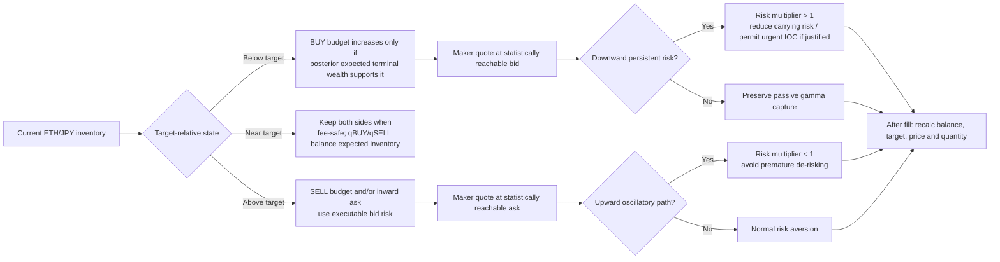

# GammaCapture strategy decision flow

This diagram describes the live ETHJPY profile on 2026-08-17. The old Macro
inventory controller remains decodable for research, but
`marketMaker.macroInventory.enabled=false`; live inventory targeting,
reservation, quantity, and execution are owned by the Fast/unified quote path.

```mermaid
flowchart TD
    A[Binance BBO + public trades] --> B{Valid BBO?<br/>Bid > 0, Ask > Bid}
    B -- No --> Z[Ignore event]
    B -- Yes --> C[Sync balances and position<br/>quoteable JPY / total ETH / average cost]
    C --> D[Update causal evidence<br/>BBO-side paths, crossings, OFI, volume, BOCPD]
    D --> E{Data gap or startup replay?}
    E -- Gap --> E1[Reset pending labels<br/>retain safe resting quote if valid]
    E -- Replay/live --> F[Evaluate 10m / 15m / 30m horizons]
    E1 --> F
    F --> G[Select horizon H by fee-net<br/>arrival utility and uncertainty]
    G --> H[Fast direction + confidence<br/>BOCPD45 auxiliary blend]
    G --> I[Executable side volatility<br/>BUY uses Ask, SELL uses Bid]
    G --> J[Asymmetric oscillation risk<br/>prequential multiplier m(H)]
    J --> J1[RiskAversion := RiskAversion × m(H)]
    H --> K[Fast reservation / drift / actuation]
    I --> K
    J1 --> K
    K --> L[Inventory state<br/>current notional, target, hard min/max,<br/>liquidation value and risk budget]
    L --> M[Build target-centered inventory band<br/>headroom and whole-position risk]
    M --> N[Unified quote optimizer]
    N --> N1[Reservation price + side distances]
    N --> N2[Probability-centered qBUY / qSELL<br/>expected inventory at H]
    N --> N3[Joint terminal-wealth check<br/>paired BBO paths, fee, covariance, tail risk]
    N1 --> O{Executable and fee-safe?}
    N2 --> O
    N3 --> O
    O -- No --> P{Two-sided continuity safe?}
    P -- Yes --> Q[Keep bounded two-sided maker quotes<br/>minimum exchange-valid size]
    P -- No --> R[Cancel/retain according to<br/>no-order lease and safety state]
    O -- Yes --> S[Apply exchange filters<br/>balance, hard inventory, min qty/notional]
    S --> T{Fast target execution beats<br/>waiting after fees and risk?}
    T -- Yes --> U[Depth-capped marketable IOC<br/>only target-restoring quantity]
    T -- No --> V[Submit maker BUY/SELL<br/>independent side quantities]
    Q --> W[Dynamic order-keep clock<br/>first-passage / selected H]
    U --> X{Fill or reject}
    V --> X
    W --> Y{Window/event/side change?}
    Y -- No --> Y1[Keep queue priority<br/>continue observing data]
    Y -- Yes --> Y2[Re-evaluate candidate<br/>refresh only if statistically/safely justified]
    Y1 --> D
    Y2 --> D
    X -- Reject/expire --> D
    X -- Fill --> AA[Sync balances immediately<br/>update position, cost and risk]
    AA --> AB[Compute replacement before cancel<br/>rebalance both sides without pausing loop]
    AB --> D
    C --> AC[Periodic checkpoint<br/>Fast models + pending labels + risk state]
```

## Trading interpretation



The intended behavior is not “always buy a dip” or “always sell a rally”.
It is:

- below target, buy only when the same-horizon executable-ask posterior and
  hard headroom support a positive terminal-wealth contribution;
- above target, sell using executable bids and the liquidation-value risk, not
  an unexecutable mid-price mark;
- near target, preserve both maker sides when the joint candidate is not
  profitable enough to choose a side, so a noisy zero decision does not remove
  the market maker entirely;
- during a persistent decline, increase carrying-risk aversion and allow an
  IOC only when the conservative waiting loss exceeds the maker-to-IOC cost;
- during an upward oscillation, reduce carrying-risk aversion so the strategy
  does not liquidate too early merely because variance is high.

## Complex algorithms below the flowchart

### 1. Horizon selection and arrival probability

For each \(H\in\{10m,15m,30m\}\), the model uses the same-symbol causal BBO
history. It estimates the probability/rate that each executable side is
reached at its proposed distance. The selector compares a fee-net utility per
unit time, not just the smallest “healthy” window:

\[
U_H \approx \lambda_{buy,H}E[\Pi_{buy,H}]
       +\lambda_{sell,H}E[\Pi_{sell,H}]
       -\text{fee/selection cost}-\text{risk penalty}.
\]

The selected \(H\) is also used by Fast direction, inventory variation, and the
order-keep clock. A later joint optimizer may move the quote distance, but it
must retain the same statistical clock and recompute the side arrival rates at
the final prices.

### 2. Side-specific executable volatility

The BUY model observes executable asks and the SELL model observes executable
bids:

\[
\sigma_{buy,H}=\operatorname{sd}(\Delta\log Ask),\qquad
\sigma_{sell,H}=\operatorname{sd}(\Delta\log Bid).
\]

This avoids treating a mid-price move as a guaranteed fill. The two estimates
are shrunk toward the longer same-symbol BBO baseline when the selected window
has few observations. The larger side risk is used for whole-inventory risk
budgeting, while each side keeps its own quote-distance calculation.

### 3. Asymmetric oscillation-risk multiplier

The online model separates movement direction from path choppiness. For a
causal path with net return \(R\), total variation \(TV\), and side variance
asymmetry \(A\):

\[
O=1-|R|/TV,\quad D=\tanh(R/s),\quad
A=\frac{\sigma^2_{down}-\sigma^2_{up}}
        {\sigma^2_{down}+\sigma^2_{up}},
\]

\[
m=\operatorname{clip}\!\left(
e^{-\eta\,O D(1+wA)},m_{min},m_{max}\right).
\]

The label is strictly prequential: the current prediction is made before the
future \(H\)-endpoint is observed; only then is the pending label added to the
EWMA statistics. The live effect is deliberately one-dimensional:

\[
\lambda_t=\lambda_0m_t.
\]

It cannot independently create a BUY, remove a SELL, widen a quote, or resize
an order. That prevents the same noisy direction feature from being multiplied
through several independent controllers.

### 4. Unified reservation, quantity, and terminal wealth

The quote optimizer solves one constrained problem rather than stacking
unrelated side controllers:

\[
\max_{\delta_\pm,q_\pm}
E_t[W_{t+H}]-\lambda_t\operatorname{Var}_t(W_{t+H}),
\]

subject to exchange filters, available balances, hard inventory bounds, and a
confidence interval for the future inventory. The probability-centered
quantity step chooses \(q_{buy}\) and \(q_{sell}\) so that the expected inventory
after the window remains near the target while the uncertainty band stays
inside the hard limits. This is why side quantities can differ even when the
price model is symmetric.

The joint terminal-wealth layer evaluates paired completed BBO paths. BUY
payoff uses the executable ask for entry; SELL payoff uses the executable bid
for exit. It includes both maker fees, adverse-selection cost, inventory/order
covariance, and a lower confidence bound. If no candidate survives, the policy
may retain a bounded two-sided quote only when that continuity floor is still
exchange-valid and risk-safe.

### 5. Maker versus marketable IOC

The default action is a resting maker pair. A marketable IOC is an impulse
control, not a fallback for missing data. It is allowed only when the
conservative expected waiting loss is larger than the maker-to-IOC execution
cost, and its quantity is capped by L1 depth, balances, and target-restoring
inventory. The selected order-keep duration follows the same \(H\) that created
the crossing posterior; a BBO tick alone does not cancel a valid queue position.

### 6. Fill and restart safety

After either side fills, the strategy synchronizes balances and position first,
then calculates replacement prices and quantities using the new inventory and
average cost, and only then cancels/replaces stale orders. Startup replays the
local same-symbol capture through the online models; checkpoints restore model
statistics when the version/hash matches, otherwise bounded replay rebuilds the
state without using future data.

## Source map

| Decision | Implementation |
|---|---|
| BBO/trade evidence and side volatility | `pkg/strategy/gammacapture/market_maker.go`, `conditional_execution.go` |
| Horizon selection and order lifetime | `pkg/strategy/gammacapture/strategy.go`, `market_maker.go` |
| Fast direction / BOCPD / drift | `adaptive_fast.go`, `fast_drift.go` |
| Asymmetric risk multiplier | `asymmetric_oscillation_risk.go` |
| Reservation and base quote | `market_maker.go` (`Quote`) |
| Unified distance/quantity/terminal wealth | `joint_quote_optimizer.go`, `joint_path_payoff.go` |
| IOC decision | `fast_target_execution.go` |
| Fill-triggered rebalance | `strategy.go`, `maker_startup_warmup.go` |
| Checkpoint and restart replay | `model_checkpoint.go`, `maker_startup_warmup.go` |
