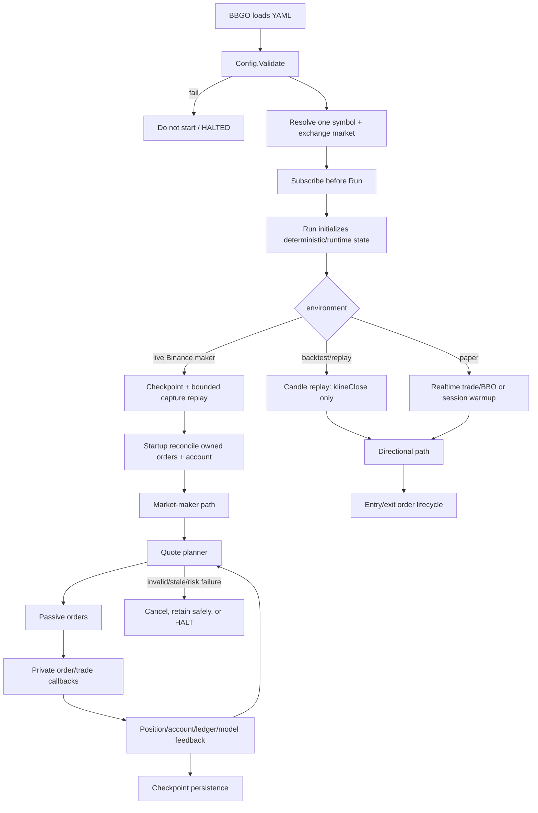
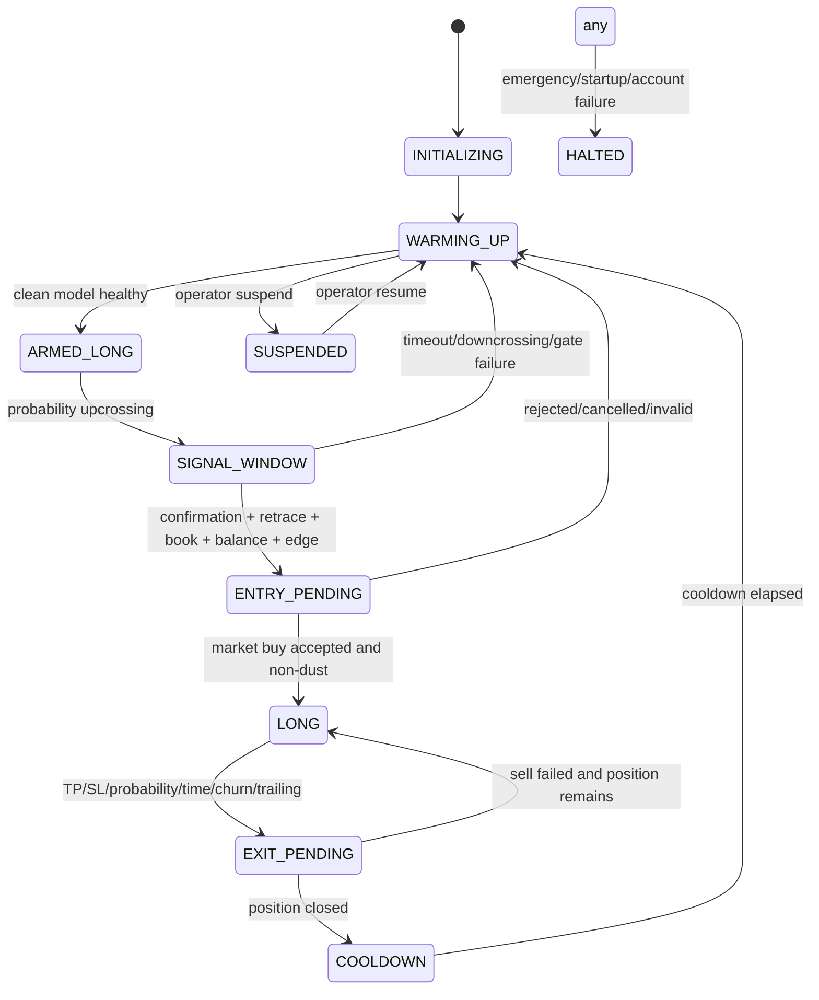
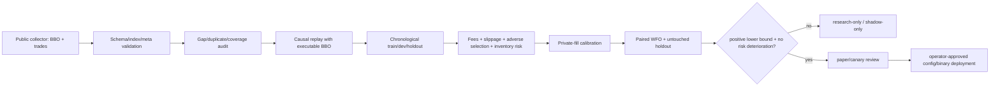

# GammaCapture 完整決策流程

> 文件狀態：接手審計版
>
> 審計時間：2026-08-27 JST
>
> 目標：把 GammaCapture 從資料輸入到實際下單、成交、持久化與停止的完整決策鏈寫成可驗證的單一參考文件。

## 1. 重要結論

GammaCapture 目前不是一個單純的「預測上漲就買」策略，而是兩條刻意分離的 runtime path：

1. **Directional path**：long-only；由 crossing/intensity、signal hysteresis、entry/exit gates 驅動。適用於 paper、backtest/replay 的 directional 研究。
2. **Market-maker path**：live ETHJPY 目前實際使用；由 BBO、side-specific volatility、executable crossing、Fast direction、inventory target、terminal-path utility 和 order lifecycle 產生被動雙邊 `LIMIT_MAKER` 報價。

在 `marketMaker.enabled: true` 時：

- directional entry state machine **不會**因為舊 barrier signal 而建立 maker position；
- BBO 是主要實時輸入；market trade 用於 public evidence/flow model；
- 最終不是任何單一模型決定下單，而是由統一 quote planner 同時決定 price、side quantity、admission；
- private fill ledger 和 private-fill calibration 目前主要是觀測/保護層，不是已證明的 alpha；
- 缺資料、無效 BBO、無法同步帳戶、startup replay 失敗、stale owned orders 無法確認清除時，應 fail closed。

## 2. 頂層架構



## 3. 啟動與安全門

### 3.1 配置與市場

程式入口在 `pkg/strategy/gammacapture/strategy.go`：

1. `Subscribe` 先呼叫 `setDefaults()`。
2. `marketMaker.enabled` 時訂閱：
   - `BookTickerChannel`
   - `MarketTradeChannel`
3. 否則依 reference mode 訂閱 market trade、BBO 或 KLine。
4. `Run` 執行 `Validate()`。
5. 依 `Symbol` 找到單一 exchange market；找不到立即返回錯誤。
6. 初始化/恢復 `Position`、`State`、`GateStats`、executor 和 runtime model。

策略刻意要求「一個 instance 一個 symbol」，因為多個 symbol 共用一個 `types.Position` 會使 inventory、平均成本、account reconciliation 和 persistence 不可審計。

### 3.2 Live maker startup

Binance live maker path 的順序是：

1. 初始化 executable crossing、horizon、Fast models、BOCPD45、pivot/target adapter、private-fill calibration 等 runtime components。
2. 若啟用 horizon-touch artifact，載入並驗證 symbol、price basis、holdout improvement。
3. 恢復 versioned `ModelCheckpoint`：
   - checkpoint version/hash/symbol 必須相容；
   - checkpoint 太舊時不做無界 replay，而改用 bounded capture window rebuild；
   - BBO cursor、trade cursor、private-ledger offset 分開處理。
4. 從 local BBO/trade capture replay 只處理 checkpoint 之後的 delta，或冷啟動所需的 bounded interval。
5. 以 causal BBO 更新：crossing、side volatility、Fast evidence、BOCPD45、Macro、volume profile、pivot regime、private-fill labels。
6. 缺少有效 BBO、最後資料過舊、capture 空檔不符合 startup requirement 時，返回錯誤，不允許冷模型報價。
7. 開啟 private order/fill ledger。
8. 建立 executor。
9. 只查詢並取消帶有 GammaCapture client-order prefix（或明確 legacy BBGO prefix）的 owned stale orders；不碰 Binance UI 或無關手動訂單。
10. 再次查詢確認 owned orders 已消失。
11. 更新 authenticated account/balance，將 account base balance 與 strategy position reconciliation。
12. 通過後才進入 live BBO quote loop。

### 3.3 應保持的 startup invariant

```text
No valid model history      => no new quote
No valid BBO                => no new quote
Account query failure       => no quote
Owned stale order unclear   => no quote
Invalid quantity/price      => no order
Checkpoint policy mismatch  => rebuild or stop, never silently restore
```

## 4. Live BBO event 的逐步決策鏈

每一個真實 BBO event 進入 `onMarketMakerBookWithEvidence`。fill-triggered refresh 可以重用最後 BBO，但必須標記為 observation-only，不能把同一事件重複計成新的 market observation。

### Step 0 — 基本資料驗證與鎖

拒絕：

- symbol 不匹配；
- executor 尚未初始化；
- bid/ask 非正數；
- ask <= bid；
- fill-rebalance generation 不允許目前 quote planner 執行。

有效事件進入 market-maker mutex，避免同時的 BBO callback、fill callback 和 account refresh 互相覆蓋 order state。

### Step 1 — 先記錄觀測資料

在計畫新 quote 前：

- private-fill calibration 更新當前 BBO；
- startup pending public trades 先按 timestamp drain；
- Fast evidence 更新 BBO/trade coverage、signed flow、OFI/volume signals；
- causal Kline pivot builder 更新 executable-BBO midpoint；
- Relative-Hold 使用 executable bid 對 strategy/Hold wealth 做 mark；
- pivot regime filter 只在真實 BBO event 前進，不在 fill refresh 重複前進；
- horizon model 更新 bid/ask side-specific observations；
- Macro/long-window model 僅在配置啟用時更新；
- BOCPD45 和 Fast drift 更新 delayed-label 狀態。

這些更新必須是 causal：當前決策不能讀取尚未 matured 的 future label。

### Step 2 — 建立當前資產與執行能力

從 account/position 取得：

- total base、quote；
- 可用於新訂單的 base/quote；
- 既有 maker orders 所佔 reservation；
- pair-equity（以當前 mid 將 base 轉成 quote）；
- 最小可執行 order notional、quantity、tick/step filter；
- hard inventory min/max 和 target-centered band。

這裡必須區分：

- `TotalBase`：用於 inventory/wealth/risk estimation；
- `QuoteableBase`：扣除現有訂單 reservation 後，實際可掛 ask 的數量；
- `QuoteableQuote`：實際可掛 bid 的 quote balance；
- exchange minimum：決定 side 是否真的可執行，不能用固定最小 JPY 假定一邊必須存在。

### Step 3 — 選擇統計 horizon

live ETHJPY 目前候選為 `10m/15m/30m`：

1. 每個 horizon 使用自己的 executable ask-return BUY volatility 與 bid-return SELL volatility。
2. 短窗估計按 sample reliability shrink 到長窗 prior。
3. 估算每個 horizon 的 side-specific touch/crossing、fee-adjusted edge 和每小時 utility。
4. 若啟用 marginal-BUY/path utility，將 target inventory、hard inventory band、risk aversion、available capital 和 executable minimum order 納入 horizon score。
5. 可選的 lifecycle-aware utility 會扣除 replace/cancel queue cost；目前配置若未啟用，不能把研究 lifecycle 決策當成 live gate。
6. 只選 crossing samples 足夠且 score 最佳的 horizon。
7. 沒有合格 horizon 時使用明確的 minimum-window neutral fallback；fallback 仍要經過後續 volatility、filter、balance、edge/risk 檢查。

**重要區分：** statistical horizon、order keep lease、quote refresh timer 不是同一件事。horizon 用來形成 quote distribution；既有 quote 的正常 retention 應由其出生時的 lease 控制，不應因每次 model update 就 cancel/requote。

### Step 4 — 形成 direction evidence

目前 live ETHJPY 的 direction evidence 來源包括：

- Fast crossing/intensity inference；
- Fast evidence coverage；
- BOCPD45 calibrated direction（ready 後與 Fast 按 confidence 合併）；
- multiscale fallback（目前配置 disabled）；
- BBO imbalance；
- signed trade/volume balance；
- OFI-volume agreement：若 conflict，僅抑制 volume component，不直接關閉 inventory/direction；
- Fast drift：若 ready 且非 shadow，conditional center mean 取代 heuristic evidence shift，避免同一資訊被計兩次；
- asymmetric oscillation risk：目前配置 disabled。

direction evidence 的角色是影響 reservation/pressure 或 Fast target utility，不代表它可以獨立授權訂單。

### Step 5 — 形成 inventory target

Inventory target 的硬邊界優先於所有模型：

```text
hard min <= selected target <= hard max
actual inventory + order quantity <= hard headroom
available balances + exchange filters remain authoritative
```

目前應按下列優先級理解：

1. pair-equity target band 和 hard capital bounds；
2. active causal pivot-regime CE target owner（ETHJPY 配置中 `causalCEEnabled: true`）；
3. posterior/dynamic target 僅在其明確 enable 且成為 active owner 時可用；
4. 50/50 是 fallback/prior，不是不可移動的 production target。

target owner 只能決定「希望 inventory 位於哪裡」；它不能直接決定 quote price、quantity、cancel 或 IOC。

Target switching 還要通過：

- same-horizon certainty-equivalent improvement；
- maker fee/adverse-selection switching cost；
- partial adjustment / actual current inventory，而不是未成交的舊 target；
- target bounds、account headroom。

### Step 6 — 估算 side volatility、fill hazard 與 risk budget

1. BUY side execution volatility 使用 executable ask path。
2. SELL side execution volatility 使用 executable bid path。
3. inventory risk 使用兩側較保守的有效 volatility。
4. pair-equity 依當前 account total balance 計算，避免 locked quote 在每次 refresh 造成 risk budget 跳變。
5. risk budget 為 absolute floor 與 equity ratio 中較安全的有效值。
6. quote notional 由 volatility、horizon、crossing/fill load 和 risk budget 計算；`quoteNotionalJPY` 只是 reference/default，不能被誤讀成固定下單額。
7. public touch 不是 private fill；public-only fill model 不可提高總資本風險，除非明確有 calibrated private-fill evidence。

### Step 7 — 計算 unified quote plan

Quote plan 一次統一處理：

- side-specific initial half spread；
- maker fee、adverse-selection floor、minimum net edge；
- Fast direction、book/flow signal、fill-rate pressure；
- inventory ratio relative to target；
- Fast drift center mean/variance；
- inventory actuation direction/strength；
- executable BBO touch distance；
- inventory band and hard headroom。

核心語意是：

```text
bid/ask price = mid ± side-specific risk/fee distance ± one signed pressure
quantity      = downstream path utility + fill probability + risk/headroom
admission     = valid BBO + fee floor + filter + balance + hard risk
```

positive inventory 會令 bid 變得不具吸引力、ask 相對靠近，以鼓勵減少 inventory；但任何 inward move 仍不可破壞 round-trip economic floor 或 crossing safety。

### Step 8 — Joint distance/quantity optimizer

若 `jointDistanceQuantity.enabled`：

1. 枚舉數值 candidate levels；candidate count 是數值解析度，不是同時掛出的 ladder orders。
2. 對每個可行 candidate 估算 side touch/hazard、paired terminal path、inventory chance constraint、fee/adverse selection 和 quantity utility。
3. `conditionalExecution` 只提供 causal executable-side state。
4. `volumeProfile` 只作 terminal-payoff conditioning feature，不是獨立 quote/quantity controller。
5. `postFillUtility` 只在已知 private fill 後評估 opposite-side continuation/reduction，不把上一筆 fill price 當硬邊界。
6. `probabilityCenteredQuantity` / Fast target execution 可以提供 quantity evidence，但不能繞過 unified risk/headroom。
7. `preserveTwoSidedQuotes` 只是可行性 continuity floor，不是盈利 override。
8. `jointHorizonSelection`、`twoStageContinuation`、adaptive path decay 等若未在 config 啟用，只能保留為研究/兼容分支。

若所有候選 CE 為負，策略可以：

- 保留已存在且仍在合法 keep lease 內的 quote；或
- cancel/replan；或
- 依 continuity policy 建立仍通過所有 hard filters 的最小可行 quote。

不得因 continuity floor 強行越過 fee、BBO、inventory、balance 或 exchange filters。

### Step 9 — Quote lifecycle 與 cancel/reprice

正常流程：

1. 若沒有 active quote，直接建立新 quote（前提是完整 plan 可行）。
2. 若有 active quote，先判斷：
   - quote 是否 crossed BBO；
   - side 是否變成真正不可執行；
   - hard inventory/balance policy 是否違反；
   - private fill 是否觸發 rebalance；
   - keep lease 是否到期；
   - adverse BBO move 是否超過以 submit-time BBO 為基準的門檻；
   - quote 是否缺少必要 side；
   - explicit emergency/early-bump 是否生效；
   - Bellman quote lifecycle 是否已啟用且有足夠 action diversity。
3. 普通 mid/imbalance/模型微變化在 keep lease 內不應單獨造成 churn。
4. 需要替換時，先建立完整 replacement plan，再 cancel 舊的 owned orders。
5. cancel 必須被記錄為 expected cancel，避免 callback 將策略自己的 reprice 誤認為外部 cancel。
6. cancel 後確認 active order state，再 submit replacement。
7. replacement 失敗時優先保留仍合法的舊 quote，不能在沒有完整 plan 時清空後裸奔。

### Step 10 — 下單與成交

所有策略側 order submission 必須通過 `submitOrders`：

- 先寫 private ledger `order_submit_intent`；
- 呼叫 BBGO executor；
- 寫 submit result/error；
- 對 owned maker order 建立 private-fill calibration order state；
- order/trade callbacks 更新 position、balances、fill calibration、post-fill state。

Maker order 必須：

- 是 `LIMIT_MAKER`/被動型 order；
- 嚴格在 observed BBO 外側；
- 通過 price/quantity/position/notional filters；
- 不因 directional long-only signal 直接變成市價 entry。

成交事件的處理：

1. TradeCollector 先更新 `Position`。
2. 只接受 owned market-maker trade，不把外部 order 混入策略 inventory。
3. partial fill 每次都要能進入 rebalance/risk path；不能只依賴 terminal order-filled callback。
4. 更新 maker post-fill state、ledger 和 private-fill calibration。
5. 安排 fill-triggered replan；此 refresh 可觀測最新 BBO，但不得重複計市場事件。
6. 若 inventory 偏離 target，Fast target execution/post-fill utility 可評估 opposite-side passive quote 或一次性 IOC reduction；IOC 必須再次通過 fee、slippage、depth、balance、hard risk 和 cooldown gates。

## 5. Directional path（非 live maker 主路徑）

當 `marketMaker.enabled: false` 時：

### Backtest/replay

- BBGO 標準 backtest 只提供 closed KLine；reference price 強制 `klineClose`。
- 不得配置 `lastTrade`/`microprice` 來假裝有 tick/BBO replay。
- 每根 closed candle 是一個 causal reference observation；不能還原 candle 內 chronology。

### Paper/realtime

- 可使用 `lastTrade` 或 `microprice`。
- `microprice` 必須有有效、非零 bid/ask quantities。
- entry 要求 fresh BBO、spread、balance、bar range/return、confidence/health 等 gates。

### 狀態機



Directional crossing gap event 不可建立健康 model，也不可製造多重 chronological crossings；ambiguous path 應 reset/保持不健康。

## 6. 資料、回測與 promotion 流程



必須區分：

- public touch：BBO 是否到達 quote；
- private fill：本 bot order 是否實際成交；
- accounting PnL：包含真實費用與 balance mutation；
- synthetic replay：僅是模型敏感度分析，不能命名成 production proof。

Promotion 最低要求：

1. 完整 causal input contract；
2. 沒有 future leakage；
3. fee/slippage/adverse-selection accounting；
4. paired chronological WFO；
5. untouched holdout；
6. block-level lower confidence bound；
7. turnover/fills/uptime 不惡化；
8. max drawdown、hold-relative risk 可接受；
9. private-fill ledger calibration；
10. rollback binary/config 和 kill switch。

截至本審計，既有 research queue audit 的結論仍是 **沒有候選通過完整 promotion rule**。因此 research source 存在、某次 replay 為正、或 live YAML 設為 enabled，都不等於獲得新 promotion。

## 7. 持久化與恢復

持久化分成三類：

1. **Strategy state**：position、entry/exit state、cooldown、inventory reset cooldown、gate stats。
2. **Model checkpoint**：bounded causal sufficient state；包含 crossing/Fast/evidence/BOCPD/horizon/volume profile/Macro/pivot/private calibration 等必要資料，但不包含 credentials、orders、balances。
3. **Private ledger**：append-only order intent/result/cancel/fill/order update，並附當時 BBO 和 production version。

恢復原則：

- deterministic backtest/replay 不應偷偷載入 live checkpoint；
- checkpoint hash 必須覆蓋有效 policy config；
- capture file size/mtime/index 變動時走安全 delta replay；
- private ledger offset 與 BBO/trade cursor 不可混用；
- startup 必須先恢復模型、再 reconcile owned orders、再允許新 quote。

## 8. 已發現的配置/理論/數據風險

以下項目已由 source audit 核對；其中安全類問題應優先以 regression test 固化，再修正 implementation。所有修正只先改 source/test，不直接重啟或部署 live service：

### 8.0 已核對的 production safety findings

1. `Config.Validate()` 對 `environment: live` 是空分支：live 被允許，但 `Validate()` 本身沒有通用的 production acceptance gate。實際安全仍依賴後續 startup warmup、account query、stale-order reconciliation 和 quote gates；這些不能被誤稱為 config-level promotion gate。
2. `OnSuspend`/`OnEmergencyStop` 只改 `State.Runtime` 並觸發 cancel/close；source audit 顯示 `onMarketMakerBookWithEvidence()` 入口沒有先檢查 `State.Runtime` 或 strategy status。由於 BBO callback、cancel callback、emergency callback 可並發，存在 HALTED/SUSPENDED 後重新規劃或提交 maker quote 的 race 風險。應先寫一個能證明 suspended/halted 不會呼叫 submit 的測試，再加明確 fail-closed gate；取消動作仍需保留。
3. private ledger 使用 `atomic.Uint64`，但 `OpenPrivateOrderFillLedger()` 沒有掃描既有 JSONL 的最大 sequence；process restart 後 sequence 可能從零重新開始。這不破壞檔案 append 本身，但破壞跨 restart 的事件排序/唯一性語意，應改為恢復 `max(sequence)+1` 並測試 malformed/truncated tail 的處理。
4. ledger event 寫入預設不一定每筆 fsync；crash 可能遺失最近已成功返回的 OS-buffered event。這是 audit durability trade-off，不應把「callback 沒報錯」當成「ledger 已 durable」。production profile 應明確設定 `syncEachEvent`，並監控 write/sync failure。
5. ledger I/O failure 目前只 log、不改變下單決策。這避免 writer 故障直接擾亂交易，但若 ledger 是 production acceptance prerequisite，就應以 health/alert 暴露「交易仍可繼續但 audit 不完整」，而不是靜默降級。


### 8.1 配置語意容易被誤讀

ETHJPY config 同時有：

- `dynamicInventoryAim.pivotRegimeTarget.enabled: false`
- `dynamicInventoryAim.pivotRegimeTarget.causalCEEnabled: true`

源碼以兩者任一為 true 就初始化 target adapter，並在後續以 `CausalCEEnabled` 參與 target decision。因此實際語意是「legacy pivot actuator disabled、causal CE target active」，但 YAML 表面容易被理解成整個 pivot target disabled。應補 config validation/logging，明確輸出 active target owner，避免 operator 誤判。

### 8.2 `enabled: true` 不等於獨立控制器

ETHJPY 的 `fastDrift`、`RelativeHoldRisk`、`fastTargetSwitching`、`fastTargetExecution`、`probabilityCenteredQuantity`、`jointDistanceQuantity`、`conditionalExecution`、`volumeProfile`、`postFillUtility` 等多項設定為 true，但它們的權限不同：有些影響 reservation、some target、some quantity、some post-fill，不能在監控中統一稱為「alpha enabled」。每個 model 必須暴露：`enabled`、`ready`、`applied`、`owner`、`reason`。

### 8.3 Collector gap 是 receive-time gap

collector 的 `gap_before_ms` 使用 `time.Now().UTC()` 的 callback receive time；Binance book-ticker 沒有 exchange timestamp。這能偵測本機/stream callback 的停頓，但不能直接證明市場事件缺失，也不能與 trade event-time gap 混為一談。研究品質摘要應同時報告：receive gap、trade event-time gap、重連 generation、檔案寫入錯誤。

### 8.4 Public touch 不可當 private fill

現有文件已承認這點，但執行和報告層仍要強制分欄。任何以 public BBO touch 估算的 quote fill、PnL、turnover 都必須標記為 proxy/synthetic；private ledger 沒有足夠覆蓋時，不可提高 risk budget 或放寬 gate。

### 8.5 研究配置與 production 配置混在同一大檔

同一份 YAML 同時保存 compatibility fields、research-only knobs、shadow signals、active canary 和 live policy，增加「誤開啟 disabled owner」或把 research artifact 當 production artifact 的風險。後續應至少產生 machine-readable effective-policy dump，並在 startup log 中列出實際 active owner，而不是只打印整份 YAML。

### 8.6 Live path 的 keep/reprice 語意必須持續測試

`horizonUpdateInterval`、`refreshInterval`、`minRefreshInterval`、`maxRefreshInterval`、selected horizon、order keep lease 和 `adverseRepriceBps` 各自不同。任何將 model update 直接映射成 cancel/requote 的改動，都可能摧毀 queue priority；應用 lifecycle replay 和 live ledger 驗證 order age、cancel reason、BBO-at-submit 基準。

## 9. 下一步修正順序

1. 先建立 effective-policy/decision trace：每個 BBO event 記錄 gate、owner、model readiness、selected horizon、target、price、quantity、拒絕原因。
2. 為 pivot CE enabled/legacy enabled 寫 config semantic test。
3. 為 collector 分離 receive-time gap 與 event-time/data gap，並產生每日品質摘要。
4. 對 quote planner 補 end-to-end tests：invalid BBO、stale data、missing side、fee floor、hard inventory、partial fill、external cancel、replacement failure。
5. 以 private ledger 重算 private touch-to-fill、partial-fill、cancel age 和 adverse selection，更新 research gate。
6. 對任何理論修改先建立一個能變紅的 causal replay/test，再修改最小 production code。
7. 在沒有完整 promotion evidence 前，維持現有 live policy，不啟用新的 research actuator。

## 10. 審計後的操作原則

```text
先驗證資料，再相信模型。
先驗證模型，再計算 utility。
先驗證 utility，再計算 quantity。
先驗證 quantity/filter/risk，再下單。
先驗證成交，再更新 inventory。
先讀回 ledger/account/order state，再宣稱成功。
```
