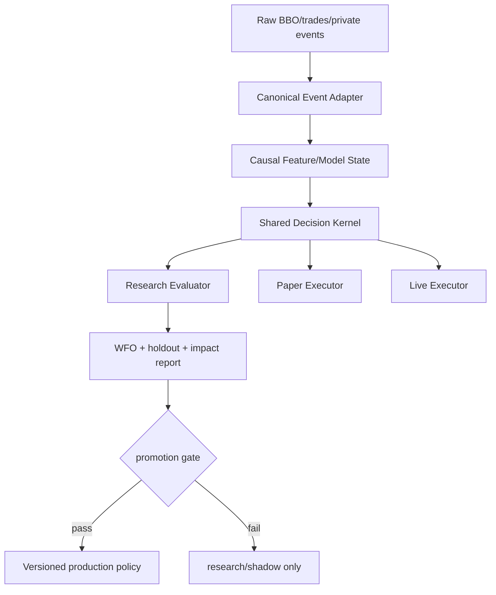

# GammaCapture 研究到 Production 控制架構

## 問題定義

目前研究→production 有三個結構性失效點：

1. 研究 code 與 production code 重新實作，導致研究結果難以由 production 完整重現。
2. 回測實作錯誤可能產生虛假 alpha，之後被錯誤整合。
3. 整合後沒有嚴格的 before/after attribution，無法知道改動對策略宏觀效能的真實影響。

這三點不能靠增加更多研究 flag 解決；需要改變資料流和 release boundary。

## 新的核心原則

```text
研究不是另一套策略實作。
研究只能替同一個 Decision Kernel 提供已標註、可驗證的 evidence。
Production 只能執行同一個 kernel 的 bounded policy。
```

研究、回測、paper、live 必須共享：

- 相同的 input schema；
- 相同的 causal event ordering；
- 相同的 fee/slippage/adverse-selection 定義；
- 相同的 `Decision` 輸出結構；
- 相同的 hard safety constraints；
- 相同的 model/version/config fingerprint；
- 相同的 decision trace 欄位。

Environment 可以不同，但 policy semantics 不能因為「研究方便」而不同。

## 1. 統一 Decision Contract

建議建立 production/research 共用的明確資料結構，概念如下：

```go
type DecisionInput struct {
    At              time.Time
    Symbol          string
    BBO             ExecutableBBO
    PublicFlow      PublicFlowEvidence
    Inventory       InventorySnapshot
    ModelState      ModelStateSnapshot
    AccountState    AccountSnapshot
    ConfigVersion   string
}

type DecisionOutput struct {
    Action          Action // NO_ORDER, KEEP, REPLACE, CANCEL, PASSIVE, IOC
    Bid             OrderIntent
    Ask             OrderIntent
    TargetInventory float64
    Horizon         time.Duration
    Utility         UtilityBreakdown
    Gates           GateResult
    ModelReadiness  ReadinessSummary
    Reason          string
    TraceVersion    int
}
```

實際型別應配合 BBGO 現有 types，但必須滿足：

- 研究 replay 與 live callback 都能產生 `DecisionInput`；
- production planner 與 offline evaluator 都消費同一個 kernel；
- evaluator 可以逐 event 比較 baseline/candidate output；
- 禁止 research-only function 直接另造一套 quote/quantity formula 後宣稱可 production。

### Decision contract 的 hard boundary

Research adapter 可以：

- 讀取歷史 BBO/trades；
- 建立 causal model state；
- 產生 candidate evidence；
- 產生 shadow decision；
- 計算 matured labels。

Research adapter 不可以：

- 另造 production 不使用的 fill semantics 後計算 PnL；
- 讀取 future BBO 形成當前 feature；
- 用 midpoint touch 冒充 executable fill；
- 在沒有同樣 hard constraints 的情況下比較 candidate；
- 直接修改 live config 或 order lifecycle。

Production kernel 可以：

- 使用已通過 schema/version/causal checks 的 evidence；
- 執行相同的 deterministic utility、risk、filter、order lifecycle；
- 在 evidence 未 ready 時降級為明確 fallback/no-order。

## 2. 研究與 production 的四層拆分



### Layer A：Raw data

保存：

- event time（有則用 exchange time）；
- receive time；
- BBO bid/ask/size；
- public trade id/time/side/quantity；
- gap marker、stream generation、source；
- private order/fill events；
- account snapshot。

### Layer B：Canonical Event Adapter

只負責：

- schema normalization；
- event ordering；
- duplicate removal；
- gap segmentation；
- BBO/trade merge；
- exact timestamp predicate；
- causal cutoff。

它不能包含 alpha、quote、PnL 或 optimizer logic。

### Layer C：Causal Feature/Model State

每個模型必須聲明：

- input fields；
- update event；
- lookback；
- label maturity；
- readiness condition；
- output units；
- fallback；
- whether it can affect price/quantity/target/admission/lifecycle。

### Layer D：Shared Decision Kernel

統一計算：

- horizon；
- direction；
- target；
- volatility；
- touch/fill hazard；
- utility；
- quantity；
- hard risk/filter；
- action。

Research 與 live 不可各自實作「看起來等價」的版本。

## 3. 防止虛假 alpha 的回測規則

任何候選都必須先通過以下 checks：

### 3.1 因果性

對每個 anchor `t`：

```text
features(t) 只能包含 event_time <= t 的資料
labels(t)    只能在 maturity > t 後寫入 model state
decision(t) 不能看到 labels(t) 或未成熟 future state
```

測試方式：

- 將 future rows 截斷後重播；
- 將 future rows 改成不同價格；
- 當前 decision output 必須 byte-for-byte 不變；
- matured label 到達前不得改變舊 decision trace。

### 3.2 可執行價格

- passive BUY 的 path 用 ask path 判定 touch；
- passive SELL 的 path 用 bid path 判定 touch；
- quote distance 必須包含當時 spread；
- midpoint 只能當明確標註的 diagnostic/control；
- public touch 與 private fill 分欄；
- private fill 不存在時，不可聲稱真實 turnover/PnL。

### 3.3 時間與 gap

- BBO 以 receive time 時，必須標為 local-observation clock；
- trade 使用 exchange time 時，必須明確處理 receive/event ordering；
- 跨 gap 的 first-passage path 不得連續穿越；
- overlap labels 必須計算 effective sample size；
- 不同 event source 不能用 row count 假定相同樣本量。

### 3.4 費用與風險

每個 arm 必須使用同一套：

- maker/taker fee；
- slippage；
- adverse selection；
- minimum edge；
- inventory risk；
- quantity/filter；
- cancel/replacement cost；
- partial fill semantics。

若 candidate 只在「較寬鬆的 simulation」中為正，結果只能是 invalid，不是弱 promotion。

## 4. 整合影響評估

每一個 candidate 必須產生三個 replay：

1. **Reference**：production current policy。
2. **Candidate**：只替換一個明確 component。
3. **Ablation**：candidate component disabled 或 neutral fallback。

三者必須使用：

- 同一 event stream；
- 同一 initial account；
- 同一 random seed（最好 deterministic）；
- 同一 execution/fill model；
- 同一時間切分；
- 同一 checkpoint policy。

### 必報 metrics

#### 策略宏觀

- net PnL；
- gross PnL；
- fees；
- slippage/adverse selection；
- terminal equity；
- max drawdown；
- drawdown duration；
- volatility / downside deviation；
- turnover；
- exposure time；
- inventory mean/std/max；
- hold-relative return/risk。

#### 微觀執行

- quote uptime；
- quote count；
- quote age distribution；
- cancel/replace count；
- fills / partial fills；
- fill rate by side/distance/horizon；
- queue-age proxy；
- IOC count；
- stale/missing-side events；
- order rejection/error count。

#### 統計可信度

- chronological block estimates；
- effective sample size；
- block lower confidence bound；
- number of positive blocks；
- untouched holdout；
- private-fill calibration coverage；
- public-touch/private-fill disagreement。

### Attribution table

每個 decision event 需要記錄：

```text
reference_action
candidate_action
changed_component
reference_target / candidate_target
reference_horizon / candidate_horizon
reference_price / candidate_price
reference_quantity / candidate_quantity
utility_delta
risk_delta
fill_model_delta
reason_delta
```

沒有 action-level diff，就不能回答「整合後影響了什麼」。

### Promotion rejection conditions

任何一項成立都拒絕 promotion：

- candidate PnL 為正但只在 synthetic/midpoint fill；
- candidate 改變超過一個 component；
- candidate 沒有 untouched holdout；
- block lower bound <= 0；
- drawdown 或 hold-relative risk 惡化且無明確風險交換；
- fill/turnover 改善只來自較寬鬆 execution；
- quote lifecycle action diversity 不足；
- private-fill calibration missing；
- 研究 replay 與 production kernel decision trace 不一致；
- 無法從 artifact 還原每個 promotion 結論。

## 5. Release boundary

研究輸出不應直接是「開關」；應該是 versioned artifact：

```text
PolicyArtifact {
  policy_version
  kernel_version
  feature_schema_version
  data_cutoff
  train/validation/holdout_split
  config_fingerprint
  model_fingerprint
  estimator_source
  causal_checks
  fill_model
  metrics
  attribution
  promotion_decision
  rollback_reference
}
```

Production YAML 只引用已批准的 artifact/version；如果 artifact fingerprint、schema 或 kernel version 不匹配，startup fail closed。

## 6. 針對目前 GammaCapture 的落地順序

### P0：先阻止錯誤再整合

1. 暫停新增 alpha promotion；保留目前 live policy，不把任何研究候選升級。
2. 為 live maker 加入明確 `SUSPENDED/HALTED/strategy status` admission gate。
3. 為每次 decision 產生 effective-policy trace，顯示 active owner、ready/applied、fallback/reason。
4. 為 private ledger 修正跨 restart sequence recovery，並暴露 audit degraded health。

### P1：建立 shared kernel boundary

1. 把 `MarketMakerQuoteInput`、horizon decision、target decision、quantity decision、lifecycle decision 的輸出統一成可序列化 decision trace。
2. replay 直接呼叫相同 quote planner；不要在 `cmd/gammacapture-mm-research` 重新複製公式。
3. 為每個 research flag 指定 capability：`target`、`price`、`quantity`、`admission`、`lifecycle` 或 `diagnostic`，禁止隱性跨層。
4. 建立 reference/candidate/ablation runner。

### P2：回溯現有整合

逐一對所有目前 enabled/canary component 做三臂 replay：

- baseline current production policy；
- one-component candidate；
- neutral ablation。

優先次序：

1. causal pivot CE target；
2. fast target switching/execution；
3. joint distance/quantity；
4. Volume Profile；
5. Relative-Hold；
6. fast drift；
7. post-fill utility；
8. private-fill calibration effect。

若無法產生相同 decision trace，先視為 integration failure，不是 alpha result。

### P3：只允許可回滾 artifact promotion

1. candidate 產出完整 artifact。
2. untouched holdout 通過。
3. private-fill calibration 通過。
4. paper/shadow 觀測期完成。
5. operator review 並保留 reference policy。
6. config/binary atomic deployment。
7. live restart 後讀回 effective-policy、checkpoint、orders、ledger 驗證。

## 7. 驗收標準

GammaCapture 恢復可信研究→production 流程前，必須能回答：

- 研究和 live 是否呼叫相同 decision kernel？
- candidate 和 reference 每個 event 改了什麼？
- alpha 是否依賴 future data、midpoint 或 synthetic fill？
- 每個模型當前是否 ready、applied、owner 是誰？
- 整合後 PnL、drawdown、turnover、inventory、fill rate 各自改變多少？
- candidate 是否在 untouched/private-fill holdout 仍成立？
- 若 candidate 失效，能否只回退該 component？
- live restart 後是否能從 artifact、checkpoint、ledger 還原決策？

在這些問題都能由實際 artifact 和 replay output 回答之前，任何新 alpha 只能是 research/shadow，不得進入 production。
