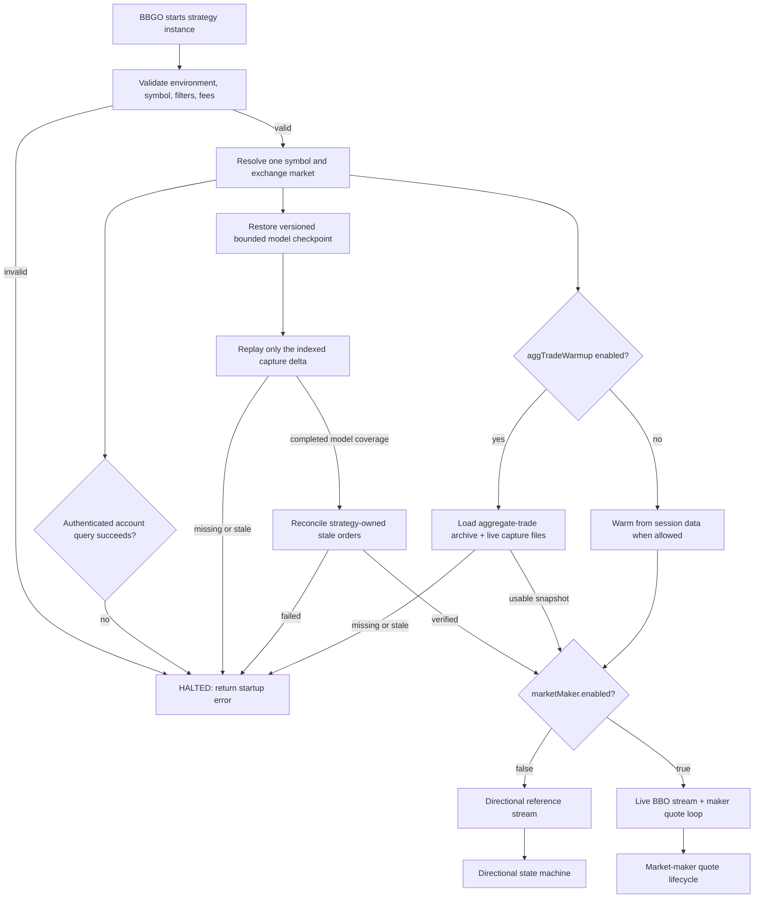
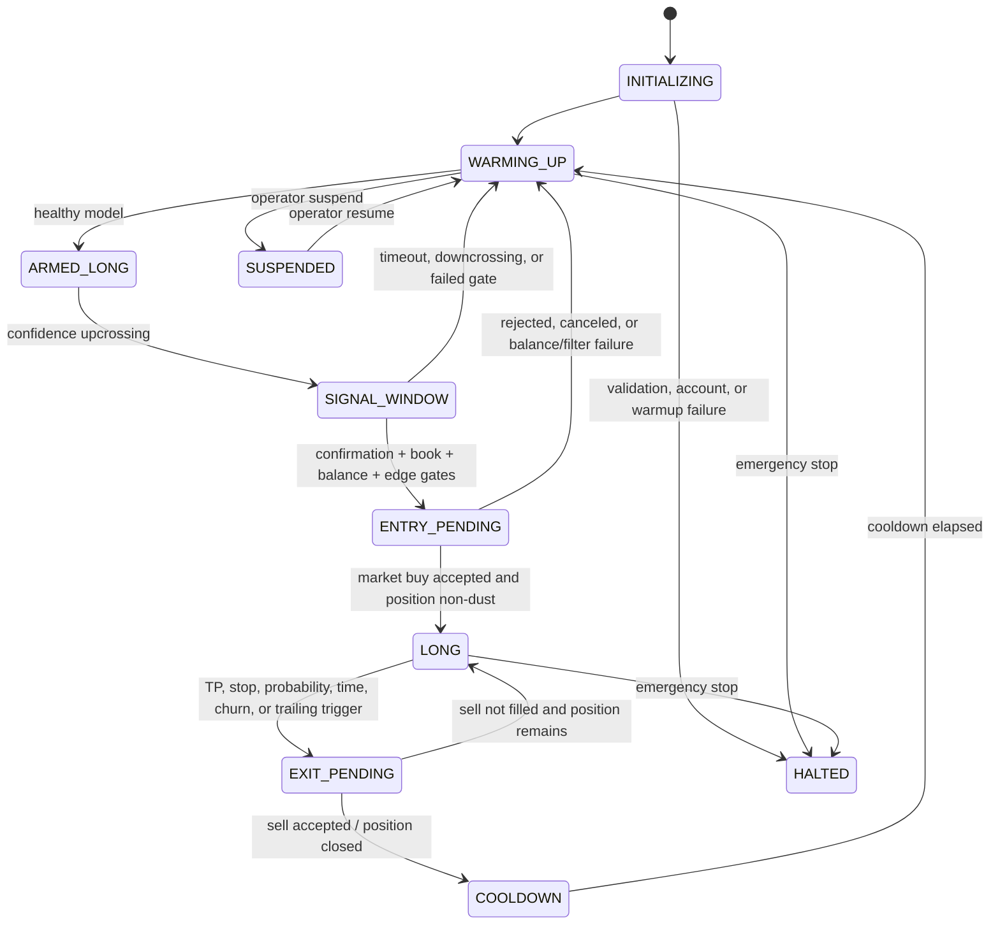
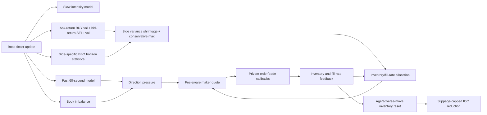

# Gamma Capture strategy (directional research and live market making)

`gammacapture` supports two deliberately separate execution paths for one JPY
market per BBGO strategy instance. The original path is a long-only,
fee-aware directional strategy driven by the crossing/intensity model. The
`marketMaker.enabled` path is a passive, two-sided Binance spot market maker
driven by live BBO updates, causal volatility, crossing rates, inventory risk,
and short-term order-book pressure. It does not consume directional entry
signals or open a position through the pivot state machine. The strategy is
registered in `pkg/cmd/strategy/builtin.go`.

`environment: live` is supported. It must be treated as an authenticated
production mode: keep the Binance API-key IP allowlist and permissions valid,
monitor persisted online-model synchronization, and monitor the process for
fatal startup errors. The supplied maker profile does not require a historical
archive or pre-trained artifact. A failed account query (for example Binance error
`-2015`) stops the process before it can quote.

## Compatibility assessment

This checkout supplies the required extension points: `SingleExchangeStrategy`
(`ID`, `InstanceID`, `Subscribe`, `Run`), `GeneralOrderExecutor`, persisted
fields, `types.Position`, `StrategyController`, and `bbgo.Sync`. Paper mode
subscribes to individual market trades and uses each trade price as a causal
reference observation. Its built-in backtester supplies closed candles, not
trades, BBO, or book deltas, so `backtest`/`replay` explicitly use one closed
candle as one *reference-price observation*. A deterministic run cannot select
`lastTrade`; this prevents a configuration that silently has no replayed input.

BBGO subscribes before a strategy's `Run` phase. As a result dynamic market
discovery must be a preflight operation that emits one allowlisted strategy
instance per eligible JPY symbol. The current strategy requires the resolved
`symbol`, rejects denylisted symbols, and accepts a selection block so generated
instances retain their discovery audit trail. A multi-symbol stream cannot share
a single `types.Position` safely.

## Architecture and state flow

The runtime is easier to audit as several related diagrams rather than one
large state machine. Configuration validation and startup are shared; after
warmup, directional mode and market-maker mode deliberately use different
decision loops.

### Mode selection and startup



The supplied live Binance maker profile requires fresh historical BBO and
enough completed 10/15/30-minute windows before order handling begins, so a
restart cannot silently fall back to a cold quote model. Profiles that set
`requireStartupHistory: false` may continue from persisted or empty state, but
inventory reset remains health-gated. Directional aggregate-trade mode still
uses its separate `requireHealthy` gate.

### Directional state machine



The directional loop consumes market trades, microprice, or closed candles
depending on environment and `referencePrice.mode`. It owns the long position,
confidence hysteresis, TP/SL passage probabilities, and gate statistics.

### Market-maker quote lifecycle

```mermaid
stateDiagram-v2
  [*] --> PUBLIC_WARMUP
  PUBLIC_WARMUP --> STARTUP_RECONCILE: checkpoint restored + capture delta replayed
  PUBLIC_WARMUP --> HALTED: required history missing, stale, or insufficient
  STARTUP_RECONCILE --> WAIT_FOR_BBO: owned stale orders cleared and account refreshed
  STARTUP_RECONCILE --> HALTED: query/cancel/verification failure
  WAIT_FOR_BBO --> COMPUTE_QUOTE: valid BBO + volatility statistics
  WAIT_FOR_BBO --> WAIT_FOR_BBO: data/statistics gap
  COMPUTE_QUOTE --> QUOTE_WINDOW: fee floor + filters + balances pass
  COMPUTE_QUOTE --> WAIT_FOR_BBO: no valid risk-sized ticket
  QUOTE_WINDOW --> QUOTE_WINDOW: ordinary BBO update inside window
  QUOTE_WINDOW --> REPRICE: window expiry, adverse BBO, or material state change
  QUOTE_WINDOW --> REPRICE: quote crosses BBO or side is missing
  QUOTE_WINDOW --> INVENTORY_RESET: aged ask + adverse move + healthy model
  INVENTORY_RESET --> QUOTE_WINDOW: IOC submitted; only another reset is cooldown-gated
  REPRICE --> COMPUTE_QUOTE: cancel/rebuild after resting floor
  QUOTE_WINDOW --> WAIT_FOR_BBO: no volatility and no active quote
  QUOTE_WINDOW --> HALTED: emergency stop
```

The horizon model updates every minute, but it does not cancel a healthy
resting quote merely because the calculated price changed. Order retention uses
the same executable first-passage clock as quote risk. For each side, touch
distance includes the current spread and its own executable-price volatility:
`tau_buy = (d_ask_to_bid_quote / sigma_ask)^2` and
`tau_sell = (d_ask_quote_to_bid / sigma_bid)^2`. The paired quote uses the
later side time and the statistically selected horizon, then rounds upward to a
configured horizon with measured arrivals. The configured maximum remains a
hard exposure cap.

The paired quote window uses the farther admissible ordinary side distance. The
mark-to-market equity floor is relative to the live mark, so it cannot create the
very large, static retention distance produced by an accounting-cost floor. Pricing volatility, inventory
risk, crossing-rate lookup, and expiry all use the resulting keep horizon. An
ordinary mid-price, adverse-distance, or imbalance observation cannot cancel
the quote before that horizon; those movements are the first-passage path the
order is waiting for. A crossed quote, inventory/side-policy violation, missing
side, private maker execution, or explicit early-bump transition remains
a hard lifecycle action. A side is considered missing only if its balance and
post-allocation notional pass the exchange minimum-notional and minimum-quantity
filters; an impossible 8-JPY bid, for example, cannot churn a valid ask. L1
imbalance changes otherwise remain telemetry because they were true on 84.7%
of live evaluations and destroyed queue priority without discriminating unusual
states.
`adverseRepriceBps` is measured from the BBO captured at submission, not from
the quote's intentional distance to the current BBO.

### Executable-price model (v2)

Market-making volatility and public-touch likelihood are side-specific. A
passive buy is observable from the best-ask path and a passive sell is
observable from the best-bid path:

~~~text
buy volatility  = sqrt(sum(log(ask[t]/ask[t-1])^2) / sum(delta_t))
sell volatility = sqrt(sum(log(bid[t]/bid[t-1])^2) / sum(delta_t))

buy touch  iff min(future ask) <= submitted bid quote
sell touch iff max(future bid) >= submitted ask quote
~~~

The estimator uses BBO points at most once per second, rejects intervals across
a declared outage or longer than two minutes, and keeps quiet elapsed time in
the denominator. The former estimator discarded zero returns and took a
quantile conditional on a move; on a sparse symbol that was not a per-unit-time
volatility and could systematically widen quotes.

Quote distance and touch distance are intentionally different. The strategy
edge is the submitted ask-to-bid distance; the public path must additionally
cross the current spread:

~~~text
buyTouchDistance  = log(currentAsk / bidQuote)
sellTouchDistance = log(askQuote / currentBid)
grossQuoteEdge    = log(askQuote / bidQuote)
~~~

The spread is therefore part of passage/fill difficulty, but never counted as
strategy profit. Buy and sell short-window estimates are separately shrunk
toward their longer BBO baselines in variance space. Their conservative maximum
sizes inventory and determines the paired lifetime, while each side's own
estimate determines its quote width. Microprice barrier crossings remain
available for directional probability only; they no longer enter quote or
inventory volatility.

Online-arrival state version 2 resolves the same executable events at every
horizon/distance bucket. Version-1 midpoint cells are discarded and rebuilt
causally from local BBO capture on startup. A legacy aggregate-trade archive has
no spread, so it may warm the directional model but is only a synthetic
zero-spread compatibility input for maker statistics. Horizon-touch artifacts
now require priceBasis executable-bbo; midpoint-labeled v1 artifacts are
rejected and the legacy SQLite trainer is explicitly non-deployable until it
trains on executable BBO labels.

A read-only July BBO audit compared non-overlapping ten-minute midpoint touches
with executable touches. The largest mismatch occurred at the closest quote
distance:

| symbol | distance | midpoint buy / executable buy | midpoint sell / executable sell |
| --- | ---: | ---: | ---: |
| BTCJPY | 15 bps | 150 / 149 | 146 / 145 |
| ETHJPY | 15 bps | 257 / 257 | 233 / 233 |
| XRPJPY | 15 bps | 244 / 228 | 200 / 184 |
| SOLJPY | 15 bps | 431 / 409 | 396 / 382 |
| XRPJPY | 30 bps | 58 / 56 | 53 / 48 |
| SOLJPY | 30 bps | 119 / 112 | 104 / 100 |

These are public touch proxies, not private fills or a PnL claim. They do
demonstrate that midpoint labeling overstated close-quote arrival most on the
wider/discrete-tick XRPJPY and SOLJPY samples; the error diminished at larger
distances.

### Event and risk feedback



The directional causal path is `market trade (paper/live) or closed candle
(deterministic replay) → reference price → CrossingEngine → IntensityModel →
finite-horizon first passage → hysteresis state → risk gate → BBGO order
executor`. Position and crossing state use BBGO persistence. Trade callbacks
reject stale timestamps and non-increasing exchange trade IDs before mutating
state.

When `marketMaker.enabled: true`, the live path is instead:
`persisted online state or empty cold start → BBO update → medium-term
(10-minute) ask/bid execution models + slower ask/bid priors → side-wise
variance shrinkage → explicit 10-minute
window → joint quote policy → hard inventory/balance projection → LIMIT_MAKER
quotes`. The joint policy combines normalized inventory, direction, book
imbalance, volatility, fees, and side crossing hazards once into a signed
pressure; that pressure determines reservation-price shift and
bid/ask distance. Final bid/ask notionals are calculated by the probability-centered Macro projection. Legacy skew/allocation
coefficients remain decode-compatible but are not read by the active path.
Existing quote
windows are retained until their selected horizon expires, unless a quote
crosses the BBO or the BBO itself moves adversely by `adverseRepriceBps`.
The market-maker path never uses the directional entry gate to decide whether
to quote.

For live market-maker instances, `marketMaker.accountSyncInterval` (default `60s`)
queries the authenticated exchange account periodically. The refresh treats total
base/quote balances as the source of truth for quoteable capital, logs available,
locked, and total JPY/base, and reconciles any non-rounding base-quantity drift into
the persisted position. It deliberately preserves the existing fee-adjusted
average cost because an account snapshot cannot infer the cost of an external
deposit. A successful refresh immediately re-evaluates the latest fresh BBO; a
failed refresh leaves the last snapshot unchanged and does not submit orders.

In paper operation, the strategy may reconstruct its crossing model from the
session's preloaded kline window. Deterministic `backtest` and `replay` modes
deliberately do not: their stores already contain the full requested range, so
preloading would leak future candles into the first simulated decision. Those
modes warm one closed candle at a time. The rolling intensity window still
deliberately discards older crossings; additional history is warm-up data, not
a way to evade its health threshold.

Each `backtest` or `replay` instance starts with a fresh position, crossing
engine, cooldown, and gate report. Persisted paper state is intentionally not
reused there: otherwise one parameter run could leak its ending state into the
next and invalidate the comparison.

## Mathematical specification and assumptions

For `Y=log(P)`, barriers are `B_k=anchor+k*h`. The engine advances only when
the observed price crosses the next adjacent barrier, counts every barrier in a
multi-observation move, and caps discontinuities. A capped move is labelled
gap-affected and resets the anchor rather than inventing unobserved crossings.
The supplied one-minute configurations set `maxCrossingsPerEvent: 1`: a candle
endpoint spanning two or more barriers does not establish the unobserved order
of those crossings, so it is treated as an uncertain gap. Paper mode receives
the ordered market-trade stream instead; an event-level configuration can use a
wider cap only after its ordering and gap handling are verified.

For a rolling window `T`, the clean-crossing estimate is
`sigma_GC = h * sqrt((N+ + N-) / T)`. Directional rates use Gamma-prior
posterior means:

`lambda+ = (alpha+ + N+) / (beta+ + T)`, and equivalently for `lambda-`.

The strategy models grid moves as a birth-death process with those rates.
`TPBeforeSL` uses uniformization to compute finite-horizon TP, SL, and
unresolved probabilities; its outputs are conserved to one. `SkellamPMF` is
provided for terminal-displacement diagnostics through a numerically stable
Poisson convolution. Neither Poisson/Skellam assumptions nor signal
upcrossings are claims of profitability; model health blocks entries until
enough clean observations exist.

Entry additionally requires a conservative resolved-path expectancy:
`P(TP) * TP_bps - P(SL) * SL_bps - all_in_cost_bps`. Unresolved paths receive
zero value rather than an optimistic drift estimate, because the later
time/probability exit is unknown at entry. This is intentionally conservative;
it does not infer an intrabar path, BBO, or fill quality from a one-minute
candle.

To prevent the candle-only backtest from chasing the very impulse that caused a
confidence upcrossing, a completed signal remains eligible for a configured
five-minute confirmation window. The submitted entry candle must have both a
range of at most 25 bps and an absolute open-to-close move of at most 15 bps.
If the signal candle itself exceeds either limit, it must also retrace 10 bps
from the signal price before confirmation. This rejects a quiet candle that is
still priced at the top of an impulse.
`stretchedSignalRetraceBps` is explicitly set in the supplied configurations;
zero disables this optional research guard.
These are deliberately conservative observation-quality filters; a production
event/BBO replay must replace them with actual spread, depth, and impact checks.

### Prior-range breakout regime overlay (research note)

The fixed log-price crossing grid does not by itself identify a break of a
previous rolling high or low. A range breakout must therefore be modeled as a
separate causal episode, not as an extra ordinary crossing and not as an
instruction to reset the grid immediately. The literature supports two
competing outcomes at salient levels: support/resistance can interrupt or
reverse an intraday trend, while clustered stop orders can propagate a genuine
break into a price cascade. See Carol Osler, *Support for Resistance:
Technical Analysis and Intraday Exchange Rates* (Federal Reserve Bank of New
York, 2000), *Stop-Loss Orders and Price Cascades in Currency Markets* (Federal
Reserve Bank of New York Staff Report 150), Huddart, Lang, and Yetman, *Volume
and Price Patterns Around a Stock's 52-Week Highs and Lows*, and Cont, Kukanov,
and Stoikov, *The Price Impact of Order Book Events*.

The executable boundaries must be side-specific. For a causal lookback L, the
upper boundary is the maximum historical best bid and the lower boundary is the
minimum historical best ask, excluding the current observation:

    U(t) = max bid(s) and D(t) = min ask(s), for s in [t-L,t).

An upward breakout candidate requires bid(t) > U(t); a downward candidate
requires ask(t) < D(t). Mid or microprice may remain latent directional
features, but must not replace executable BBO labels. A breakout episode is
resolved by competing first passages: continuation to a volatility-normalized
extension, re-entry through the old boundary plus a microstructure-noise
margin, or unresolved at the selected 10/15/30-minute horizon. Repeated BBO
updates outside the range belong to one episode and must not be counted as
independent observations.

The initial online model should combine a shrinkage-aware Beta posterior for
continuation versus re-entry with a Bayesian online changepoint probability.
It keeps the old slow posterior and a shadow post-break posterior concurrently:

    lambda(t) = (1-pRegime(t))*lambdaOld + pRegime(t)*lambdaPostBreak.

Candidate features are normalized penetration, occupation time outside the
range, boundary age, executable-side horizon volatility, spread, depth-scaled
OFI, and the abnormal-volume absorption/decay state. Raw public volume alone is
not a directional claim. Symbols and sides should share hierarchical priors so
sparse JPY pairs do not require many brittle bins. The model needs no offline
artifact: startup BBO replay warms every candidate lookback and live
observations continue the same posterior.

The overlay outputs exactly one breakout drift, mixture variance, and
side-specific toxicity estimate to the joint quote policy. Drift shifts the
reservation price, mixture variance widens risk, and toxicity changes the
affected side's distance and size. The same evidence must not be applied again
through independent price, quantity, and hard-allow multipliers. Hard gates
remain limited to balance, inventory safety, and exchange feasibility.
Unresolved candidates keep the two-sided quote loop running; they do not
trigger a cold reset or blanket cancellation.

A directional action is fee-admissible only when the posterior expected value
is positive after the complete round trip. With continuation gain G,
failed-break loss L, and all-in cost C, the required probability is

    pContinuation > (L+C)/(G+L).

The live profile's 10-bps maker fee on each side gives a 20-bps fee floor
before adverse selection and queue uncertainty, offset only by spread actually
captured. Deployment should require a positive lower credible bound for
expected value, not merely pContinuation > 0.5.

Breakout timing must be coherent with the maker horizon. A detector using a
five-minute peak-to-current drawdown can miss a slower 10--30-minute decline:
by the time a rebound confirms, the causal peak may already have left the
five-minute buffer. Breakout and early-rebound studies must therefore maintain
10-, 15-, and 30-minute extrema in parallel and select them by prequential
calibration/fee-adjusted value. Order retention may preserve queue priority,
but a statistically confirmed regime or urgency transition must be able to
request one bounded reprice inside the normal keep window without creating a
per-BBO cancel loop.

Validation uses de-clustered causal episodes and executable BBO paths for
BTCJPY, ETHJPY, XRPJPY, and SOLJPY. Walk-forward reports must include Brier
score/log loss, continuation and re-entry calibration, next-15-minute-pivot
markout, fill proxy, trades per hour, fee-adjusted PnL, and drawdown. A model
that fails to improve holdout expected value remains a risk/toxicity overlay
and must not become breakout alpha.

### Macro inventory carrying-risk study (2026-08-03)

The target-centered maker band solves a microstructure problem but not the
portfolio problem created by carrying spot inventory for hours. Pair equity is
already marked as quote cash plus base inventory times the current mid, and the
ask equity floor protects a single sale relative to the current mark. Neither
charges the directional risk of inventory that remains unsold. The relevant
self-financing decomposition is

    dW(t) = dPnL_spread(t) - dFees(t) + q(t) dS(t).

The existing risk budget bounds deviation around a fixed 50% target over the
10/15/30-minute quote horizon. At the target its deviation penalty is zero even
though `q dS` is still material. Rebalancing repeatedly to 50% can therefore buy
a falling asset and lose total wealth while completed maker round trips retain
a positive local spread.

This matches the inventory-utility treatment in
[Avellaneda and Stoikov](https://math.nyu.edu/inmemoriam/avellaneda/HighFrequencyTrading.pdf),
[Gueant, Lehalle, and Fernandez-Tapia](https://arxiv.org/abs/1105.3115), and the
non-martingale extension of [Fodra and Labadie](https://arxiv.org/abs/1206.4810).
The no-transaction result under proportional costs is due to
[Davis and Norman](https://pubsonline.informs.org/doi/pdf/10.1287/moor.15.4.676),
and the wealth-cushion drawdown bound follows
[Grossman and Zhou](https://onlinelibrary.wiley.com/doi/10.1111/j.1467-9965.1993.tb00044.x).

#### Historical evidence and limitations

A causal minute-end BBO-mid study covered about 2026-07-23 13:34 UTC through
2026-08-03 01:58 UTC. SOLJPY was excluded from the cross-symbol summary because
its capture was fragmented. Before maker-spread alpha, a 10,000 JPY portfolio
with 50% initial spot exposure produced:

| Symbol | Price return | Price max DD | Fixed-50% return | Fixed-50% max DD | 15m-rebalanced return | 15m max DD |
| --- | ---: | ---: | ---: | ---: | ---: | ---: |
| BTCJPY | -7.511% | 8.920% | -3.756% | 4.480% | -3.819% | 4.555% |
| ETHJPY | -6.512% | 11.185% | -3.256% | 5.690% | -3.285% | 5.738% |
| XRPJPY | -8.104% | 9.977% | -4.052% | 4.998% | -4.127% | 5.111% |

The 15-minute policy generated about 1,009 rebalances per symbol. A 30-minute
policy generated about 504 and remained slightly worse than fixed 50%; a
45%--55% no-trade band did not trade. This allocation-only experiment includes
a 10-bps one-way fee but no maker spread, private queue fills, or queue latency.
The sample is only about ten and a half days and is dominated by decline, so it
establishes a horizon mismatch rather than production-optimal coefficients.

ETHJPY overlapping log-return diagnostics were:

| Horizon | Standard deviation | 1% quantile | 5% quantile | Minimum |
| --- | ---: | ---: | ---: | ---: |
| 15m | 22.10 bps | -75.75 bps | -34.04 bps | -171.35 bps |
| 30m | 32.16 bps | -119.02 bps | -51.54 bps | -265.34 bps |
| 6h | 107.50 bps | -336.03 bps | -197.61 bps | -400.01 bps |
| 24h | 215.47 bps | -463.65 bps | -408.16 bps | -564.41 bps |

At the 2026-08-03 11:02 JST mark, base notional was 3,792.81 JPY and the
short-horizon inventory budget was 17.04 JPY. The ETH 1% losses were 28.73 JPY
at 15 minutes, 45.14 at 30 minutes, 127.45 at six hours, and 175.85 at 24 hours:
1.69, 2.65, 7.48, and 10.32 times the budget. The worst 24-hour move was about
214.07 JPY, or 12.56 times the budget. Deployment uses causally closed rolling returns, but corrects their effective
sample count by the horizon-to-bar overlap factor before evaluating sufficiency,
drift shrinkage, or cross-horizon reliability.

The de-clustered six-hour executable-range breakout study on BTCJPY, ETHJPY,
and XRPJPY found pooled 10-bps continuation rates of 44.55% upward and 48.26%
downward at 15 minutes, and 48.48% upward and 46.25% downward at 30 minutes.
Wilson 95% intervals were 38.00%--51.29%, 41.88%--54.69%, 40.98%--56.06%, and
38.70%--53.97%; all contain 50%. Raw breakout therefore remains a variance and
toxicity observation, not directional alpha. Ten bps also cannot alone clear a
20-bps maker round-trip fee.

#### Macro inventory controller specification

Let marked wealth, running peak, drawdown, and risky weight be

    W(t) = C(t) + q(t)S(t)
    M(t) = max W(u), u <= t
    d(t) = 1 - W(t)/M(t)
    w(t) = q(t)S(t)/W(t).

The configured 50% target becomes a strategic prior `w0`. For each macro
horizon H in the live 3h/6h/24h set, maximize

    U_H(w) = w mu_H - (gamma/2) w^2 sigma_H^2
             - (kappa/2) (w-w0)^2,

which gives

    wUtility_H = (mu_H + kappa w0)/(gamma sigma_H^2 + kappa).

The absolute `w^2` term charges baseline inventory even at `w=w0`. `mu_H` is
the horizon log-return mean shrunk toward zero and `sigma_H^2` is horizon
variance. Three-hour, six-hour, and 24-hour returns advance on every causally closed
10-minute bar. Their marginal distributions use all rolling observations, while
inference uses an overlap-corrected effective sample count. Utility preferences are not risk constraints, so
the controller does not take their worst-horizon minimum. It assigns each
dimensionless horizon optimum the empirical-Bayes reliability

    reliability_H = n_H/(n_H + nPrior)

and aggregates

    wUtility = sum_H(reliability_H wUtility_H)/sum_H(reliability_H).

This uses sample support to moderate the short-history horizons without
applying inverse variance a second time: variance already enters each
`wUtility_H`. If every horizon is insufficient, the prior implementation's
conservative zero-drift fallback is retained.

Let `L(alpha,H)=-Q_alpha(R_H)` be a positive downside loss. The implementation
uses the greater of empirical loss and the configured Gaussian lower-tail loss.
The configured `bCarry` is an active-risk budget around the strategic core,
not a charge against the entire core position. Define

    aCarry_H = bCarry/L(alpha,H)
    wCarryFloor_H = max(policyMin, w0-aCarry_H)
    wCarryCap_H   = min(policyMax, w0+aCarry_H).

This prevents a 1% active-risk budget and a 5--8% tail move from incorrectly

For maximum wealth drawdown `Dmax`, define

    F(t) = (1-Dmax)M(t)
    cushion(t) = max(0, W(t)-F(t))
    wDD_H = cushion(t)/(W(t)L(alpha,H)).

The live active interval and expected target are

    wCap    = min_H(wCarryCap_H,wDD_H)
    wFloor  = min(wCap, max_H min(wCarryFloor_H,wDD_H))
    wTarget = clip(wUtility,wFloor,wCap).

Thus only preferences are reliability-weighted. Carrying-loss and drawdown
budgets retain their strict cross-horizon intersection and constrain active
deviation; averaging those bounds could exceed the configured expected-loss
budget. Wealth drawdown remains an absolute emergency cap; ordinary tail risk
does not erase the strategic core allocation.

#### Rolling horizon updates and reversal accumulation

All configured Macro dimensions update on the same closed-bar clock. For
`Delta=10m` and `H` in `{3h,6h,24h}`, the live observation is

    R_H(t) = log(M(t)/M(t-H)).

Successive values overlap, so they are not counted as independent evidence. If
`K=H/Delta`, the implementation uses

    nEffective_H = nRaw_H/K.

For independent bar increments this is the Bartlett/HAC effective-sample
correction because

    1 + 2 sum_{k=1}^{K-1}(1-k/K) = K.

The rolling observations estimate the marginal return mean, variance, and tail,
but `nEffective` controls minimum-sample health, drift shrinkage, and utility
reliability. The empirical tail index is also selected on the effective-sample
scale. Thus all three horizons move every 10 minutes. Their overlap factors are 18,
36, and 144 respectively; those dense observations are not misreported as
independent support. The open 10-minute bar never enters the model, and startup
reconstructs the same state from archived Binance BBO.

The live ETHJPY profile uses a 10-minute closed-bar grid. The confirmed BIC
change-point path still needs four posterior bars, but an additional causal
fixed-endpoint test evaluates the newest two executable-price returns against
at least six prior bars. A turn can therefore be recognized after two closes:
10--20 minutes after the underlying change depending on bar alignment, rather
than waiting roughly 40 minutes of posterior evidence. The 3h/6h/24h values
remain risk-estimation horizons rather than short-horizon return samples.

CPU cost remains bounded by the closed-bar cache. The O(history) rolling-return,
BIC, and sequential calculations run at most once per horizon after a new bar
closes. BBO ticks within that bar reuse the cached distribution and reversal
shape. Current wealth, inventory, fees, risk budgets, and executable-volatility
fallback are still recombined on each tick in O(number of horizons), so the
approximation does not freeze account or risk state. With three horizons this
changes the expensive work from roughly six history scans per quote event to
six scans per 10-minute close.

Macro continuity is defined on the closed-bar grid, not by the fast model's
two-minute event-gap threshold. A replay/websocket handoff gap shorter than one
10-minute Macro bar therefore remains inside the same segment. Only a gap of at
least one full Macro interval, or an actually missing bar, starts a new segment.
This prevents a routine startup handoff inside an open bar from discarding all
otherwise contiguous 3h/6h/24h history.

The structural controller is executable-side symmetric. A bottom reversal is
fit to ask closes because adding inventory must be attainable at the ask; a top
reversal is fit independently to bid closes because reducing inventory must be
attainable at the bid. For each Macro horizon, every admissible change point
with at least four bars on each side is compared with a single linear trend on
the matching executable log price. Bullish candidates require
`betaBefore<0, betaAfter>0`; bearish candidates require
`betaBefore>0, betaAfter<0`. Their approximate posterior includes a BIC Bayes
factor, a scan multiplicity penalty, and both slope-sign probabilities:

    log BF_H = (BIC_single-BIC_split)/2 - log(nCandidates)
    pBull_H = logistic(log BF_H)
              P(betaBefore<0) P(betaAfter>0)
    pBear_H = logistic(log BF_H)
              P(betaBefore>0) P(betaAfter<0).

The early path does not scan historical split points. It fixes the split at the
newest two returns, uses the preceding executable returns to estimate variance,
and evaluates a fixed-split BIC/Laplace change statistic:

    muPre  = mean(r[1:n-2])
    muPost = mean(r[n-1:n])
    zChange = direction*(muPost-muPre)/(sPre sqrt(1/nPre+1/2))
    log BFEarly = zChange^2/2 - log(nPre+nPost)/2
    pEarly = logistic(log BFEarly).

Both newest returns must individually agree with the new direction and the
preceding mean must oppose it. These are hard structural gates rather than
additional probabilities multiplied from the same observations, so the
coherent fixed-split posterior is not counted three times. The same
fee-adjusted confidence bound used by the confirmed path must remain positive
for buying, or negative even at the upper bound for selling. Only the shortest
Macro horizon contributes this evidence, avoiding false multiplication of the
same two bars across nested 3h/6h/24h windows.
A Bayesian counter-evidence lease update was evaluated but rejected. On the
2026-08-03 17:42--2026-08-04 05:42 UTC design incident it improved terminal
equity by 2.58 JPY versus confirmed-only staged sizing and avoided two low-area
sells. On the immediately preceding 12-hour sensitivity window it reduced
terminal equity by 3.86 JPY, increased fills from 6 to 11, increased fees from
0.60 to 1.10 JPY, and did not improve maximum drawdown. The effect was therefore
path-specific rather than validated regime evidence. It is not deployed; early
evidence must still clear the normal fee-adjusted confidence test before it can
change the persisted allocation. A future cumulative detector must control
optional stopping (for example by an e-process or calibrated sequential GLR)
and pass multi-window holdout replay before replacing this fail-closed rule.


    rhoEarly = nPost/(nPost+nMinimum)
    wEarly = wBaseline + rhoEarly(wRobust-wBaseline).


The posterior slope is projected no farther than the already observed
post-change leg (and never beyond its own horizon), then mixed with the
horizon's shrunk null drift:

    muMix_H = p_H betaAfter Hforecast + (1-p_H) muNull_H
    seMix_H^2 = p_H (SE(betaAfter)Hforecast)^2
                + p_H(1-p_H)(betaAfter Hforecast-muNull_H)^2.

The complete maker sell/re-entry cycle is inherited from live policy rather
than refitted:

    cost = 2 makerFee + 2 adverseSelection + minimumNetEdge
    edgeLCB_H = muMix_H - zInventory seMix_H - cost
    edgeUCB_H = muMix_H + zInventory seMix_H + cost.

A bullish horizon can increase inventory only when `pBull_H>0.5`,
`edgeLCB_H>0`, and its rolling risk estimate is sufficient. A bearish horizon
may reduce inventory only when `pBear_H>0.5` and even `edgeUCB_H<0`. Both sides
apply the confidence edge as a continuous active overlay around the slow
no-alpha allocation:

    edgeSoft,H = edgeLCB_H                       (bullish)
               = edgeUCB_H                       (bearish)
    wH = clip(wBaseline
              + edgeSoft,H/[gamma(sigma_H^2+seMix_H^2)],
              wFloor,wCap).

This removes the discontinuity in the former absolute long-only Merton target,
where any slightly negative fee-clearing return clipped immediately to the
minimum position. A stronger edge still produces a larger shift and can reach
the policy bounds, but the first value beyond the fee threshold is infinitesimal.

These are robust Merton/Kelly allocations, not additive tickets. The strategic
core remains the no-alpha center; carrying loss bounds the active overlay on
both sides. The current wealth-drawdown bound and outer spot limits remain
hard. Every statistically healthy horizon enters empirical-Bayes model
averaging. A fee-approved horizon contributes its target, posterior, and edge;
a healthy horizon without a fee-positive turn contributes `wBaseline`, equal
odds, and zero edge. Insufficient horizons are excluded. This avoids
post-selection bias from assigning all aggregate weight to whichever nested
window happened to cross its significance boundary.

#### Macro passive/active execution threshold

Macro still corrects inventory primarily through the existing two-sided maker
quotes. Active execution is a bounded exception, evaluated only once for each
new closed Macro bar. The comparison uses a hypothetical quote at the current
BBO (`bestBid` for a BUY and `bestAsk` for a SELL), not the strategy's possibly
old or deliberately distant Gamma quote. This keeps Macro urgency separate
from Fast's pricing policy.

Let `lambdaU` be a one-sided upper confidence bound for the BBO quote-touch
arrival rate on the correction side, `Tf` the Macro forecast horizon, and `Te`
the Fast model's currently selected 10/15/30-minute execution window. With
`H=min(Tf,Te)`, treating passive touch time as exponential gives

    E[min(tau,H)] = (1-exp(-lambdaU H))/lambdaU
    pMiss = exp(-lambdaU H)
    waitLoss = |edgeAggregate|/Tf * E[min(tau,H)].

The upper rather than mean arrival rate is intentional: it assumes the passive
order fills as quickly as the public crossing sample can statistically support,
thereby minimizing estimated wait loss and biasing against taker execution.
Missing crossing statistics fail closed.

For a BUY, `passiveToTouch=log(bestAsk/bestBid)`; the SELL expression is the
same BBO log spread. The decision triggers only when

    waitLoss > passiveToTouch + takerFee - makerFee.

Thus Binance's equal maker/taker schedule cancels in this comparison instead of
creating an arbitrary 10-bps threshold. The remaining surplus is the maximum
permitted book-impact budget. The order is `LIMIT IOC`, never an unbounded
`MARKET` order:

    buyWorst  = bestAsk * exp(surplus/10000)
    sellWorst = bestBid * exp(-surplus/10000).

Active size is probabilistic rather than the whole target gap. First isolate
the tactical Macro displacement from the no-alpha baseline inventory `q0`:

    tacticalGap = min(totalTargetGap, |qTarget-q0|)
    surplus = max(0, waitLoss-crossingCost)
    urgentFraction = pMiss * min(1, surplus/waitLoss)
    iocQuantity = tacticalGap * urgentFraction.

The submitted amount is further capped by actually available (not locked)
balance and current opposite-side BBO quantity. It must independently pass the
exchange's minimum quantity and notional filters; otherwise the correction
remains maker-only. The residual target gap stays assigned to the ordinary
maker model. This prevents a weak signal from turning the complete inventory
error into a taker order while retaining an explicit probability-of-missing
interpretation for the active tranche.

The BBO depth cap prevents the IOC from walking an unobserved thin book; the
worst price protects against a race between observing L1 and Binance accepting
it. Same-bar attempts are persistently suppressed across restart. Scheduling
an IOC does not cancel either resting maker order. If the IOC does not fill,
the maker lifecycle is unchanged. If it does fill, the normal maker fill
callback first synchronizes authoritative balances, recomputes the inventory
projection from the fill, and only then cancels/replaces affected quotes. Live
and production replay use this same next-BBO execution ordering.

A causal signal must also survive one noisy closed bar. Let `Hforecast` be the
post-change duration already selected by the structural model. Treating it as
the mean lifetime of a memoryless regime gives

    pSurvive(delta) = exp(-delta/Hforecast)
    wLease(delta) = wBaseline
                    + pSurvive(delta)(wRegime-wBaseline).

There is no fitted timeout or half-life. A fresh fee-positive change point starts
or replaces the persisted episode; absence of a compatible confidence edge
decays the target continuously. A directly confirmed opposite regime replaces
the prior lease immediately: bearish evidence is never averaged with the
survival probability of an old bullish episode. Every update is clipped by the
live policy bounds and wealth-drawdown cap. The persisted direction, change
time, activation time, target, forecast horizon, probability, and net edge
survive process restart without a pretrained artifact.

Earlier numerical examples in this section used an absolute carrying cap and a
replay harness that did not execute the live Macro controller. They are
superseded: those target percentages and direction-change counts cannot be used
as evidence for the strategic-core/active-overlay controller.

Production replay now constructs `MacroInventoryModel` and
`MacroInventoryState`, observes the same bid/mid/ask closed bars, and executes
`Decide`, sequential/full `DecideReversal`, `ApplyRegimeLease`, and the
probabilistic target-centered band in the same order as live. Its executable
order filter is still a BBO/public-trade approximation, so realized PnL remains
conditional on queue calibration. Any future acceptance result must identify
the exact code revision, warmup interval, initial balances, fees, and queue
assumption before it is promoted into this design record.

#### Probabilistic inventory variation around the macro expectation

The macro output `wTarget` is interpreted as the controlled long-run mean

    E[w(t) | model state] = wTarget,

not as a requirement that every realized fill leave `w(t) <= wTarget`. Maker
fills are discrete. Making the same number both target and instantaneous cap
creates an absorbing one-sided state: one corrective sell can leave less than
Binance's minimum executable BUY headroom, so the quote process cannot return
to its mean.

Conditionally over the adaptive fast model's currently selected window `T`, let
BUY and SELL maker
fills be independent Poisson counts with observed executable-BBO intensities
`lambdaBuy` and `lambdaSell`. Using conservative target-region executable order
notional `q` (the larger of the BUY and SELL exchange-filter lattice minima),
the inventory innovation is approximated by a scaled Skellam process:

    Delta I = q (NBuy - NSell)
    Var[Delta I | state] = q^2 (lambdaBuy + lambdaSell) T
    sigmaInventory = q sqrt((lambdaBuy + lambdaSell) T).

The symmetric admissible half-width is

    B = max(1.5 q, zInventory sigmaInventory),

then clipped by equal room from `wTarget` to the configured absolute portfolio
bounds. The factor 1.5 is discrete rather than calibrated: a continuous target
can lie at most `q/2` from its nearest reachable inventory lattice state, and a
quote at that state needs another `q` of room for one fill. The resulting floor
is important in sparse JPY books where a normal approximation at substantially
less than one expected event is not reliable. It is also a causal cold-start
fallback: absent valid arrival rates, the strategy permits exactly one
executable jump from the nearest target state on each side rather than inventing
turnover. The existing short-horizon volatility risk budget and maximum
quote-level capacity may only reduce `B`; neither can shift its center.

The unified quote pressure then supplies mean reversion. Inventory above the
center makes bids farther/smaller and asks nearer/larger; inventory below the
center does the converse. Fill-rate imbalance enters the same pressure once,
so unequal background arrival rates are compensated without a second manual
weight or a duplicated hard gate. At an absolute outer policy boundary the
symmetric width collapses to zero.

The inventory-variation window switches live with the same adaptive fast
selection used by direction and executable-price volatility (10m, 15m, or
30m); it does not wait for the next restart. The maker/order-keep horizon remains
responsible for queue lifetime and quote-distance arrival estimation. It is
used for inventory variation only if no fast window exists, with the configured
minimum trading window as the final fallback. This separation preserves queue
retention while preventing a stale 30-minute inventory scale from damping a
healthy 10- or 15-minute fast model.

When a macro horizon is below its minimum effective sample count, its drift is
still set to zero. Its variance fallback is now continuous instead of binary.
Let `nMin` be the configured minimum, `nEffective` the overlap-corrected support,
and `sigmaLive,H^2` the executable-BBO quadratic variation scaled to horizon
`H`. The live fallback weight and variance are

    wFallback = clip((nMin-nEffective)/(nMin-1), 0, 1)
    sigmaUsed,H^2 = sigmaH^2
                     + wFallback max(0, sigmaLive,H^2-sigmaH^2).

One effective sample has no variance degrees of freedom and therefore receives
the full live fallback. The weight reaches zero continuously at `nMin`; a 24h
estimate with `nEffective=7.92` and `nMin=8`, for example, receives 1.14% rather
than 100% live fallback variance. The fallback never lowers observed rolling
variance. Startup rebuilds the 10-minute bars from the local Binance BBO archive,
then live BBO continues the same model without a pretrained artifact.

The resulting regime-adjusted target remains the center of the unified quote
model. The probabilistic inventory band and exchange headroom own feasibility;
there is no separate unconstrained-utility price preference that can bypass or
fight the regime target. Inventory below the target moves the unified pressure
toward stronger bids, while the hard maximum still disables acquisition at its
boundary.

A healthy adaptive fast model also has an evidence lease tied to its selected
10m, 15m, or 30m window. Once that window has elapsed, it may replace the
same-side resting quote once only if the newly computed fee-safe Gamma-edge
price improves the bid for positive direction (or lowers the ask for negative
direction) by at least the existing `refreshMoveBps`. The normal minimum resting
interval, `LIMIT_MAKER` constraint, fee/adverse-selection floor, and inventory
feasibility gates still apply. Successful replacement resets quote age, so this
is at most one reprice per selected fast window rather than BBO chasing.

The same incident also exposed a variance discontinuity: the 24h estimate was
near, but below, its effective-sample threshold, so binary fallback could
extrapolate intrabar microvolatility to the full day and move the no-alpha
baseline abruptly. Continuous fallback weighting fixes that estimator defect;
the robust regime target and survival filter fix the separate allocation and
timing defects. Acceptance requires a fee-positive lower confidence edge,
wealth-drawdown compliance, nonzero bid headroom below the feasible maximum, a
fee-safe fast-edge bid, and no acquisition at or above the hard maximum.
Cash deposits naturally establish a new wealth peak. A deliberate withdrawal is
an external capital flow rather than trading loss, so persisted macro wealth
state must be reset or flow-adjusted before the next restart.

Macro risk output enters once as the effective inventory target/min/max band.
The regime-adjusted target remains the single center used by unified price and
quantity pressure; fast direction, book imbalance, volume agreement, and fill
hazard are not repeated through independent controllers.

Required telemetry is wealth, peak, drawdown, current/target risky weight,
utility target, capital/carry floors and caps, drawdown cap, downside loss,
limiting horizon, raw and overlap-corrected samples, latest rolling return,
per-horizon reversal posterior, early/confirmed classification, posterior-bar
count, evidence reliability, fee-adjusted confidence edge, target shift, and
fallback state. Acceptance compares terminal net PnL, maximum/conditional
drawdown, inventory-carry PnL, spread PnL, fees, turnover, fills/hour, quote
uptime, and markouts in causal walk-forward replay.

The earlier ETHJPY sample had a 24-hour downside loss of 660.37 bps. Under the
correct active-risk interpretation, a 1% budget gives 15.14 percentage points
of headroom around the 50% strategic core, not a 15.14% absolute position cap:

    active interval = [34.86%,65.14%].

The previously measured reliability-weighted utility target of 48.50% lies
inside that interval and therefore remains the no-regime center. A fee-positive
early signal can move only 20% of the distance from that baseline toward the
relevant bound; a confirmed signal may use the full interval. The separate
Poisson/Skellam maker-fill band remains centered on the selected target and
governs discrete quote headroom. Full queue-calibrated replay is still required
before treating any observed coefficient or PnL as economically validated.

## Risk and failure modes

Directional mode submits spot market buy/sell orders. Entry size is bounded by
available quote balance, the configured symbol notional, and the hard-stop risk
budget; the hard-stop budget includes the configured round-trip execution cost.
Exit quantity comes from the BBGO long position, so a sell cannot exceed owned
base inventory. Stops and trailing decisions are measured from the actual entry
price and observed high-water price, not the crossing-grid state. The hard
price-barrier stop overrides all model decisions. Other exits are maximum
holding time, probability decline, signal downcrossing, excessive churn, and
trailing-profit reversal. Model-only soft exits do not close a small
fee-negative move: they require either a configured adverse two-barrier loss
cut or a move that has cleared the fee-aware profit floor.

Market-maker mode submits Binance `LIMIT_MAKER` orders on both sides whenever
balances, exchange filters, and the configured absolute portfolio bounds allow
them. Fast remains the source of price, quote lifetime, and gross risk budget.
Macro does not hard-disable a side merely because current inventory is outside
its stochastic target region; it changes the fill-probability-weighted bid/ask
quantity split instead. There is no strategy-level fixed minimum or maximum
quote-notional clamp. Account balances, symbol filters,
`risk.maxSymbolNotionalJPY`, and the configured outer capital ratios remain
hard controls. A side is omitted only when one of those hard constraints cannot
fit the exchange's minimum executable order.

Inventory `min`, `target`, and `max` are absolute base-asset quantities at the
current mid, recalculated from total quote plus total base times mid. Total base,
including externally locked holdings, is used for portfolio risk; immediately
quoteable balances remain the exchange-submission constraint. In the ETHJPY
live profile, 50% is now the macro controller's strategic prior. Causal 3h/6h/24h
utility and carrying/drawdown bounds derive the expected target. The short
quote-horizon fill distribution creates a symmetric lower/upper region around
that expectation, clipped by the configured outer 0%/100% portfolio policy and
the independent volatility/level risk widths. `inventoryRiskBudgetJPY: 10`
remains an absolute quote-risk floor and `inventoryRiskBudgetRatio: 0.0025`
scales that separate micro budget to 0.25% of pair equity.

The probability-centered quantity model preserves Fast as the source of gross quote
risk while Macro controls the fill-weighted inventory distribution. For current
mid-marked risky notional `N`, Macro expectation `M`, horizon fill probabilities
`pBuy = 1-exp(-lambdaBuy*T)` and `pSell = 1-exp(-lambdaSell*T)`, and fixed Fast
gross `G = qBuy + qSell`, one executable fill removes at most one statistically
reachable stage of the Macro target error. For correction-side arrival rate
`lambdaCorrection`, the selected Fast/order waiting clock `TFast`, the Macro
signal's causal forecast horizon `TRegime`, and exchange-sized executable
correction cell `qExec`, define the staged actuation clock as:

    Tact = min(TFast, TRegime), using the configured minimum only when one or both clocks are unavailable.

    Karrival = lambdaCorrection*Tact
    Krequired = |M-N|/qExec
    Leffective = max(1,min(Karrival,Krequired))
    kappa = pCorrection/Leffective
    M_step = N + kappa*(M-N)
    qBuy  = (M_step - N + pSell*G)/(pBuy + pSell)
    qSell = G - qBuy.

When arrival capacity and the correction gap support multiple exchange-sized
fills, the expected fills over the forecast regime remove one current target
error. No configured level count divides ordinary quotes. Missing correction-
side arrival evidence falls back to one level; the controller never borrows the
opposite side's rate.

The shortest-clock rule is important: a 24-hour Macro lease expresses signal
survival, not permission for one maker order to wait 24 hours. It prevents a
long regime horizon from shrinking every correction to an economically
irrelevant ticket, while the executable-gap bound and probability-centered
constraint still prevent a single fill from becoming a full portfolio jump.

Balances and absolute 0%/100% inventory headroom bound each side. In addition,
each side is capped by the target-centered per-fill tranche, including at most
`|M-N|/Leffective` of correction. This prevents a low estimated
fill probability from being inverted into a near-full-inventory resting order.
Binance's minimum executable bid and ask are constraints in this same solve, so a
sub-lattice result cannot be repaired by deleting the opposite side. The
controller uses the largest feasible `G` whose one-resting-order Bernoulli
approximation does not increase expected squared Macro error:

    mu = N + pBuy*qBuy - pSell*qSell
    variance = pBuy*(1-pBuy)*qBuy^2 + pSell*(1-pSell)*qSell^2
    |mu-M| <= |N-M|
    (mu-M)^2 + variance <= (N-M)^2 + (softWidth/z)^2.

This removes the old multiplicative quantity pressure: inventory, direction,
OFI, and fill-rate evidence still form the unified price pressure, but they are
not applied again as heuristic size weights. The projection works in mid-marked
notional and converts back through the actual bid/ask prices. Each completed
fill triggers the existing immediate balance/inventory refresh, so both sides
are solved again. Diagnostics include `quantityProjectionDesiredInventoryJPY`,
`quantityProjectionTargetContraction`, both absolute hard bounds, and the other
`quantityProjection*` fields. The ETHJPY profile runs this model live with
`probabilityCenteredQuantity.shadowOnly: false`.

### Post-fill terminal-wealth utility

A private maker fill causes the next BBO to rebuild both quotes from refreshed
inventory and balances. The opposite quote is then allowed to move inward only
when completed executable-BBO paths support the concession. For candidate
touch distance `d`, define terminal wealth in bps by

    Y_i(d) = I_i(d) * [executableMarkout_i(d) - 2*makerFee - minimumNetEdge + DeltaInventoryRisk].

BUY candidates touch on the ask path and mark at the horizon bid; SELL
candidates touch on the bid path and mark at the horizon ask. This incorporates
observed spread and adverse selection directly, so the configured adverse-
selection allowance is not charged a second time. `DeltaInventoryRisk` is the
change in quadratic tracking utility relative to the current Macro expectation:

    DeltaInventoryRisk = (gamma*sigma_H^2/2) * [(w-w*)^2 - (w_after-w*)^2].

Against the ordinary Fast quote `d0`, the controller evaluates paired path
differences `D_i(d)=Y_i(d)-Y_i(d0)` on one-minute starts over the configured
rolling lookback. Overlap is down-weighted by `min(1, delta_i/H)`. It spends
edge only when

    mean(D(d)) - z*SE(D(d)) > 0.

The previous fill price is retained as path state and diagnostics, never as a
hard price gate. Therefore a statistically supported upward chase may rebid
above the previous sale, and a supported risk exit may reoffer below the
previous buy. If no candidate passes the lower bound, the ordinary Fast/Macro
quote remains unchanged. Any inward move widens the non-urgent side when needed
to preserve the full resting-pair fee and edge floor. Replay follows the live
sequence: a partial or complete maker fill updates inventory immediately and
forces replacement calculation at the next BBO.

The same reachability calculation supplies a bounded target-side price
urgency. Let `qCell` be one exchange-executable notional, `R=|M-N|/qCell` the
required correction fills, and `m` the signed fast-direction posterior mean in
`[-1,1]`. For correction side `s` (`+1` buy, `-1` sell):

    load = clip(R/K, 0, 1)
    pMomentumAligned = (1+s*m)/2
    urgency = load*pMomentumAligned.

Only the target-side quote moves inward. Its distance reduction is `urgency`
times the economically spendable distance between the normal side floor and a
fee/adverse-selection execution floor. The opposite quote is retained and, if
necessary, widened so every submitted pair still satisfies:

    targetSideDistance >= makerFee + adverseSelection
    bidDistance + askDistance >= 2*makerFee + 2*adverseSelection + minimumNetEdge.

This is an arrival-capacity utilization model rather than a manually weighted
momentum bonus. Aligned momentum increases execution probability when the
passive process cannot reach Macro's target in time; adverse momentum suppresses
the concession. Diagnostics expose `inventoryActuation*` fields, including
expected/required fills, effective levels, momentum probability, inward bps,
and the active economic floor.

Whenever two-sided fill probabilities are unavailable or the joint projection
is infeasible, fallback order construction separates absolute hard-band
headroom from one executable ticket. Let `W` be the smaller target-to-edge band
half-width in quote notional and `L` be `Leffective` above, falling back to one
when actuation evidence is unavailable. Let `eBuy` and `eSell` be the current
target error on each side in quote notional:

    qExplore = W/max(1,L)
    qBuy  = max(qExplore,eBuy/max(1,L))
    qSell = max(qExplore,eSell/max(1,L)).

Thus a moving Macro target cannot bypass the tranche and place the entire
portfolio correction into one maker order. Outside the current band, repeated
fills converge toward target in bounded stages; inside the band, each fill uses
one exploration tranche. At target, the fallback gives both sides one tranche;
no directional quantity pressure is applied. Because Binance applies
side-specific quote precision, lot-size, and minimum-notional filters, a smaller
model tranche is projected upward to the smallest executable BUY or SELL lattice quantity
only when that quantity still fits the corresponding hard inventory headroom.
If the hard headroom cannot fit an exchange-minimum ticket, that side is
deliberately omitted instead of weakening the hard band. Final quantities
remain capped by hard band headroom, balances, and exchange filters. Diagnostics
expose hard headroom, effective order headroom, and
`inventoryOrderTrancheJPY`, in addition to policy capital bounds, effective
bounds, risk half-width, and both side headrooms so deposits, withdrawals,
volatility changes, and fills can be reconciled numerically.

Macro target changes do not churn a live queue for continuous sub-tick noise.
After the minimum resting interval, quantity and price are realigned only when
the correction side changes sign or `|targetNew-targetQuoted|*pairEquity` is at
least one exchange-executable notional cell. The quoted target is updated only
after a replacement submission succeeds. Live trading and production replay
share this cell test and the same dynamic-level equations.

A quote replacement is fully constructed and checked against exchange filters
before any safe resting maker order is cancelled. If no executable replacement
exists, current orders are preserved and reconstruction is retried on a
transport cooldown rather than on every BBO callback. This prevents a
sub-minimum target tranche from producing an empty book and a runaway
missing-side retry loop.

Every BBO evaluation also sums the remaining quantities of all active maker
orders by side. If all remaining bids filling would exceed the configured
absolute upper edge, or all remaining asks filling would breach the configured
absolute lower edge, the
strategy immediately cancels and rebuilds the quote. This risk contraction
path bypasses the normal anti-churn minimum resting interval.

#### QV-time no-trade inventory controller (2026-08-06)

The live ETHJPY profile now enables `macroInventory.noTradeRegion`. When this
switch is on, this section supersedes the earlier multi-horizon utility target,
reversal lease, arrival-level contraction, and Macro IOC descriptions. The
older implementation remains available only as the disabled-path fallback.

The controller has one signed alpha state rather than a manually weighted
3h/6h/24h target. With `Nu` up-crossings, `Nd` down-crossings, and a symmetric
beta prior of total mass `m`, it computes

    pUp = (Nu + m/2)/(Nu + Nd + m)
    d   = 2*pUp - 1.

For a symmetric log-price first-passage barrier `+/-h`, Brownian motion in
quadratic-variation time satisfies

    pUp = logistic(2*theta*h),
    theta = atanh(d)/h,

where `theta` is drift per unit quadratic variation. BUY execution risk uses
ask log-return volatility and SELL execution risk uses bid log-return
volatility. With

    qBuy   = sigmaAsk^2,
    qSell  = sigmaBid^2,
    qCross = crossing-model QV rate,
    A      = qCross*Tobs,

the causal return forecast is `theta*A`. The frictionless risky-weight aim is
the regularized Merton solution

    wAim = clip((theta*A + k*wPrior)/(gamma*A + k), wRiskMin, wRiskMax),

where `gamma` is risk aversion and `k` is the strategic-prior strength. An
unhealthy signed-crossing snapshot is not allowed to move the center: it sets
`theta=0` and `wAim=wPrior` before calculating the boundaries.

The instantaneous solution is retained as `wRaw`, not applied at every BBO.
For a beta posterior `Beta(a,b)`, the signed-direction variance is

    Var(d) = 4*a*b/((a+b)^2*(a+b+1)).

The controller propagates this uncertainty through the Merton map with

    J   = A/(h*(1-d^2)*(gamma*A+k)),
    Rw  = J^2 * max(Var(dMicro), Var(dExecutable)).

The maximum is deliberate: microprice and executable-side crossings are
correlated views and must not be counted as independent evidence. On each new
causally closed Macro bar only, the persisted scalar filter uses

    f      = min(1, DeltaBar/Tobs),
    Q      = f*max(Pprev,Rw),
    Pminus = Pprev+Q,
    K      = Pminus/(Pminus+Rw),
    wAim   = wPrev+K*(wRaw-wPrev),
    P      = (1-K)*Pminus.

Thus the smoothing gain comes from posterior uncertainty and the fraction of
the rolling observation replaced by the new bar. Repeated BBO callbacks inside
the same bar cannot move `wAim`. An unhealthy posterior immediately resets the
filtered center to the strategic prior and clears the correction state rather
than preserving stale drift.

For one-way proportional execution cost `c`, the executable-side free-boundary
approximation is

    deltaSide^3 = 3*c*(wAim*(1-wAim))^2*qSide/(2*g),
    g = gamma*qCross + k/Tobs.

The lower boundary is `wAim-deltaBuy` and the upper boundary is
`wAim+deltaSell`, intersected with the retained portfolio risk bounds. Each
half-width is also at least 1.5 exchange-executable notional cells divided by
pair equity; this prevents a continuous boundary narrower than the Binance
quantity lattice. If current weight is inside the region, the execution target
is current weight and Macro contributes zero turnover. If it is outside, the
execution target is only the nearest boundary, approximating local-time
reflection instead of an immediate jump to the frictionless aim.

Execution uses one stateless pair of cost-derived boundaries. The filtered aim,
covariance, and last closed bar persist across restarts. BUY correction begins
when current inventory is below the lower boundary and releases at that same
boundary; SELL behaves symmetrically at the upper boundary. Posterior filtering
is the sole temporal stabilizer. Hard risk-bound changes still clip the state
immediately.

The interaction contract is deliberately one-way:

| Component | Behavior while `noTradeRegion.enabled=true` |
|---|---|
| 3h/6h/24h Macro returns | Keep only the strict carrying-loss/drawdown floor and cap intersection; do not weight a target. |
| Macro reversal and regime lease | Skipped; they cannot shift the single QV-time aim a second time. |
| Probabilistic inventory variation | Skipped; the free boundaries are materialized directly and are not widened again. |
| Arrival actuation | Removed from the unified runtime path; Fast risk sizing and probability-centered allocation size the correction once. |
| Macro marketable IOC | Disabled; the long-horizon boundary is expressed through the Fast target rather than a second execution path. |
| Fast direction, OFI, volume, spread, arrival model | Retained for two-sided quote price and total statistical risk budget; they do not move the Macro center. |
| Probability-centered quantity | Retained as the sole allocator of Fast gross risk between sides, using the one-sided unified target and global hard bounds. |
| Account balance, exchange filters, absolute and Macro risk caps | Retained as hard intersections and may still remove a side when an executable order would violate them. |

Live and production replay pass the same slow crossing snapshot, barrier,
executable ask/bid QV, cost, and minimum notional into this controller. Logs
expose `macroNoTradePosteriorUp`, signed direction, drift per QV, QV rate,
forecast return/variance, aim, both boundaries, execution target, direction,
and side half-widths. This separation is important: `wAim` reports the model's
economic belief, while the execution target reports whether paying turnover is
currently justified.

A causal ETHJPY replay over 2026-08-05 13:45Z--2026-08-06 00:00Z, with the
same 6,808 JPY starting equity, 0.02 ETH, queue multiplier 1, executable-price
confirmation, and production simulator, compared the immediately preceding
controller with the retained Kalman-filtered controller:

| Metric | Previous no-trade + IOC | Kalman filtered |
|---|---:|---:|
| Maker fills (BUY/SELL) | 6 (2/4) | 9 (4/5) |
| Macro IOC attempts/fills | 16 | 10 |
| Macro active quantity | 0.011173 ETH | 0.006486 ETH |
| Taker fees | 3.3325 JPY | 1.9395 JPY |
| Maximum drawdown | 0.74054% | 0.72661% |
| Net P&L | 82.0958 JPY | 80.2906 JPY |

Against the unfiltered controller, the retained filter reduced IOC count by
37.5% and taker fees by about 42%, with a 0.0139 percentage-point drawdown
improvement, while net P&L was 1.8053 JPY lower in this favorable upward
interval. This does not by itself establish universal profitability of the
filter. Both legacy-Macro replay variants remained bit-for-bit unchanged in
their reported P&L, drawdown, maker fills, and IOC counts.

The same replay was repeated with opening inventory changed from 0.02 ETH
(86.48% risky weight at the opening mark) to 0.023122840088 ETH (100% risky
weight, zero JPY), holding total starting equity at 6,808 JPY:

| Metric | 86.48% ETH start | 100% ETH start |
|---|---:|---:|
| Strategy net P&L | 80.2906 JPY | 80.2388 JPY |
| Hold net P&L | 127.6400 JPY | 147.5700 JPY |
| Strategy minus hold | -47.3494 JPY | -67.3312 JPY |
| Maker fills (BUY/SELL) | 9 (4/5) | 8 (3/5) |
| Macro IOC fills / quantity | 10 / 0.006486 ETH | 12 / 0.009853 ETH |
| Maximum drawdown | 0.72661% | 0.72667% |
| Final risky weight / target | 59.1806% / 56.1555% | 59.1804% / 56.1554% |

The zero-JPY case remained executable: the first maker SELL reduced inventory
at 13:46Z and Macro IOC reduction began when its cost test passed at 14:30Z.
Both starting allocations converged to almost identical final inventory and
equity. Consequently, the strategy deliberately discarded most of the extra
opening ETH exposure; in this upward interval that increased hold-relative
opportunity cost by 19.9818 JPY without materially changing strategy P&L.

The market-maker refresh policy is queue-preserving. A medium-term (10-minute) quote model
update does not automatically cancel an order. A quote remains active through
the explicit 10-minute trading window in the supplied configuration and is
rebuilt only after the adaptive minimum resting interval when the window
expires, the quote crosses the current BBO, a material mid-price change occurs,
a side is missing, or the current BBO has moved adversely by
`adverseRepriceBps` from the BBO observed when the quote was submitted. Comparing the current BBO directly with the distant quote is
incorrect and is explicitly avoided. During a temporary data/statistics gap,
an already active quote is retained through its window rather than entering a
cancel/recreate loop.

Every private maker execution is an exception to the minimum resting interval.
The trade callback observes both partial and terminal fills after TradeCollector
has applied them to Position. Executions arriving within 500 ms are coalesced. Ordinary BBO callbacks keep
ingesting fast evidence, crossing state, and executable-side volatility while
the rebalance is in flight; the surviving maker order remains live. The worker
first obtains an authoritative REST account snapshot and reconciles the base
position. It then computes the complete unified two-sided price-and-quantity
plan from a fresh BBO while the old order is still active. Only when that plan
is complete and its execution generation is still current does it cancel the
remaining strategy-owned order and immediately submit the replacement set.
This minimizes the no-order interval while still replacing a survivor whose
price and quantity were derived from pre-fill inventory. Balance-sync or
fresh-BBO failures retain the old quote and retry without submitting from stale
balances. A newer partial fill invalidates the calculated generation and forces
another sync before cancellation.

The selected window is a hard maximum quote age. The former near-fill hold was
removed because it never activated in live observations and could retain stale
evidence indefinitely after the statistical window expired.

If an ask remains active while inventory is exposed, the inventory-reset policy
can submit a small slippage-capped IOC sell only when the exit remains profitable
against BBGO's fee-adjusted average position cost and improves on the passive
alternative by the configured minimum. The ordinary stale path still requires a
healthy slow model; the fast path additionally requires both a healthy fast
crossing model and healthy raw trade/BBO evidence. Passive fill probability is estimated from completed BBO windows at the
actual resting ask distance; the fixed 10-bps directional lambda is rejected,
and insufficient distance-specific samples fail closed. The observed adverse
move is shrunk by `driftContinuationWeight`; the live SOLJPY configuration
uses the holdout-selected martingale baseline of zero rather than repeating the
last decline as a future forecast. Reset cooldown limits only another IOC reset
and never blocks normal maker refresh or fill replenishment.

Normal passive asks protect mark-to-market equity rather than a realized-profit
ledger or historical accounting-cost floor. Let Q be total JPY, B the marked
base position, M the current midpoint, q the proposed sell quantity, P its maker
price, f the effective maker fee rate, a the adverse-selection allowance in BPS,
and g the configured minimum round-trip edge in BPS. Before and immediately
after a fill, with the remaining position still marked at M,

E_before = Q + B M

E_after = Q + q P (1-f) + (B-q) M.

The passive sell floor is therefore

P_floor = M exp((a + g/2)/10000) / (1-f),

which guarantees

E_after - E_before >= q M (exp((a + g/2)/10000) - 1).

This is an execution-level equity invariant, not a promise that market risk
cannot reduce the value of unsold inventory. It is available on every BBO before
the first fill and moves proportionally with the live mark, so an ask can chase
down while reducing exposure instead of waiting forever at historical average
cost. Later profitable fills and lower-cost acquisitions already change Q, B,
and the next marked equity calculation; they are not converted into a separate
credit that can be counted twice. BBGO average cost remains accounting telemetry
and is still used by the separate IOC inventory-reset profitability gate. Price
formatting rounds the equity floor upward to the next exchange tick.

The optional acquisition-reset path is deliberately not a symmetric copy of
the sell reset. It may replace a passive bid with a target-capped IOC BUY only
while total base inventory has remained below the dynamic target for a
continuous `minDeficitAge`. Normal maker repricing does not reset that clock.
The path uses only crossings measured at the horizon optimizer's actual maker
quote distance; directional barrier events, raw BBO counts, and fast evidence
coverage cannot authorize an acquisition.

An anchor-to-current gain is not sufficient breakout confirmation. The same
causal five-minute public-data check is applied to shadow observations and to
the live IOC gate: fast evidence must be healthy and at least the configured
numbers of trades and BBO observations must exist. Return thresholds are not
fixed BPS floors. Under the same local martingale approximation, a configured
one-sided tail probability `alpha_r` generates

`q_r(t) = Phi^-1(1-alpha_r) sigma_hat sqrt(t)`.

The one-minute continuation check requires `return_1m >= -q_r(1m)`, the
five-minute breakout check requires `return_5m >= q_r(5m)`, and the
anchor-to-current adverse-move gate reuses `q_r(5m)`. The live profile uses
`alpha_r=0.10` (`z=1.28155`). Missing variance calibration fails closed; the
zero-valued legacy YAML return/adverse thresholds do not silently restore an
old volatility regime.

The false-breakout limit is not a fixed BPS constant. Midpoints are reduced to
one observation per second over the causal five-minute window and the local
log-price variance rate is estimated as

`sigma_hat^2 = sum((Delta log(mid))^2) / sum(Delta t)`.

Under the explicit local martingale approximation
`d log(mid) = sigma_hat dW`, the reflection principle gives

`P(max(X)-X(T) <= d) = 2 Phi(d / (sigma_hat sqrt(T))) - 1`.

For configured tail probability `alpha`, the live limit is therefore

`d_alpha = Phi^-1(1-alpha/2) sigma_hat sqrt(T)`.

The SOLJPY profile uses `alpha=0.10`, so `z=1.64485`; the resulting BPS
changes with current five-minute volatility. At least 20 one-second variance
increments are required and missing/zero variance fails closed. A legacy
`startMaxDrawdown5mBps` may only tighten this calculated limit and is zero
(disabled) in live configuration. Thus a price can still be above the deficit
anchor while a statistically unusual spike-and-crash invalidates acquisition.
This path check is a false-breakout veto, not standalone proof of positive
expected value; the confidence-bounded crossing and fee-aware value gates below
remain mandatory.

For `N+` upward and `N-` downward quote-distance crossings, the gate first
requires at least `minSamples` two-sided observations. With configured
one-sided z-score `z`, the Wilson lower confidence bound for the upward share
must exceed 0.5. It separately bounds the Poisson crossing intensities:

`lambda+_L = max(0, (N+ - z*sqrt(N+)) / T+)`

`lambda-_U = (N- + z*sqrt(N-) + z^2) / T-`

and requires `lambda+_L > lambda-_U`. Passive-bid and future maker-ask fill
probabilities are then `1-exp(-lambda*t*fillIntensityHaircut)`, using the
downward upper bound for the value of continuing to wait and the upward lower
bound for the IOC's exit probability. The expected IOC value charges the
configured taker fee, future maker fee, maximum IOC slippage, adverse-selection
allowance, and a z-score volatility penalty for unresolved inventory. It must
exceed both zero by `minimumExpectedValueBps` and the passive-wait value by
`minimumImprovementBps`. Quantity is capped at the current dynamic inventory
target and risk-sized buy ticket; spot inventory limit and exchange filters
remain hard constraints.

The 2026-07-28 chronological BBO holdout contained 83,696 BBO events and 3,470
aggregate trades over 14.15 active hours. The earlier fixed-20-bps acquisition
gate produced no qualifying IOC BUY; that is evidence against promoting the
fixed threshold, not evidence that a different adaptive gate is profitable.
A 2026-07-29 production-policy replay over 686,608 BBO events and 31,109
public trades produced 31,871 acquisition evaluations. Every evaluation had a
valid live drawdown limit (3.35--56.37 bps, mean 15.61 bps), demonstrating that
the variance calibration updates through changing regimes. None passed all
return, false-breakout, quote-distance crossing, and fee-adjusted value gates;
no IOC BUY was generated. The visible-queue fill calibration also failed its
predeclared tolerance, so the replay cannot be used to loosen those gates.
`acquisitionReset.enabled` therefore remains false until a nonzero,
fee-positive chronological holdout sample exists.

The follow-up start-label study therefore tests a different question. It takes
one non-overlapping observation per 10-minute horizon inside contiguous BBO
segments and labels a start positive only when a future best bid reaches the
IOC-entry price plus 10-bps taker fee, 10-bps future maker fee, 5-bps slippage,
2-bps adverse selection, and 2-bps minimum edge (29 bps total). Across 1,000
observations it found 68 positive labels. In the chronological 400-observation
holdout, 20 were positive; the old trailing-20-bps condition selected 32 starts
and caught 4, while the causal `return1m >= -5 bps`, `return5m >= 20 bps`, and
at-least-10-public-trades rule selected 12 and caught 2. Their union caught 6
of 20 rather than 4 of 20. The new rule's hit rate was 2/12 = 16.7%, but its
95% Wilson interval (about 4.7%-44.8%) still overlaps the unconditional 5%
holdout rate. It is therefore enabled only as `shadowStartEnabled`: live logs
can collect nonzero causal observations, but this signal cannot submit an IOC.
A future best bid is public executable/touch evidence, not proof of a private
maker exit fill.

The 2026-07-29 anti-overfit follow-up froze a 432-member grid before reading
the newer July 25-29 interval. Every candidate used the same five causal
thresholds (10-minute return or an early conjunction of 1-minute return,
5-minute return, 5-minute trade imbalance, and 5-minute trade count). Selection
used five chronological development folds and required at least 40 signals,
five hits, 15% positive coverage, four active folds, and three folds containing
a hit. The score penalized fold-to-fold hit-rate dispersion in addition to
maximizing the aggregate Wilson lower bound.

Development selected only one change: `startMinimumTrades5m` from 10 to 20.
Its development precision increased from 17/96 (17.7%) to 17/91 (18.7%) and
all five folds contained hits. On the previously untouched July 25-29 test,
however, reference and candidate were identical at 5/40 (12.5%, 95% Wilson
about 5.5%-26.1%). The predeclared promotion rule required at least a two-point
absolute precision gain, so it rejected the candidate. Live shadow thresholds


Both paths fail closed on invalid configuration, stale/missing warmup data, or
exchange account failures. The implementation never manufactures crossings
through capped gaps. Historical aggregate trades still do not provide BBO,
depth, queue position, or this bot's private fills; market-maker research
results therefore remain sensitivity checks rather than live-fill evidence.
Startup reconciliation removes only maker orders carrying the strategy's
client-order-id prefix (or the legacy BBGO broker prefix), leaving unrelated
Binance UI orders untouched, and verifies that owned stale orders are gone
before quoting.

## Configuration and backtest

Use [config/gammacapture.yaml](../config/gammacapture.yaml). The supplied
configuration is the current SOLJPY live market-maker profile:
`environment: live`, `marketMaker.enabled: true`, `makerFeeBps: 10`,
`takerFeeBps: 10`, a six-hour intensity window, a 72-hour warmup lookback,
and a dynamically selected 10–30 minute quote window.
Durations use BBGO's `types.Duration` so YAML strings such as `30m` parse
correctly. The normal production command is:

```bash
go run ./cmd/bbgo --dotenv .env run --config config/gammacapture.yaml
```

Run it only after verifying the Binance API-key IP allowlist, trading
permissions, and the aggregate-trade archive. If account authentication fails,
BBGO stops before quoting; always verify existing exchange orders separately
after a restart.

`referencePrice.mode` defaults to `lastTrade` in paper mode and `klineClose` in
backtest/replay. Paper research may explicitly select `microprice`, calculated
from the best ask weighted by bid quantity and the best bid weighted by ask
quantity. `microprice` requires valid nonzero BBO quantities and remains
research-only until the capture has produced sufficient out-of-sample evidence.
Backtest/replay enforce `klineClose` because BBGO's standard service does not
replay market-trade or BBO callbacks. This avoids treating a candle-derived
result as a tick-level execution result.

The supplied live market-maker configuration selects `microprice`. In maker
mode each BBO update is used for quoting and also advances the causal crossing
model; the microprice is used only when both BBO quantities are valid. A maker
quote is always kept strictly outside the observed BBO, so the strategy submits
`LIMIT_MAKER` rather than crossing with a taker order.

In paper mode `lastTrade` also subscribes to the best-bid/best-ask ticker. An
entry requires a valid book ticker no older than `risk.maxBookAge` (five seconds
in the supplied configuration) and a log spread no wider than
`risk.maxSpreadBps` (10 bps). The new `book` gate appears between `retrace` and
`balance` in the gate report. Candle replay bypasses this particular gate rather
than inventing historical quotes; its configured execution-cost budget remains
conservative.

### Public BBO capture for calibration

Historical spot aggregate trades do not contain contemporaneous quotes. Capture
the same public aggregate-trade and BBO inputs used by paper/live mode without
starting a strategy, account session, or order executor:

```bash
go run ./cmd/gammacapture-capture --symbol BTCJPY --duration 2h --output data/gammacapture/live
```

The command writes separate `trades` and `bookticker` CSV files partitioned at
UTC midnight, for example `ETHJPY-bookticker-2026-08-05.csv`. A same-day
restart appends without duplicating the header. Each file has an atomic
`.meta.json` sidecar containing its UTC range and row count, plus a `.index.csv`
sidecar containing one safe byte offset per UTC minute. The strategy uses the
date partition to skip non-overlapping days and the sparse index to seek near
the checkpoint cursor; it still applies an exact event-time predicate.

The collector is public-only and never submits an order. BBO timestamps are
local receive times because Binance's book-ticker payload has no exchange
timestamp. Before switching an existing collector, stop its writer and copy its
legacy timestamped files into the daily layout with:

```bash
bin/gammacapture-capture --migrate-legacy \
  --symbol ETHJPY --output data/gammacapture/ETHJPY
```

Migration normalizes older short rows to the current schema, partitions by the
UTC `received_at` date, writes indexes and metadata in a temporary directory,
and rereads every output row before atomically publishing it. It refuses to
overwrite an existing daily target and leaves every source file unchanged.
Once daily files exist for a stream, strategy warmup and research replay treat
them as authoritative instead of reading the legacy copies again; if no daily
file exists, the legacy layout remains the fallback. This prevents duplicate
statistics and avoids rescanning monolithic files after migration.

Fast-evidence startup merges both configured collector roots
(`livePath` and `<path>/<SYMBOL>`) before applying that daily preference. A
stale legacy file in one root therefore cannot hide a current daily file in the
other. Checkpoints additionally record the size and modification time of fully
consumed files; a later startup skips them only while both values still match,
while any append or replacement forces the safe delta replay path.

Summarize a completed (or still-growing) capture with:

```bash
go run ./cmd/gammacapture-bbo-research \
  --book data/gammacapture/live/BTCJPY-bookticker-<YYYY-MM-DD>.csv \
  --trades data/gammacapture/live/BTCJPY-trades-<YYYY-MM-DD>.csv \
  --max-spread-bps 10 --max-book-age 5s
```

The initial, still-growing live sample measured a 0.54-bps median spread,
1.22-bps 95th percentile, and 2.21-bps maximum; every observed quote was
within the 10-bps cap. Its 95th-percentile trade-to-last-BBO age was 1.95
seconds, 96.49% of trades passed the five-second book-age condition, and one
trade was 19.55 seconds after the preceding quote. The stale-book gate is
therefore an execution-safety control rather than a redundant spread check.

### Retired online-arrival learner

The former dual-timescale online-arrival/Poisson learner and its Binance
startup replay have been removed from the runtime. Horizon decisions now use
the side-specific executable-BBO history already maintained by the maker
model. The `onlineArrival` YAML/state fields remain passive compatibility
fields for older files and are ignored by quote selection and warmup.

The BBGO strategy state persists a bounded, versioned model checkpoint. It
contains the crossing engine, slow/fast crossing windows, decayed direction
events, recent fast evidence, the executable-BBO horizon ring, and closed/open
Macro bars. It contains no orders, balances, credentials, or fills. A compatible
live restart replays only capture rows newer than the causal cursor; backtest
and replay environments never load this live checkpoint. Checkpoint restoration
and delta replay are independent of the retired online-arrival learner and run
even when `aggTradeWarmup.enabled` is false. The checkpoint cursor, rather than
a possibly newer top-level state timestamp, is authoritative for the delta
boundary. When the checkpoint is missing, incompatible, or older than the
bounded sufficient window, live startup reconstructs the rolling crossing and
executable-BBO models from indexed local capture before stale orders are
reconciled; it does not begin quoting from an empty model.

Research replay has a separate deterministic parsed-event checkpoint for
repeated experiments over the same interval. It is enabled by default at
`data/gammacapture/state/replay-cache` and can be disabled with
`--replay-cache-dir ""`. The cache stores only parsed BBO/trade observations,
never model state, orders, balances, credentials, or private fills. Its key
contains the symbol, replay mode (`exact` or `macro-1s`), warm-up/evaluation
interval, configuration-content fingerprint, and every selected CSV file's absolute
path, size, and modification time. Therefore an identical train/holdout or
Macro replay reports `replayCacheHit: true`; appending, replacing, repartitioning
or changing the configuration automatically selects a new cache entry. A
missing, corrupt, or oversized cache is ignored and rebuilt atomically. This
keeps repeated parameter trials fast while retaining the strict separation
between live restart checkpoints and deterministic backtests.

The legacy aggregate-trade warmup remains available for directional research
profiles. It replays public executions, not private fills.

### Raw trade/BBO fast evidence

The maker path also derives a causal `VolumeBalanceSnapshot` from the same
trade/BBO window. It buckets notional into 30-second intervals, estimates a
robust log-volume z-score from the preceding buckets, and compares the latest
price impact with the local impact distribution. A large volume z-score with
small price impact enters `SHOCK_ABSORPTION`; when volume and signed pressure
return toward baseline it enters `BALANCING`. The snapshot exposes shock,
absorption, balance progress, signed pressure, confidence, and a bounded
auxiliary signal to the unified quote model. Fewer than six buckets or fewer
than four baseline volume buckets produce a neutral signal. This detector is
not a profitability claim; its continuation/reversal probabilities remain a
0.5 prior transformed by the confidence-weighted signal. Calibration must use
chronological public-data labels: BBO mid markouts, public trade-through/touch
proxies, spread, and the configured fee floor. It cannot infer this bot's
private queue position or exact fills.

The maker maintains parallel crossing and public-evidence models for every
configured `fastWindows` entry. The supplied ETHJPY profile uses
`[10m, 15m, 30m]`; every live event is fed to all three models. On each quote
evaluation it selects the shortest crossing window whose raw `fastHealth` is
`HEALTHY`. If a shorter window degrades, a longer healthy window takes over
without a restart; the shorter window resumes automatically when it recovers.
When none is healthy, selection still prefers the highest-health candidate with
the most clean crossings, then the longer window for a tighter zero-event rate
estimate.

Crossing activity and raw-data coverage are deliberately separate. A selected
window with healthy public trade/BBO coverage and zero clean crossings is
`fastActivity=QUIET`, not missing data. It exposes `fastRateUsable=true` and
continues ordinary two-sided quoting from executable ask/bid volatility, online
arrival statistics, inventory, and fee constraints. Missing or incomplete
public coverage is `UNOBSERVED` and fails the fast posterior closed. Raw `fastHealth` may therefore remain `INSUFFICIENT_DATA` while the rate is
usable; that label continues to describe activity count only. One clean
crossing is `SPARSE`; two or more (the current fast `MinEvents=1` health rule)
is `ACTIVE`. Only `ACTIVE` may set `fastDirectionalActions=true` for the fast
inventory-reset gate.

The selected fast rate is an online Gamma-Poisson empirical-Bayes update and
needs no pretrained artifact. Let the live slow crossing rate be
`lambda_s`, let `N` be clean crossings in fast observed exposure `T`, and set
`kappa = min(1/lambda_s, T_s)`, where `T_s` is slow observed exposure. The
posterior total rate is

`lambda_fast = (1 + N) / (kappa + T)`.

Thus the slow model contributes exactly one pseudo-crossing rather than a
manually tuned weight. Slow rate usability is based on explicit observed
market-data exposure, not its crossing-count health label: every causal BBO (or
aggregate-trade fallback observation) advances exposure, the configured window
caps it, and a detected data gap resets it. This lets a fully observed
zero-crossing slow window provide a valid low-rate posterior. If no slow
exposure exists, a non-empty fast window temporarily uses causal `N/T`; an
empty window remains rate-unusable.

Direction is estimated only from the currently selected window with a symmetric
`Beta(1,1)` prior. For `N_up` and `N_down`, signed direction is

`d_fast = (N_up - N_down) / (N_up + N_down + 2)`,

and confidence is `N/(N+2)`. Consequently zero crossings are exactly neutral,
one isolated crossing contributes only `+/-1/3`, and crossings outside the
selected window cannot leak into today's quote. The signal is multiplied by
the smaller public-trade/BBO completion ratio. Diagnostics expose
`fastActivity`, `fastDataHealth`, `fastRateUsable`,
`fastDirectionalActions`, `fastDirectionConfidence`, posterior up/down rates,
observed exposure, prior exposure, and `fastRateSource`, in addition to
`fastWindowSelected` and `fastWindowHealths`.

The diagnostics also report the fee-aware quantities explicitly:

* `roundTripMakerFeeBps` is two maker legs (10 bps per leg is 20 bps round trip);
* `quoteEdgeAfterFeesBps` subtracts both maker fees from the two-sided quote distance;
* `quoteNetEdgeBps` additionally subtracts adverse selection and the configured
  minimum net edge.

Raw evidence must be validated out of sample with private fills, markouts, and
all fees before it is allowed to relax degraded quoting.

### 15-minute pivot mapping table

For longer-horizon evaluation, the public-data replay writes
`data/gammacapture/research/SOLJPY-volume-balance-pivot15m-execution.csv`. It builds
causal 15-minute bars from BBO mid prices and confirms a fractal pivot only
after the following bar is complete:

* `HIGH` when the bar high is above the previous bar high and at least as high
  as the next bar high;
* `LOW` when the bar low is below the previous bar low and at most as low as
  the next bar low.

Each non-neutral volume-balance observation is mapped to the next confirmed
pivot, but performance is measured from the first direction-matched public
aggregate trade at or after the signal (and no later than that pivot). The
table records the execution proxy time/price/side, expected/actual pivot,
pivot confirmation time, elapsed minutes from the execution proxy, directional
hit, and gross markout in basis points.
`fee_positive_15bps` means the public markout in the signal direction reached
the configured 15 bps round-trip maker-fee floor; it is a markout proxy, not a
claim that the bot's order filled. Rows without a later pivot are censored,
not treated as failures. This removes the previous arbitrary 30-minute
cutoff while preserving causal labeling, and the table is for calibration and
backtesting rather than a live decision input. The current SOLJPY public-data
run contains 1,205 bars and 20 mapped signals. Nineteen have a usable public
execution proxy: 10/19 directional hits (52.6%) and 10/19 markouts at or above
15 bps (52.6%); one row is censored because no trade occurred before its pivot.
This is a small calibration sample, so it should not yet be used to relax quote
gates. The same replay also writes per-symbol tables for `BTCJPY`, `ETHJPY`,
and `XRPJPY`. The current public-data results are: BTCJPY 4/4 execution
proxies, 3/4 directional hits (75.0%), 0/4 at or above 15 bps; ETHJPY 11/11,
6/11 hits (54.5%), 4/11 at or above 15 bps (36.4%); XRPJPY 41/41, 16/41 hits
(39.0%), 12/41 at or above 15 bps (29.3%). These are ticker-specific samples
and must not be pooled into one probability without a symbol/liquidity
hierarchy.

### Depth-normalized OFI and impact-decay study

The reproducible read-only study command is:

```bash
go run ./cmd/gammacapture-ofi-study \
  --data data/gammacapture --symbol ETHJPY \
  --from 2026-07-23 --to 2026-07-30 --test-from 2026-07-27
```

It aggregates public BBO events and trades into 30-second buckets, computes
Cont-style BBO order-flow imbalance normalized by visible L1 depth, queue
imbalance, signed-volume pressure, spread, impact per notional, and shock age,
then labels the next causal 15-minute pivot. Every baseline uses the same first
public trade after the observation as its execution proxy; no private fill or
queue-position claim is made. It reports 30-second/1-minute/5-minute/10-minute
markout curves and train/test metrics. The fixed `agreement` baseline only emits
a directional prediction when depth-normalized OFI and signed-volume pressure
have the same sign; it has no fitted parameter search.

The current chronological holdouts (15 bps round-trip fee floor) are:

| ticker | baseline | test signals | direction hit | mean net bps | coverage |
| --- | --- | ---: | ---: | ---: | ---: |
| BTCJPY | OFI-depth | 145 | 54.5% | -15.55 | 100% |
| BTCJPY | agreement | 72 | 54.2% | -20.85 | 49.7% |
| ETHJPY | OFI-depth | 135 | 54.1% | -1.88 | 100% |
| ETHJPY | agreement | 63 | 68.3% | +5.76 | 46.7% |
| XRPJPY | OFI-depth | 86 | 58.1% | -2.89 | 100% |
| XRPJPY | agreement | 49 | 67.3% | +4.72 | 57.0% |
| SOLJPY | OFI-depth | 140 | 54.3% | -12.42 | 100% |
| SOLJPY | agreement | 71 | 47.9% | -21.94 | 50.7% |

ETHJPY and XRPJPY are promising public markout results, but they are not yet
accepted for live use: the confidence intervals remain wide, the sample covers
only one short period, and the public execution proxy is optimistic. SOLJPY and
BTCJPY do not support deployment of this agreement gate. The output artifacts
are stored as `data/gammacapture/research/<SYMBOL>-ofi-pivot15m-study.json` and
`.csv`; they are research outputs, not live strategy inputs.

### Early-bump escape-before-fill model

The early-bump path addresses a specific competing-risk event: after a
statistically unusual drawdown, will price escape upward before the existing
passive bid is traded through? It does not replace the slow/fast crossing
models and does not reinterpret an instantaneous BBO as a ten-minute crossing.
The ordinary quote remains the baseline. An eligible signal may improve only
the BUY price by a discrete, configured delta, capped at best bid and always
strictly below best ask.

The causal inputs now include:

* midpoint drawdown from the trailing adaptive selected 10/15/30-minute high;
* the legacy five-minute drawdown retained as a diagnostic and for the
  independent acquisition-reset calibration;
* midpoint rebound from the trailing 30-second low;
* Cont-style top-of-book order-flow imbalance over 30 seconds;
* microprice displacement from midpoint, normalized by half-spread; and
* the existing public-trade, BBO-coverage, volatility, inventory-target, and
  headroom observations.

Queue imbalance, OFI, and microprice are diagnostic features in the first
artifact. They do not independently authorize a delta: the local SOLJPY study
did not show useful separation from queue imbalance alone. The initial
activation is the simpler predeclared drawdown/rebound rule so it remains
auditable and can be rejected cleanly by future holdouts.

The July 23–29 causal study sampled one observation per minute after a
five-minute drawdown of at least 15 bps. The response was whether the +10-bps
best-bid barrier occurred before the -10-bps best-ask barrier within two
minutes. A rebound of at least 7 bps produced 21 successes in 45 observations
(46.7%, two-sided 95% Wilson interval 32.9%–60.9%). The less-than-1-bps
baseline produced 45/255 (17.6%, 13.5%–22.8%). Production recomputes those
Wilson bounds from the artifact counts and fails closed unless the activation
lower bound exceeds the baseline upper bound plus
`minimumProbabilityLift`. These counts were selected on the original
five-minute population. The live selected-window implementation therefore
remains `shadowOnly` while it accumulates separate 10/15/30-minute outcomes;
the old Wilson result must not be presented as calibrated live-trading support
for the expanded trigger population.

The first quote-distance sensitivity study evaluated the discrete grid
`{0,3,5,7,10}` bps using public trade-through as a private-fill proxy. The
missed July 29 order was 6.7 bps below the lowest public trade, so the first
artifact selected +7 bps. This was a grid choice, not evidence that every
additional basis point had positive value.

A subsequent reproducible replay expanded the grid to
`{0,3,5,7,10,15,20,25,30}` bps and used one-second BBO, public trade-through
during the 30-second lock, a two-minute escape label, and a ten-minute
fee-adjusted markout. Across July 23–29, the +7-bps policy filled 1/143
signals and caught 0/49 upward escapes. Moving approximately to best bid at
+30 bps caught 7/49 escapes, but produced -12.33 bps per signal after two
10-bps maker fees and the configured risk allowances. In the chronological
July 27+ evaluation slice it caught 6/37 escapes and produced -14.20 bps per
signal. Its paired daily-bootstrap interval was entirely negative. Acting
earlier did not produce a fee-positive policy that caught an upward escape.

The research command also fits a causal ridge forecast of the 30-second
best-bid return from 5/15/30-second returns, return acceleration, rebound,
five-minute drawdown, 30-second OFI, microprice displacement, and spread. The
adaptive delta is the largest configured grid point no greater than:

`min(distance to best bid, max(0, predicted return - z * development residual sigma))`

Spread therefore affects the forecast and also caps the order at best bid; it
is not treated as forecast profit. The pre-July-27 fit chose ridge lambda 100.
On July 27+ its out-of-sample R² was -0.052. With no confidence penalty it
acted on only 4/91 signals, filled one that the baseline also filled, and
caught no upward escape; at one residual standard deviation it made no
amendments. The adaptive model contributes zero paired value and stays out of
live trading. The limiting mechanism is execution as well as prediction:
after an upward escape begins, aggressive sell flow commonly disappears, so
a passive bid cannot fill. Any future taker or earlier-queue-position model
must be evaluated separately against the full round-trip fee budget.

The 30-second forecast above is a one-shot urgency comparison, not a rolling
chase controller. The cadence-corrected replay keeps 30 seconds only as the
episode limit, recomputes features from each causal BBO snapshot, and tests
5-, 10-, and 20-second amend cadences. Each amend is upward-only, adds the
confidence-adjusted forecast to the resting bid, and remains capped at the
current best bid. The 20-second candidate matches the live maker minimum
refresh interval; faster candidates quantify the value and churn of changing
that control limit.

Development selected 20 seconds, a 1-bps minimum amend, and no confidence
penalty. On July 27+ it amended 6 times in 5/91 episodes, filled 2 orders versus
1 baseline fill, caught no upward escape, and lost 0.17 bps per signal relative
to baseline. Its cadence-aligned forecast R² was -0.066, so it is not promoted.

As an execution upper bound, the replay also forces every eligible amend to
the contemporaneous best bid. On July 27+, 5/10/20-second cadences caught
5/5/4 upward escapes respectively, but their paired fee-adjusted values were
-12.76/-11.75/-11.12 bps per signal. All three daily-bootstrap intervals were
entirely negative. These bounds already ignore queue-ahead and do not charge
an invented queue-reset penalty, so real execution cannot justify promotion
from this sample. Faster control does improve capture, but the additional
fills are not profitable after the declared round-trip cost budget.

The lifecycle is stateful:

1. `IDLE`: retain the normal fee- and volatility-aware bid.
2. `LOCKED`: after one supported signal, amend once and hold that absolute
   price. Rising BBO updates cannot cause another lift or reset queue age.
3. `COOLDOWN`: expiry, a new 30-second low, loss of rebound confirmation, an
   ask crossing the locked bid, or an inventory/headroom safety change ends
   urgency. Normal quoting resumes before the next episode can arm.

`shadowOnly: true` executes the complete classifier and logs the hypothetical
bid without changing orders. The supplied profile remains shadow-only because
the observations above selected the rule and are not an untouched production
test. Promotion requires a chronological holdout plus private-fill calibration:
at least 50 independent bump episodes, a positive lower confidence bound for
incremental fee-adjusted PnL, no material worsening of one/five-minute
markouts, and at least 30 private BUY fills. IOC/taker acquisition remains a
separate path and is never enabled by this maker urgency state.

### Fees and minimum edge

The backtest account schema is `makerFeeRate` and `takerFeeRate` (not
`makerCommission` / `takerCommission`). The supplied configuration uses
`0.1%` (10 bps) for both maker and taker fees. Directional market-order entry
and exit therefore budget 20 bps in fees per round trip. Passive maker quotes
use the maker rate when estimating edge and enforce a fee-adjusted position-cost
floor on sells. Inventory-reset IOC orders use the taker rate and must still clear
`minimumRoundTripValueBps` at the configured worst-case IOC limit; they are no
longer permitted merely because a negative IOC estimate is less negative than
waiting. Replace these values with the rates returned for this account and
symbol by Binance before using a report for a trading decision; account tier,
BNB payment settings, and temporary pair promotions can change them.

`risk.estimatedCostBps: 30` is deliberately more conservative than the 20 bps
fee-only calculation, retaining 10 bps for spread/slippage. The strategy then
requires `minimumNetEdgeBps: 15` after that cost budget, delaying trailing
profit exits until at least four 10-bps barriers have been retained. Soft model
exits are disabled for the initial five minutes; hard stops and the maximum
holding limit remain immediate. These controls reject known fee-negative
setups; they do not guarantee a profit.

When assessing a BBGO report, use `finalEquityValue` (or final JPY balance) as
the net result. The built-in `totalProfit` field is calculated from the
average-cost P&L report and does not subtract the commission rows in
`trades.tsv`; it must not be treated as fee-inclusive performance.

### Hyperparameter optimization

BBGO's native `hoptimize` command is useful for generating bounded candidate
sets, but its objective must be `equity`, **not** `profit`. `profit` optimizes
`summary.totalProfit`, which excludes recorded commission; `equity` maximizes
`finalEquityValue - initialEquityValue` and is the fee-inclusive measure used
for promotion decisions. The supplied optimizer files therefore use
`objectiveBy: equity`.

The following is a directional candle/replay example only; it is not the live
SOLJPY market-maker configuration:

```bash
go run ./cmd/bbgo --dotenv .env hoptimize \
  --config config/gammacapture-research-h2-train.yaml \
  --optimizer-config config/gammacapture-hyperopt-train.yaml \
  --output /private/tmp/gammacapture-hyperopt --json --json-keep-all
```

The bounded search varies only causal candle-replay parameters: initial TP
distance (5--9 barriers), entry probability (0.58--0.70), and the residual
edge requirement (0--20 bps). It deliberately does not independently vary
hard and soft stops, because the configuration invariant requires
`softStopBarriers < hardStopBarriers`; paired stop candidates need a separate,
prevalidated sweep.

The exact historical TPE, turnover, barrier-selection, and event-calibration
figures previously recorded in this section have been removed. They were
generated before the capture-side process was included, used older fee
assumptions in some runs, and are not valid evidence for the current live
market-maker path. Do not compare those old candle-only numbers with current
SOLJPY live observations.

`objectiveBy: equityWithTurnover` and `minimumRoundTurns` remain available for
directional candle/replay experiments. They are anti-zero-trade constraints,
not profitability guarantees. A fresh directional `hoptimize` run must publish
its config, fee rates, date ranges, trial count, final-equity objective, and a
frozen holdout before any result is considered for promotion.

Entry selection now also enforces a gross-range floor. With
`minimumRangeBps: 0`, the required target excursion is derived as
`estimatedCostBps + minimumNetEdgeBps`; an explicit larger value can be used
when spread/slippage is expected to be worse. The sequential gate report now
includes `range`, `max_range_bps`, and its pass rate, so a rejected trade is
distinguished from one that merely failed the probability model.

The position state also persists causal feedback after each strategy exit:
predicted TP probability, fee-adjusted realized return, positive/negative exit
counts, and the last exit reason. It is a calibration scorecard, not an
automatic probability rewrite; the model will not be changed from a handful of
trades without an independent validation sample.

The current live path cannot be evaluated by native candle-only `hoptimize`:
the capture-side market maker needs historical BBO, visible depth, queue
position, and private fill reconciliation. The aggregate-trade/BBO research
runner below is the current replacement for a stale maker backtest, but its
queue model is still a proxy.

Do not use the live `config/gammacapture.yaml` with the candle backtester as a
market-maker performance claim: the backtester has no historical BBO, depth,
queue, or private fill stream. For a directional trade-derived replay, use
`config/gammacapture-aggtrades.yaml` and the command in the next subsection;
for the current maker path, use `gammacapture-mm-research` with captured BBO.
A new fee-inclusive report must be generated after every strategy or fee
change before publishing performance numbers.

The `gammacapture:*:gatestats.tsv` report is a sequential funnel. In addition
to `healthy`, it records raw upcrossings before health, current
`probability_ready` bars, confirmed signal windows, probability, expected-edge,
bar-quality, optional trend, retrace, BBO book, balance, quantity, and entry gates. It
also emits `eligible_after_cooldown` and an explicit percentage denominator for
every sequential gate, so rates do not need to be reconstructed manually.

The current capture-side calibration (run on 2026-07-21) used SOLJPY
aggregate trades from 2026-07-01 through 2026-07-14 for training and a
2026-07-14 through 2026-07-21 holdout. It observed 478,780 BBO events over
90.34 hours and 44,708 aggregate trades. The selected research candidate was
1-bps nominal half-spread, inventory skew 10 bps, and volatility multiplier
0.05. Training produced 950 synthetic fills (73.08/day) and −¥33,700 net;
the 200-fills/day activity target was not met. The BBO holdout produced 100
proxy fills (35 buys, 65 sells), 99.97% quote uptime, 291 seconds average quote
life, 13.66 bps average quoted half-spread, ¥2,272.82 estimated maker fees,
and +¥1,778.34 proxy net P&L (26.57 fills/day). The result is not stable-profit
evidence: the capture had 29 up-crossings and 7 down-crossings (the usability
threshold requires at least 50 of each), median spread 1.63 bps, 95th-percentile
spread 4.87 bps, and only 0.028% of BBO observations wider than the 20-bps
round-trip fee floor. Queue position is estimated from visible BBO size and
aggressive trade volume rather than exchange-confirmed fills.

The full JSON report for that run is `/tmp/gammacapture-mm-soljpy-latest.json`.
It is a calibration snapshot only and was not copied into the live YAML.

### Aggregate-trade replay

`config/gammacapture-aggtrades.yaml` uses real public Binance Vision
aggregate-trade archives rather than the SQLite candle service. Fetch and run
it as follows:

```bash
go run ./cmd/gammacapture-data --output data/gammacapture --symbol BTCJPY --from 2026-01-01 --to 2026-07-13
go run ./cmd/bbgo --dotenv .env backtest --csv --config config/gammacapture-aggtrades.yaml --sync --base-asset-baseline --output apps/backtest-report/public/output --subdir
```

The configured CSV `path` keeps raw data separate from the generated report.
BBGO's existing CSV backtester converts the chronological aggregate trades to
the configured bar interval (one minute in the supplied replay config), so every
reference candle is sourced from actual trades. It does **not** yet emit every trade event or historical spot best-bid/
best-ask updates. Consequently, this is a higher-fidelity trade-derived replay,
not a claim of tick/BBO execution fidelity.

The supplied configuration uses a two-hour intensity window with
`minEvents: 10`, so the strategy's `HEALTHY` state requires 20 clean crossings
over two hours. The CSV backtest feed filters emitted bars to
`backtest.startTime` through `backtest.endTime`; deterministic replay therefore
warms naturally after the requested start rather than consuming a future-loaded
session store.

### Aggregate-event calibration

`cmd/gammacapture-event-research` reads the same archive one aggregate trade at
a time. It is a calibration tool, not an execution simulator: it assumes fills
at observed trade prices and does not model BBO depth or queue position.

```bash
go run ./cmd/gammacapture-event-research --from 2026-01-01 --to 2026-06-01
go run ./cmd/gammacapture-event-research --from 2026-06-01 --to 2026-07-13
```

For the tested two-hour, 8-barrier target / 2-barrier stop hypothesis, the
event-level training interval had 17 qualified entries, 4 target hits, 13 stop
hits, and −¥984 after 15 bps actual taker fees. The untouched holdout had four
entries and +¥309, which is far too small to outweigh the failed training
calibration. This hypothesis is therefore research-only and is not promoted to
the supplied strategy configuration.

The historical directional 6-barrier TP / 3-barrier hard-stop, 15-minute
prediction, and 30-bps all-in-cost specification was also evaluated on the ordered aggregate
trades. From 2026-01-01 through 2026-06-01 it had 12,750,790 healthy event
observations, two healthy upcrossings, and 1,027 confirmed probability bars;
all failed the required extra 15-bps expected-edge gate. Setting that extra
edge requirement to zero admitted one trade, which hit its stop for −¥226 net.
The frozen 2026-06-01 through 2026-07-13 interval had no probability-qualified
trade even with the zero-extra-edge experiment. Thus neither the current gate
nor its looser counterpart has evidence for a TP/stop promotion.

### Independent price and lead-lag checks

Two deliberately separate, closed-price checks were used to look for missing
trade classes before changing the live algorithm. These historical rejection
checks charged a 15 bps round-trip taker fee (the current profile uses 20 bps
fee-only), and used non-overlapping positions on the 2026-01-01 to
2026-06-01 training interval. They are rejection tests, not parameter searches:

* One-hour long momentum, a 100-bps target, and a 50-bps loss cut made 246
  trades and lost 13.13 bps per trade after fees. Slower (four-hour and daily)
  lookbacks and wider targets were also negative.
* One-hour long mean reversion after a 100-bps drawdown, with the same target
  and loss cut, made 299 trades and lost 8.46 bps per trade after fees. Its
  wider-target and slower variants were likewise negative.
* A BTCUSDT closed-bar lead signal did not clear cost even before fees: its best
  tested five-minute bucket averaged about 2.9 gross bps per trade, versus 15
  bps in fees alone.

Consequently no directional, mean-reversion, or cross-market rule is enabled
in `gammacapture`, and the TP/loss-cut parameters are not loosened merely to
make orders appear. The failed aggregate-event calibration also means that a
reported first-passage TP probability is not yet a calibrated trading
probability. A promotion now requires a frozen, fee-inclusive out-of-sample
result with enough independent entries, preferably using historical spot BBO
and depth so spread, impact, and fill selection are observable.

### Market-making policy and training

The quote policy is separated from the pivot-entry logic in
`pkg/strategy/gammacapture/market_maker.go`. It charges a fee and
adverse-selection floor, widens each side from its causal executable-price
volatility, and projects the unified inventory/direction/hazard pressure onto
both sides. It measures ask-path BUY and bid-path SELL crossing statistics,
shrinks each short estimator toward its longer BBO baseline in variance space,
allocates buy and sell notionals from inventory/fill-rate evidence, and smooths
those allocations to avoid one-minute size flips. The supplied profile
continuously updates every configured fast window for direction and public
evidence; the executable-BBO volatility model uses the selected short window
without requiring directional crossing health. Independently, the fee-adjusted
arrival score chooses among the same horizons for quote distance and lifetime.
It suppresses a side at the inventory/filter limit and never intentionally
crosses the observed BBO.

The supplied live ETHJPY profile keeps 10 bps maker/taker values as a
conservative execution floor. Live pricing uses the larger of that floor and
the authenticated exchange/account rate before spread, cost-floor, reset, and
expected-value calculations. This prevents an advertised 7.5-bps discount from
being used when actual Binance fills are charged 10 bps in base or quote. Diagnostics expose `feeSource`,
`makerFeeBpsEffective`, and `takerFeeBpsEffective`. The ETH profile uses a 10-minute statistical floor and a 30-minute exposure
cap, with 10/15/30-minute candidates, a 20 bps adverse-BBO diagnostic threshold,
and a 20-second transport anti-churn floor. `refreshInterval` is only a
compatibility fallback: the actual resting interval is the first-passage
duration rounded upward to one of those measured horizons. Ordinary BBO movement does not consume that queue lifetime.
The following frozen July table is retained as a legacy midpoint-model result and must not be used to promote the executable-price v2 policy. It used July 24--28 for training and July 28--31 as an
untouched 72-hour holdout. The 15-minute training grid selected 30 bps, zero
inventory skew, and a 0.25 volatility multiplier. Holding those parameters
fixed, the holdout comparison was:

| retention cap | full fills (buy/sell) | fills/day | average quote life | fees | net PnL | excess over hold |
| --- | ---: | ---: | ---: | ---: | ---: | ---: |
| 10m | 64 (32/32) | 21.33 | 520s | 35.63 JPY | -23.03 JPY | +4.44 JPY |
| 15m | 65 (32/33) | 21.67 | 673s | 36.75 JPY | -17.87 JPY | +9.60 JPY |
| 30m | 56 (27/29) | 18.67 | 767s | 32.59 JPY | -29.03 JPY | -1.56 JPY |

The hold benchmark starts with the replay target inventory of 0.01 ETH and was
-27.47 JPY over the same falling market. Fifteen minutes is the continuous
holdout point estimate and is therefore enabled; it is not a significance
claim. In three reset-at-midnight daily blocks, 15m, 10m, and 30m each won one
day, so more independent days are required before promoting a longer cap. The
30-minute volatility/arrival statistic remains diagnostic.
The strategy records the BBO at quote submission; `adverseRepriceBps` is
measured against that reference BBO, not against the quote price itself. This
prevents a deliberately distant quote from being canceled immediately. Quote
cancellation/recreation is deferred until the minimum resting interval for
these refresh signals, which prevents per-tick cancel/re-submit churn.

Not every YAML number is an estimand. Tail probabilities, confidence levels,
capital ratios, minimum net edge, slippage caps, cooldowns, minimum sample
counts, and hard spread/capital limits are operator risk policy and remain
fixed guardrails. Market-state quantities such as quote notional, inventory
band, horizon, spread, refresh interval, joint quote pressure, acquisition return
floors, acquisition drawdown, and authenticated fees are derived at runtime.
The remaining active fixed market-scale controls (`barrier.width`,
`refreshMoveBps`, `adverseRepriceBps`, and
inventory-reset adverse-move thresholds) are intentionally not self-modified
in this change: they affect crossing-state identity, queue churn, or live IOC
exits and require a frozen shadow/holdout comparison before promotion.

Maker fill-rate statistics are accepted only when the persisted online BBO
estimator has enough effective completed windows and observed both upward and
downward touches at the relevant horizon/distance bucket. The directional Gamma
barrier model uses a separate fixed barrier width and is not a valid fallback
for maker fills. During a sparse-market cold start or an unvalidated horizon,
the maker path reports no side-specific fill rate and uses its conservative
one-ticket sizing prior instead of claiming unsupported turnover. The legacy
rolling calculation remains decode/test compatible, but the supplied live
profile selects `EstimatorSource=online-bbo` once the online gate matures.

The optional `horizonTouchModel` is currently fail-closed. Version-1 cells
were trained with midpoint path labels and midpoint-relative distance; they are
not statistically compatible with the executable distance passed by version 2.
The artifact loader now requires both
`version: gammacapture-horizon-touch-v2` and
`priceBasis: executable-bbo`. The existing SQLite trainer can still reproduce
legacy midpoint-proxy research metrics, but marks its output non-deployable
because one-minute OHLC has neither best ask nor best bid.

A future deployable artifact must train BUY labels from future ask minima and
SELL labels from future bid maxima, use the BBO-to-order executable distance,
retain a chronological executable-BBO holdout, and clear the configured Brier
and log-loss gates. Midpoint return and realized-volatility features may remain
directional covariates; only the label and distance basis are prohibited from
using midpoint as a fill proxy. Public touch still is not proof of a private
fill, so `touchToFillHaircut` and eventual private queue evidence remain
required. The supplied live profile keeps `horizonTouchModel.enabled: false`;
online version-2 arrival rates provide the no-pretraining path.

On restart, `startupCancelStaleOrders` removes only orders carrying the
strategy-owned client-order-id prefix and verifies the exchange no longer
reports them. If Binance rejects account authentication, reconciliation fails
closed and the strategy does not start.

The research runner performs a small train grid and a separate holdout run:

```bash
go run ./cmd/gammacapture-mm-research \
  --data data/gammacapture/binance/SOLJPY/aggTrades \
  --symbol SOLJPY \
  --train-from 2026-07-01 --train-to 2026-07-14 \
  --holdout-from 2026-07-14 --holdout-to 2026-07-21 \
  --bbo-data data/gammacapture/live \
  --maker-fee-bps 10 --adverse-selection-bps 2 \
  --minimum-net-edge-bps 2 --min-fills-per-day 200 \
  --inventory-target-ratio 0.5 \
  > /tmp/gammacapture-mm-soljpy.json
```

When captured BBO is available, training and holdout both use the same event
replay. The runner fails closed if only one period has BBO, instead of selecting
parameters with synthetic 1m fills and evaluating them with a different queue
model. Archive and collector trades are merged by Binance trade ID so an
overlapping capture is consumed once. If neither period has BBO, both periods
use the same 1m high/low fallback and the JSON marks
`historicalBBOAvailable: false`.

The standard event replay treats `inventory-limit` as the spot maximum, uses
`inventory-target-ratio` to center the `[0, maximum]` band, and passes that
band to the same joint quote policy used by the strategy. Order quantities use
`BidQuoteNotional` and `AskQuoteNotional`, capped by quote balance and inventory
headroom; a partial execution reduces the remaining quantity and stays active
until completion or refresh. JSON `fills` counts completed orders, while
`executionEvents` and `partialFillEvents` expose queue consumption separately.
Crossing health comes from future BBO paths over the selected quote horizon,
not an aggressive trade compared with its contemporaneous mid. The slow model
selects only among the 10-, 15-, and 30-minute first-passage arrival rates; the
shorter 1-, 3-, and 5-minute values remain diagnostics only. A crossing event is counted only once
per side per horizon-length refractory period, so overlapping BBO observations
do not masquerade as independent arrivals.

Volatility used to describe this slow policy is horizon matched. The JSON
`horizonVolatility` values are computed from non-overlapping, UTC-aligned BBO-mid
closes and report 15- and 30-minute RMS/log-return standard deviation, sample
count, mean, and absolute-return p95. `realizedOneMinuteVolatilityBps` remains a
short-scale diagnostic for compatibility; it must not be substituted into the
10--30-minute inventory-risk or arrival-rate calculation. Terminal-return
volatility and within-window maximum excursion answer different questions: the
former measures horizon risk, while `horizonExcursions` measures whether a
resting quote could be touched before expiry.

The visible top-of-book queue remains only a proxy for queue ahead at a deeper
quote, and cancel/replace transport latency is still absent. The trainer's
`fillsPerDay` constraint and PnL therefore remain sensitivity evidence rather
than a live-fill claim. If holdout cannot sustain the requested turnover, it
must be reported as a volatility/data limitation. The starting YAML is
`config/gammacapture-mm-research.yaml`; this research simulator remains
separate from live exchange execution in `config/gammacapture.yaml`.

For live calibration, capture public aggregate trades and BBO together:

```bash
go run ./cmd/gammacapture-capture \
  --symbol SOLJPY --duration 24h --output data/gammacapture/live
go run ./cmd/gammacapture-bbo-research \
  --book data/gammacapture/live/SOLJPY-bookticker-<YYYY-MM-DD>.csv \
  --trades data/gammacapture/live/SOLJPY-trades-<YYYY-MM-DD>.csv \
  --max-spread-bps 10 --max-book-age 5s
```

These files provide public price/quote and trade-age statistics, but not queue
position or the bot's private fills. Treat fill counts from the 1m synthetic
runner as a sensitivity range until authenticated order/trade reconciliation
has produced a sufficiently large SOLJPY sample.

The production-policy comparison replays the current dynamic sizing,
inventory band, fast/slow intensity, and horizon-touch decisions over the
captured BBO and aggregate-trade stream:

```bash
go run ./cmd/gammacapture-mm-research \
  --production-compare --symbol SOLJPY \
  --config config/gammacapture.yaml \
  --horizon-touch-model config/gammacapture-horizon-touch-soljpy.json \
  --bbo-data data/gammacapture/live \
  --holdout-from 2026-07-17 --holdout-to 2026-07-26 \
  --pair-equity-jpy 7255 --starting-base 0.287 \
  --calibration-from 2026-07-23T07:54:00Z \
  --calibration-to 2026-07-25T15:51:30Z \
  --journal-data /tmp/gammacapture-strategy-lifecycle.jsonl
```

Before comparing policies, the runner calibrates its visible-BBO queue
multiplier against confirmed maker BUY and SELL fills from the legacy live
policy. Export the selected userspace journal interval locally as JSONL and
pass it with `--journal-data`; do not publish the export because unrelated
error messages may contain signed request URLs. The parser accepts only
strategy-owned `gcmm-* LIMIT_MAKER GTC` orders. Inventory-reset
`LIMIT IOC` trades are treated as maker cancellation boundaries and are
excluded from maker-fill calibration.

For a fast order-lifecycle-only check:

```bash
go run ./cmd/gammacapture-mm-research \
  --lifecycle-only --symbol SOLJPY \
  --bbo-data data/gammacapture/live \
  --calibration-from 2026-07-23T07:54:00Z \
  --calibration-to 2026-07-25T15:51:30Z \
  --journal-data /tmp/gammacapture-strategy-lifecycle.jsonl
```

The lifecycle gate requires at least 30 confirmed maker fills, including at
least 10 BUY and 10 SELL fills, in addition to acceptable precision and recall.
This prevents a perfect match on a handful of orders from being presented as
statistically calibrated.

`calibrationPassed` is false when the best candidate misses the directional
fill counts by more than one order in total. In that case `decision` explicitly
forbids using the synthetic comparison to promote a policy or tune live quote
distances. This is a fail-closed research gate: public BBO and aggregate trades
cannot reconstruct private queue position, account locks, or the exact deployed
order lifecycle.

`researchForceEntry` is available only for an explicitly marked replay/backtest
replay-only. It bypasses model, signal, and expected-edge *entry* gates so the
BBGO matching path can be verified; it is rejected for paper and live modes and
does not bypass balance, market-minimum, or exit controls. Do not use the P&L
from an experiment that enables it as strategy-performance evidence. The supplied configuration leaves it disabled.

## Telegram schema and command flow

BBGO's normal notifier remains bound through `GeneralOrderExecutor` order/trade
notifications. A production `RuntimeReporter` must emit immutable snapshots
with version/commit, mode, connectivity, data age, model health, barrier state,
TP/SL probabilities, current position, orders, JPY exposure, and JST timestamp.
State-changing Telegram commands must be authenticated, serialized through the
strategy control channel, and require expiring single-use confirmations for
flatten/kill. The current code does **not** expose those commands, therefore it
is not an operator-ready Telegram deployment.

## ETHJPY conversion and OFI/volume agreement

The userspace ETHJPY profile is `config/gammacapture-ethjpy.yaml`. Before
switching symbols, the SOLJPY service must be stopped and its strategy-owned
`gcmm-*` orders cancelled. The conversion performed on 2026-07-31 sold
`0.506 SOL` at market; the remaining `0.00008116 SOL` is below the exchange
quantity step and is intentionally left as dust. The resulting JPY remains
liquid for passive ETHJPY acquisition; the strategy does not market-buy ETH.

`marketMaker.ofiVolumeAgreement` compares the normalized 30-second public OFI
with the five-minute signed public-trade imbalance. It is an auxiliary input,
not a hard side gate: when both magnitudes exceed their configured thresholds
and signs disagree, only `VolumeBalance.Signal` is suppressed before the joint
quote model; inventory, direction, spread, and exchange-filter controls remain
active. `ofiVolumeAgreementReady`, `ofiVolumeAgreementApplied`, and
`ofiVolumeAgreementReason` are emitted in the quote diagnostic log.

The live ETHJPY profile enables:

```yaml
ofiVolumeAgreement:
  enabled: true
  minOFI: 0.10
  minVolume: 0.10
  suppressOnDisagreement: true
```

The warmup loader accepts both the Vision archive hierarchy and the active
userspace collector layout (`data/gammacapture/<SYMBOL>/*.csv`).


When an exchange-side cancellation removes a strategy-owned maker order, the
userspace service now coalesces the cancellation callbacks and re-evaluates
within 500ms using a fresh BBO. Cancellations initiated by the strategy's own
repricing path are tagged and ignored by this replenisher, preventing a
cancel/requote loop.

### Conditional acquisition quote (ETHJPY)

The passive bid can miss an upward bump because a rising BBO lowers the
probability of touching a bid that remains at its old distance. The acquisition
quote path uses causal fast evidence to estimate a horizon-scaled executable-ask
drift and applies a one-sided, maker-only accommodation only when its lower
confidence bound is positive:

`delta = min(maxDelta, bidDistance - feeFloor, max(0, drift - z * sigma * sqrt(T)))`.

For diagnostics it also reports the drifted-Brownian lower-barrier first-passage probability. The bid is capped below the current ask and never crosses the fee/adverse-selection floor. The ETHJPY profile is currently `shadowOnly: true`; it reports the hypothetical delta and probability without changing live orders until an out-of-sample review confirms the effect. The macro reversal policy now also retains `CapitalCapRatio` when applying tactical accumulation.


## 2026-08-07 causal long-window pivot/excursion experiment

### Motivation and recovered evidence

The locally reproducible result previously described as “better than hold” was the
legacy midpoint order-retention holdout on a falling market: it lost less than
hold. It was not evidence that the old Macro controller predicted long-window
pivots. The long-window-pivot explanation was therefore treated as a hypothesis,
not copied back as an assumed-good coefficient set.

The production defect visible in the 2026-08-05 ETHJPY rise was a phase lag:
QV crossing drift recognized the rise, but it did not estimate trend survival or
remaining excursion. On the 100%-ETH opening replay the QV-only target reached its
largest bullish allocation after the 18:20 price high.

### Causal model

The optional `noTradeRegion.trendExcursionEnabled` path has no pretrained
artifact and is evaluated only on causally closed Macro bars.

1. The state vector contains executable ask and bid log returns over every
   configured Macro horizon (currently 3h, 6h, and 24h).
2. Historical labels are spaced one forecast horizon apart. A label is admitted
   only after its complete future window has elapsed, preventing overlap from
   being counted as independent evidence and preventing look-ahead.
3. `k = ceil(sqrt(N))` nearest historical states estimate terminal return,
   maximum/minimum executable excursion, profitable-pivot probability, and
   time to the next pivot. Feature scales come from the available history; there
   are no manually weighted trend features.
4. Ask and bid forecasts must agree in sign. The weaker executable-side mean and
   probability are retained.
5. The existing sequential/BIC executable-price change-point posterior selects
   the current regime. A selected horizon pays a Bayesian `log(m)` penalty,
   implemented by dividing posterior odds by the number `m` of healthy
   candidate horizons. This prevents an uncorrected max over 3h/6h/24h while
   avoiding permanent dilution by neutral windows.
6. In a structural regime, amplitude is the confidence-bounded post-change
   slope:
   `A = max(0, direction*mu_slope - z*SE_slope) * tau`.
   The analog model supplies `tau`, but projection is capped at the already
   observed post-change leg; the model never extrapolates the slope farther than
   it has causally observed.
7. The resulting regime posterior and the QV crossing posterior are Bayesian
   model-averaged into one expected return and variance. They pass through one
   Merton target, one Kalman state, and one proportional-cost no-trade boundary.
   There is no second inventory target or duplicated feature weight.
8. A regime-direction change adds posterior-weighted innovation variance to the
   Kalman process covariance. Strong bottom/top evidence can therefore update
   quickly without globally shortening the filter window.

CPU work is cached per closed Macro bar. BBO ticks inside the bar do not rescan
the long history.

### Same-window factorial replay

All rows below use the identical local ETHJPY replay:
2026-08-05 13:45Z through 2026-08-06 00:00Z, 6,808 JPY starting
pair equity, 0.023122840088 ETH (100% risky opening), queue multiplier 1,
next-BBO execution, and the same maker/IOC simulator. Hold earned 147.56997 JPY
with 1.10574% maximum drawdown. QV-only+ioc reproduced
80.2387808826 JPY and 0.7266667% drawdown on every run.

| revision | change | net P&L JPY | max DD | result |
|---|---|---:|---:|---|
| v1 | fixed-3h terminal kNN mean | 75.9334 | 0.7005% | rejected: late bullish turn |
| v2 | signed remaining excursion | 77.6038 | 0.6936% | rejected: terminal direction still late |
| v3 | change point selects direction | 79.9607 | 0.6778% | rejected: neutral horizons dilute posterior |
| v4 | multiplicity-corrected strongest horizon | 79.0200 | 0.6342% | rejected: early posterior strong, amplitude weak |
| v5 | confidence-bounded structural slope amplitude | 80.8402 | 0.6521% | research-only |

v5 improved QV-only by only 0.60143 JPY and reduced maximum drawdown by
0.07453 percentage point. Its extra maker+taker fees were about 0.5785 JPY, so
almost all incremental P&L was consumed by turnover. More importantly, it did
not meet the requested behavioral objective: although the bullish posterior was
77% at 16:20 and 86% at 16:30, the confidence-bounded amplitude was only
2.84–3.10 bps and the filtered target remained below 50%. The useful change was
the exit: the model turned bearish after the high and held a materially lower
target than QV-only.

Artifacts:

- `/tmp/gamma-eth-trend-qv-full-base.json`
- `/tmp/gamma-eth-trend-excursion-v2-full-base.json`
- `/tmp/gamma-eth-trend-structural-v3-full-base.json`
- `/tmp/gamma-eth-trend-multiplicity-v4-full-base.json`
- `/tmp/gamma-eth-trend-structural-amplitude-v5-full-base.json`

### Deployment decision

The implementation, diagnostics, unit tests, and two-variant replay mode are
retained, but `trendExcursionEnabled` remains false in the live ETHJPY profile.
Repeated tuning on this same 10.25-hour event would overfit. Enabling it requires
an untouched multi-day walk-forward/shadow result that improves fee-adjusted P&L
and preserves the earlier post-peak drawdown improvement. Until then the live
service remains on the previously verified QV-only controller.

### Untouched bearish stress replay: 2026-08-03

The first untouched counter-regime check used the complete 2026-08-03 UTC day.
The BBO fell from an intraday peak of 297,021 JPY at 00:01:31Z to 286,750.5 JPY
at 08:30:03Z, a 3.45784% peak-to-trough drawdown, before partially recovering.
The replay started with the same 6,808 JPY pair equity and 100% ETH exposure
(0.022940981226 ETH). Parameters were frozen from the 2026-08-05 experiment.

| model | net P&L JPY | max DD | low-period risky weight (08:30) | maker+taker fees JPY |
|---|---:|---:|---:|---:|
| hold | -85.3175 | 3.4578% | 100.0% | 0 |
| QV-only+ioc | -87.0770 | 2.1802% | 34.18% | 10.2597 |
| trend-excursion v5+ioc | -86.5913 | 2.2845% | 42.96% | 11.4068 |

Both controllers materially reduced the falling-period drawdown versus hold,
so the existing partial-adjustment/IOC path did de-risk. The trend model also
reacted faster initially: risky weight fell from 100% to 63.88% by 00:30 and
40.03% by 01:00, versus 65.70% and 53.22% for QV-only. This advantage did not
persist. QV-only continued its staged bearish IOC decisions through 03:50 and
reached 32.97% risky weight at 06:00; trend v5 stopped sustained de-risking and
was back at 42.89% by 04:00 and 42.96% near the low. At 08:30 QV-only equity was
6.76 JPY above trend v5 and 80.73 JPY above hold.

Trend v5 then recognized the rebound earlier, beginning bullish IOC tranches at
09:10; QV-only did not begin them until 14:20. That recovery timing allowed v5
to finish 0.486 JPY above QV-only, but both finished below hold after costs, and
v5 had the worse strategy drawdown. The failure mode is therefore not a lack of
initial bearish detection. It is premature exhaustion of the bearish excursion
and re-expansion of inventory before a causally confirmed bottom. This untouched
counterexample reinforces the deployment decision: v5 remains research-only
and `trendExcursionEnabled` remains false.

Artifact: `/tmp/gamma-eth-2026-08-03-drop-v5-vs-qv.json`.


### No-trade hold-protection gate (2026-08-07)

The no-trade controller now exposes a conservative hold-protection gate. Let m be the executable log-return forecast over the model horizon and s its posterior standard error. A discretionary increase in risky inventory is allowed only when m - z*s >= 2c + e; a reduction is allowed only when -m - z*s >= 2c + e. Here c is the configured one-way maker/adverse-selection cost and e is the minimum residual edge. This is a one-sided 95% gate when z=1.645. Missing uncertainty is treated as failure, not as zero risk.

The gate is applied after the unified QV/continuation/trend aim and before materializing the boundaries. It does not create another target controller: when the condition fails, the aim is projected to current inventory, so Macro adds no discretionary turnover. The separate capital/drawdown policy interval remains available for hard safety actions. Diagnostics are logged as macroNoTradeForecastReturnSE, macroNoTradeForecastEdgeLowerBps, and macroNoTradeHoldProtectionApplied.

A pathwise promise that a fee-paying strategy will never finish below hold on every future up, down, or ranging path is mathematically impossible while allowing nonzero trades: an adverse next price move or a round-trip fee can make a trade lose. The enforceable guarantee is therefore a deployment rule: do not promote a variant unless paired excess equity versus hold has a nonnegative one-sided lower confidence bound in each predeclared regime and the tail-drawdown limit passes; otherwise use the hold-equivalent fallback. A short ETHJPY stress replay showed why this distinction matters: the gate reduced a bearish 30-minute loss from -3746.75 JPY to -3459.52 JPY, but remained 2.52 JPY below hold after fees. It is not promoted live on that evidence.

The ETHJPY YAML records holdProtectionEnabled: true, holdProtectionZScore: 1.645, and holdProtectionMinEdgeBps: 0, but noTradeRegion.enabled remains false until a longer same-ticker, regime-stratified replay meets the predeclared lower-bound gates.


#### Upward-window validation and stale-filter fix

An ETHJPY-only BBO scan selected the strongest 60-minute rise on 2026-07-26 without using strategy P&L: 22:10Z to 23:10Z, 316,834.5 to 321,006 JPY (+130.803 bps). Before the state fix, hold-protected QV lost 7.11 JPY versus hold because a rejected SELL target still leaked through the persisted Kalman mean. ApplyNoTradeState now projects both the filtered aim and covariance to current inventory immediately when hold protection rejects a direction; independent HAR and hard capital-risk reductions remain downstream.

On the identical replay after the fix, hold earned 4,164.00 JPY; protected QV earned 4,163.53 JPY (excess -0.47 JPY, max drawdown 0.1512%), while unprotected QV earned 4,134.96 JPY (excess -29.04 JPY, max drawdown 0.1407%). The protected path made no Macro IOC fill; its residual 0.47 JPY shortfall was one small maker SELL and 0.46 JPY fee after the outer capital cap compressed the target near the end. Therefore the stale-state bug is fixed, but the upward-regime lower bound remains negative and live promotion remains rejected. Artifacts: /tmp/no-trade-up-60m.json and /tmp/no-trade-up-60m-fixed.json.


#### Oscillation-window validation

The predeclared ETHJPY range regime (2026-07-28 18:00Z to 2026-07-29 06:00Z) was scanned using BBO path statistics only. The selected two-hour window, 03:04Z to 05:04Z, had -13.979 bps net displacement, 629.465 bps path variation, and a 144.343 bps range. Hold lost 426.00 JPY. Corrected hold-protected QV lost 423.00 JPY, an excess of +2.998 JPY, with one maker round trip, 1.354 JPY fees, and no Macro IOC decisions or fills. Unprotected QV lost 480.75 JPY, an excess of -54.75 JPY, with nine Macro IOC fills and 155.02 JPY total fees.

The hourly paired-CI implementation was also corrected: samples are now non-overlapping hourly excess increments, not cumulative excess endpoints, and first-block costs are included from the common zero-excess starting equity. For protected QV the two increments were -2.853 and +5.841 JPY; mean hourly excess was +1.494 JPY but the one-sided 95% lower bound was -5.656 JPY. Thus the point estimate beats hold and drawdown is marginally lower (0.9310% versus 0.9313%), but the lower-confidence deployment gate still fails because n=2 is too small and heterogeneous. Artifact: /tmp/no-trade-range-120m-fixed-ci.json.


#### Exact live-config no-trade toggle A/B

A targeted replay mode now compares the current maker-only legacy path with the identical configuration after changing only noTradeRegion.enabled to true; activeExecution remains false. In the two-hour oscillation window, true improved P&L from -464.54 to -423.00 JPY, reduced maker fees from 51.07 to 1.35 JPY, and changed excess versus hold from -38.54 to +3.00 JPY. It retained more risky inventory (62.45% versus 52.41%), so maximum drawdown rose from 0.8371% to 0.9310%, still marginally below hold at 0.9313%. The protected lower 95% bound remained -5.656 JPY.

Cross-regime counterchecks reject an immediate live toggle. In the +130.803 bps upward hour, true was 0.470 JPY below hold and 0.475 JPY below the current false configuration. In the 30-minute bearish stress window, true submitted one small maker BUY and finished 2.673 JPY below both hold and false; false made no fill. Therefore true removes legacy over-adjustment and fee drag in the ranging path but currently weakens the one-sided inventory restraint on bearish paths. The YAML remains false. Artifacts: /tmp/no-trade-range-120m-live-toggle.json, /tmp/no-trade-up-60m-live-toggle.json, and /tmp/no-trade-down-30m-live-toggle.json.


#### Credible bearish-posterior Fast BUY restraint

Fast BUY quantity now consumes the same unified no-trade return posterior on the active Fast horizon. Let `p- = P(R_H < 0)` under the posterior normal approximation and let `p0 = Phi(z)`, where `z` is the existing inventory-risk confidence score. The continuous restraint is

`r_buy = max(0, (p- - p0) / (1 - p0))`, and `BUY_final = (1-r_buy) BUY_probability-centered`.

Fast quote prices already include maker fees, adverse selection, and minimum net edge, so the posterior restraint does not subtract transaction costs a second time. It changes only proposed BUY quantity after the probability-centered split. It does not move the Macro target, increase SELL quantity, or set the legacy directional `allowBid=false` gate. Exchange minimum quantity remains the only discrete final filter. Missing posterior uncertainty and statistically weak bearish means leave BUY retention at one.

Exact ETHJPY causal replay counterchecks retained the prior outcomes: the 2026-07-29 03:04Z--05:04:01Z ranging path remained +2.998 JPY versus hold with three fills and 1.354 JPY fees; the 2026-07-26 22:10Z--23:10:01Z upward path remained -0.470 JPY versus hold; and the 2026-08-03 00:00Z--00:30:01Z bearish path retained its pre-posterior BUY because the credible bearish threshold was not reached before that fill. This last result is causal and intentional: the restraint cannot use the later price decline as advance evidence. Artifacts: `/tmp/no-trade-range-120m-buy-restraint.json`, `/tmp/no-trade-up-60m-buy-restraint.json`, and `/tmp/no-trade-down-30m-buy-restraint.json`. Deployment on 2026-08-08 enabled `noTradeRegion.enabled: true` after the credible-bearish restraint was added. Live startup also exposed a sparse-arrival fallback bypass; the same BUY retention is now applied when probability-centered quantity is temporarily unavailable, without changing SELL quantity or the Macro target.

## 2026-08-08 effective-crossing posterior and quote lifecycle

### Root cause and estimator correction

The Fast horizon selector previously treated overlapping horizon observations as
independent crossing samples, required nonzero events on both sides, converted
empirical touch probabilities through a Poisson-arrival assumption, and reused
the statistical horizon as the exchange-order replacement clock. In a sparse
ETHJPY market this combination could leave every horizon degraded, inflate the
apparent information content of highly overlapping windows, and cancel an order
that was approaching execution merely because its model window expired.

For a horizon `H`, observation starts separated by `delta_i` now contribute
bounded effective exposure

`a_i = min(1, delta_i / H)`, with `n_eff = sum_i a_i`.

Side-specific touch counts use the same weights. With weighted touches `x_s`,
the online probability estimate is the Jeffreys posterior

`p_s = (x_s + 1/2) / (n_eff + 1)`,

and its posterior standard error is reported with the horizon decision. Zero
observed touches remain finite evidence instead of making the opposite side
unusable. Since the observations are first-passage windows and not assumed to
be independent Poisson arrivals, the quote-sizing rate is simply

`lambda_s = p_s / H`.

No exponential `1-exp(-lambda H)` transform is applied. The minimum effective
sample threshold is six in the live ETHJPY and generic profiles. This threshold
applies to overlap-adjusted exposure, not raw BBO count.

### Executable-side price and order clock

Every final BUY review uses its actual distance from the executable ask and the
ask-side volatility model; every final SELL review uses its actual distance
from the executable bid and the bid-side volatility model. The statistical
window remains 10, 15, or 30 minutes, while the order review duration is derived
after the final quote price is known:

`T_review,s = min(H, delta_s^2 / sigma_s^2)`,

subject to the configured refresh bounds. `orderKeepDistanceBps` therefore
reports the selected executable distance rather than a hard-coded 80 bps
fallback.

At a clean window expiry, the strategy revalidates each side against the latest
executable BBO and the full round-trip floor. A side that remains close enough
to execution is retained with its original exchange order and queue age; only
the stale side is cancelled and replaced. Hard transitions such as a crossed
quote, missing side, side-policy mismatch, statistically significant
realignment, Macro target realignment, or IOC completion still force immediate
re-evaluation. Self-cross guards are applied when retained and replacement
orders coexist. The production replay implements the same next-BBO activation,
selective cancellation, side-specific review clock, quantity projection, and
partial-fill semantics as live trading.

### Eight-hour ETHJPY validation

The exact replay covered 2026-08-08 02:37:56Z--10:37:56Z (11:37:56--19:37:56
JST), starting with 6,872.06269679 JPY pair equity and 0.0099663 ETH. Orders
decided at `BBO[t]` became eligible no earlier than `BBO[t+1]`; a 5% drawdown
stop was armed but did not trigger.

| visible-L1 queue multiplier | fills | BUY / SELL | net P&L JPY | max drawdown | quote uptime | average quote life |
|---:|---:|---:|---:|---:|---:|---:|
| 1 | 2 | 0 / 2 | +10.6793 | 0.1130% | 100% | 387.84 s |
| 0 | 3 | 0 / 3 | +10.6403 | 0.1130% | 100% | 387.84 s |

The conservative queue-one path returned approximately 0.1555%, versus
0.1617% for leaving the opening ETH/JPY allocation unchanged, an excess of
-0.4282 JPY. The zero-BUY result persisted with queue multiplier zero and Fast
BUY retention remained one throughout, so it was not caused by visible queue
depth or the bearish-posterior restraint. ETH mid rose about 0.3691%; the
additional queue-zero SELL reduced subsequent upside exposure. With only two
or three one-sided fills, Sharpe, t-statistics, and confidence intervals are not
statistically meaningful. The result validates lifecycle continuity, not an
outperformance claim.

### Causal pivot audit and deployment

Fifteen-minute fractal pivots use executable ask for a LOW entry and executable
bid for a HIGH exit. Hindsight LOW-to-HIGH envelopes in the same replay reached
30.48, 31.80, and 34.78 bps, while the instantaneous BBO spread at any confirmed
pivot never exceeded 6.61 bps. A pivot is known only after the following
15-minute bar closes. After this causal delay, the first usable move retained
23.70--25.02 bps; the 34.78 bps move peaked before its LOW was confirmed and was
not tradable from that signal.

The ordinary maker floor is 26 bps: 20 bps for two 10-bps maker legs, 4 bps for
two 2-bps adverse-selection budgets, and 2 bps minimum residual edge. Therefore
no causally confirmed pivot move in this interval cleared the complete floor,
and the absence of a BUY fill did not justify lowering the cost guard. The
tested binary was deployed through the userspace
`gammacapture-strategy.service`; startup restored its checkpoint and capture
delta before cancelling two stale orders, then submitted fresh two-sided
`LIMIT_MAKER` quotes without API, filter, panic, or restart errors.

## 2026-08-10 exact incremental crossing cache

`CrossingDecisionAtSideDistances` previously rebuilt the future max-bid and
min-ask window for every BBO evaluation. Although the monotone-deque scan was
linear rather than quadratic, replay complexity remained `O(B*N)`, where `B`
is the number of BBO decisions and `N` is the retained one-second history.

The horizon model now separates distance-independent path work from the quote
barrier query. Initial warmup builds each horizon's completed exposure path in
`O(N)`. Each record stores the exact ask-side downward excursion, bid-side
upward excursion, gap validity, and holding-window timestamps. As new seconds
arrive, only newly completed windows are appended; each completed window is
calculated once. A precomputed link follows the identical greedy one-minute
exposure spacing used by the estimator, so changing bid/ask distances does not
rescan intervening one-second observations. Old records are trimmed with the
bounded horizon history. No sampling, interpolation, or probabilistic
approximation is introduced.

Randomized path tests compare the cache against an independent brute-force
implementation across side-specific distances, multiple horizons, capture
gaps, and same-second BBO replacement. The 2026-08-09 14:41:13Z to 2026-08-10
02:41:13Z ETHJPY production replay was byte-identical before and after the
change. CPU-profiled wall time fell from 63.86 seconds to 20.39 seconds; the
crossing decision's cumulative CPU share fell from 59.14% to 8.84%.

## 2026-08-10 quantity projection and staged HPO

The probability-centered quantity projection previously searched a fixed
32-point gross-notional grid. A narrow feasible confidence-constrained interval
near the exchange minimum could fall between grid points and incorrectly force
the legacy direction fallback.

The solver now treats feasibility as a continuous normalized constraint-
violation objective. It seeds exchange-capacity kinks, minimizes the objective
with a bounded golden-section search, and then bisects the upper feasible
boundary. Quote-time work remains bounded `O(1)`.

A second contradiction was exposed by live startup diagnostics. At the Macro
target, requiring the expected inventory error never to increase forces
`E[N_T]=M` exactly. Unequal BUY/SELL arrivals and exchange minimum quantities
make that equality generally impossible, so the supposedly safer path fell
back to unmodelled equal orders. The duplicate hard gate is removed. The single
coherent constraint now controls mean displacement and fill variance together:

`E[(N_T-M)^2] <= (N-M)^2 + (softWidth/z)^2`.

Regression tests cover both a narrow feasible interval and asymmetric
minimum-size orders with unavoidable nonzero expected drift.

### Staged HPO protocol and result

Research-only CLI overrides permit bounded sequential optimization: first
inventory risk budget/confidence, then spread/volatility/order lifetime, and
then Macro risk budget/bar interval. An independent 2026-08-08 eight-hour
interval and fixed up/range/down regimes were not used for candidate selection.

| stage | candidates | result |
|---|---|---|
| inventory confidence | risk budget 0.10%-0.35%; `z` 1.282/1.645/1.960 | risk budget was non-binding; `z=1.282` passed validation |
| quote geometry | half spread 13/15/18 bps; volatility multiplier 0.50/0.75/1.00 | production 15/0.75 remained best |
| retention | 30/45/60 minutes | no effect because selective side retention was the binding clock |
| Macro | risk aversion 0.5/1/2; carry budget 0.5%/1%/2%; bar 5/10/15 minutes | default 1/1%/10m remained Pareto-best |

With the coherent risk constraint, the 12-hour tuning interval improved from
3.4939 JPY and 7 fills at `z=1.645` to 3.6804 JPY and 10 fills at `z=1.282`.
The untouched eight-hour holdout was identical at 10.8614 JPY and one SELL fill
for all three tested z-scores. Fixed up and down regimes were also identical.
In the range regime, `z=1.282` improved excess versus hold from 0.9208 to
1.0086 JPY while reducing fills from six to five.

Therefore production uses `inventoryRiskZScore=1.282`,
`minimumHalfSpreadBps=15`, `volatilityMultiplier=0.75`, and the existing Macro
parameters. The HPO flags are isolated to the research command and cover
inventory risk, quote geometry, horizon, and Macro parameters. Explicit zero
residual edge uses a separate set flag, so a zero-value override object cannot
silently erase the configured profitability floor.

This is a bounded sensitivity study, not evidence of a globally optimal vector.
No candidate produced a positive lower confidence bound across the small
regime set; `z=1.282` is promoted only because it Pareto-dominated the production
baseline on the tested intervals, not because of a joint-grid optimum.

## 2026-08-10 live covariance and order persistence audit

Hold protection projects an unprofitable Macro target back to current risky
weight. That projection is a control decision, not a new zero-noise
observation. The previous implementation also cleared the scalar Kalman
covariance, so `macroNoTradeAimFilterVariance` incorrectly logged zero and the
next closed-bar update started from an overconfident state. Hold protection now
projects only the posterior mean. Covariance and the actual Kalman update
diagnostics remain intact. A compatibility branch recognizes exact-zero
covariance left by older checkpoints and restores it from the current Beta
posterior measurement variance without moving inventory. The first deployed
decision reported filter variance `4.935889852285411e-05` and measurement
variance `7.513493584888184e-05`.

The ETHJPY service now enables private trade and complete order-lifecycle
persistence. SQLite order insertion upserts `(order_id, exchange)`, allowing
`NEW`, partial, cancelled, and filled updates to occupy one row. Startup REST
history synchronization is disabled independently of live user-data writers;
backfill is intentionally a separate maintenance operation because the legacy
SQLite `inserted_at` format still needs compatibility handling. After the private stream is
connected, configured symbols receive one open-order reconciliation plus exact
status queries for any locally nonterminal row absent from the exchange open
set. This closes the startup interval in which stale orders are cancelled
before private websocket updates are available. Deployment validation left
exactly two nonterminal rows, matching the current BUY and SELL quotes.

### Capital-utilization diagnosis and next model

The observed small tickets are not caused by the configured reference
notional. In the audited live decision, Fast supplied `16,603.77 JPY` of gross
risk capacity, but the no-trade region was only `+/-152.26 JPY`. Splitting that
width across six future correction levels yielded `25.38 JPY` per tranche,
below Binance's approximately `100 JPY` executable minimum. The projection
therefore collapsed to one minimum order per side: `202.02 JPY`, or about
`2.93%` of `6,895.10 JPY` pair equity. Increasing `quoteNotionalJPY` or the
Fast risk budget cannot remove this downstream discrete constraint.

The recommended replacement is a joint price-distance/quantity ladder, not a
larger fixed order. For side `s` and level `k`, estimate executable first-passage
probabilities `p_{s,k}=P(tau_{s,k}<=H | F_t)` from the completed BBO paths and
choose distances and quantities together. Same-side fills are nested, so their
exact Bernoulli covariance is

`Cov(I_i,I_j)=min(p_i,p_j)-p_i p_j`.

Cross-side covariance is estimated from the same completed path pairs. The
deployed one-order-per-side solver maximizes confidence-adjusted fee-net edge
subject to:

`|E[N_H]-M| + z sqrt(Var[N_H]) <= noTradeWidth`,

hard post-fill inventory/capital bounds, account balances, exchange filters,
and a stressed gap-path CVaR budget. The high-arrival side can move farther out
instead of being shrunk below the exchange minimum, while the low-arrival side
moves inward only when its fee-adjusted lower-bound edge remains positive.
This uses more resting capital without assuming independent fills or allowing
all near-touch orders to fill in the same adverse jump.

### Implemented non-Poisson joint distance/quantity path

The final Fast quote now evaluates a small outward ladder from the unified
reservation quote to the configured maximum half-spread, but submits only the
selected level on each side. Candidate levels are alternatives, not
simultaneous orders; after a fill, the normal inventory refresh solves the
allocation again.

For every distance candidate, the same paired completed BBO paths estimate

`pB=P(tauB<=H)`, `pS=P(tauS<=H)`, and
`pBoth=P(tauB<=H, tauS<=H)`.

These are measured window probabilities and are passed to quantity allocation
directly. They are not converted again through `1-exp(-lambda*H)`, which would
silently impose a homogeneous Poisson clock. With risky-notional change
`DeltaN=qB*IB-qS*IS`, the implemented inventory variance is

`Var(DeltaN)=pB(1-pB)qB^2+pS(1-pS)qS^2-2(pBoth-pB*pS)qB*qS`.

The joint mean is projected onto the Frechet bounds
`max(0,pB+pS-1)<=pBoth<=min(pB,pS)` so separate Jeffreys pseudo-counts cannot
create an impossible covariance matrix.

The old fixed no-trade width/order-level cap is removed from live and
production-replay sizing. Data-derived reachable fills may still stage a real
correction. Available balances, hard portfolio min/max,
exchange filters, the Fast gross budget, posterior bearish BUY restraint, and
the existing second-moment inventory constraint remain binding.

Candidate selection now uses completed-path terminal executable wealth rather
than treating every touch as a completed cycle. A one-sided fill pays its one
actual maker/adverse-selection cost and is marked at terminal bid/ask; a path
that touches both quotes pays two fill costs plus `minimumNetEdgeBps`. This
fixed an earlier accounting error that charged a hypothetical second fee to
inventory still held at the end of the crossing horizon.

The path mean is exponentially weighted with a scale-derived half-life
`sqrt(H * lookback)`. Effective-sample Bessel correction is applied to path
variance. No second arbitrary `horizonMinSamples` gate is imposed: more than
one independent path is required to identify variance, then sparse evidence
widens the standard error continuously.

Per candidate, the posterior expected sign of positive fee-net path payoff is

`c = max(0, 2*Phi(muHat/SE(muHat)) - 1)`.

The raw Fast quantity is multiplied by `c`, then the existing joint Bernoulli
inventory chance constraint, balances, exchange minimums, and hard inventory
headroom are applied. Among executable candidates the solver maximizes

`CE = E[PnL] - gamma*Var(PnL)/(2*pairEquity)`.

This separates online sizing from version promotion: a sparse live decision is
shrunk continuously instead of requiring every quote to pass a significance
test, while deployment still requires paired multi-regime replay. The selected
distance remains one physical order per side; `candidateCount` is numerical
resolution, not a simultaneous order ladder.

The initial 2026-08-10 eight-hour ETHJPY replay exposed a promotion bug.
Against the immediately preceding probability-centered allocator, the
unguarded joint path kept 13 fills (5 BUY, 8 SELL) and reduced maximum drawdown
from 0.480% to 0.407%, but net P&L fell from 37.42 JPY to 33.01 JPY and fee
turnover increased. Live shadow diagnostics explained it: all candidate
fee-net P&L lower bounds were exactly zero, so the gross-notional tie-break had
selected a larger order despite no positive-confidence evidence. The corrected
rule requires `LowerPnLJPYHour > 0`; gross notional is only a tie-break among
strictly positive candidates. When that guard is not met the accepted
probability-centered prices and quantities remain active, while the rejected
candidate stays visible in diagnostics.

The guarded rerun improved the unguarded joint result from 33.01 JPY to
34.74 JPY and bounded drawdown at 0.437%, but it still remained below the
immediately preceding allocator's 37.42 JPY. This proves that a positive
single-window cycle lower bound is necessary but not sufficient: repeated
larger fills interact with the moving Macro target and create path-dependent
inventory drift that the one-step constraint does not price. That version
therefore remained `shadowOnly: true` pending a multi-step target-transition
test rather than a positive one-step edge alone.

### Posterior-sign utilization canary (2026-08-10)

The terminal-path/Kelly follow-up corrected three engineering/statistical
problems before activation:

1. one-sided terminal inventory had been charged a nonexistent second maker
   fee;
2. path sample scarcity duplicated the crossing-health hard gate instead of
   entering the standard error; and
3. setting `shadowOnly=false` changed the fallback allocator to hard headroom
   even when the joint decision was rejected. Baseline soft caps and joint hard
   caps are now separate inputs, so a rejected joint decision is exactly the
   established allocator.

The eight-hour ETHJPY replay on 2026-08-10 00:00--08:00 UTC improved as the
distance/quantity numerical grid was refined:

| policy | fills (B/S) | net P&L JPY | max DD | accepted pair-equity gross |
| --- | ---: | ---: | ---: | ---: |
| established allocator | 13 (5/8) | 37.4249 | 0.4800% | about 2.9% typical minimum pair |
| posterior-sign, 5 candidates | 3 (1/2) | 37.8511 | 0.4823% | 7.88% mean when accepted |
| posterior-sign, 9 candidates | 3 (1/2) | 38.4568 | 0.4674% | 8.34% mean when accepted |
| posterior-sign, 13 candidates | 3 (1/2) | 38.8864 | 0.4695% | 8.44% mean when accepted |

Six additional non-overlapping eight-hour blocks on August 8--9 were paired
against the established allocator. Four were exactly identical because the
joint posterior did not change a fill. One improved by `+0.0767 JPY`; one was
worse by `-0.0812 JPY`. Together with the primary block, observed incremental
P&L was approximately `+1.46 JPY`; the worst incremental drawdown was only
`+0.0012` percentage points. This supports a bounded live canary with 13
candidates, but the small number of changed fill paths does **not** establish a
positive lower confidence bound. Live logs therefore retain posterior
confidence, effective samples, expected/lower P&L, Kelly penalty/utility, and
both Fast-relative and pair-equity-relative capital utilization for continued
promotion review.


### Independent downside-risk inventory aim (2026-08-11)

Live diagnostics exposed a self-anchoring failure in hold protection. Even with
roughly 314--426 bps of rolling downside loss, the rejected Macro aim was
written back as the current risky weight. The no-trade error was consequently
zero and passive spread capture was left to absorb the entire marked ETH loss.

`downsideRiskControlEnabled` separates estimation from execution. The latent
regularized Merton aim and its covariance remain independent of holdings. A
protected inventory increase keeps an execution band centered on current
holdings without overwriting that aim. A risk-reducing SELL is admitted only
when either the original posterior lower bound clears round-trip cost or the
regularized objective clears one-way execution cost:

`Delta U = U(w*) - U(w) - c |w* - w| > 0`,

`U(w) = w mu - gamma w^2 sigma^2 / 2 - k (w - w0)^2 / 2`.

The proportional-cost no-trade boundary remains the final partial-adjustment
controller; this utility test is not a market-order stop and introduces no
fixed drawdown-bps threshold. When signed QV direction is neutral but healthy,
the same Merton denominator now lets variance reduce long-only exposure rather
than silently resetting the aim to the strategic prior. Live logs expose gross
and fee-net risk-reduction utility in bps.

Exact next-BBO ETHJPY replay used zero visible-queue multiplier and a 5% early
drawdown stop. Relative to the immediately preceding binary:

| causal interval | old PnL / DD | new PnL / DD | fill change |
| --- | ---: | ---: | ---: |
| 2026-08-10 03:00--15:00 UTC | -36.9441 JPY / 0.7987% | -36.9441 JPY / 0.7987% | identical 6 BUY / 3 SELL |
| 2026-08-03 00:00--08:00 UTC decline | -101.0212 JPY / 1.6774% | -96.7798 JPY / 1.5799% | 7/3 to 9/6 BUY/SELL |
| 2026-07-29 03:04--05:04 UTC range | -4.2137 JPY / 0.8035% | -5.4724 JPY / 0.7456% | 3/1 to 5/3 BUY/SELL |
| 2026-07-26 22:10--23:10 UTC rise | 47.4927 JPY / 0.1186% | 47.4927 JPY / 0.1186% | identical 0 BUY / 1 SELL |

The decline improved by 4.2413 JPY and 0.0975 drawdown percentage points; the
range path paid 1.2587 JPY for 0.0579 points less drawdown. Therefore this is a
risk-return tradeoff, not a claim of pathwise PnL dominance or a positive lower
confidence bound. The running service was not restarted by this research pass.

### Removal of the configured inventory-level divisor (2026-08-11)

The configured inventory order-level count was removed from live configuration,
strategy code, and production replay. It had been treated as an unconditional
divisor even though the no-trade half-width could be only 1.5 exchange-executable
cells. In that state every configured count above one produced a sub-minimum
model tranche which the Binance filter adapter silently promoted back to the
same minimum order. The setting therefore reduced capital utilization without
providing the intended staged-risk control.

Staged Macro actuation is now entirely data-derived:

    Karrival = lambdaCorrection*Tact
    Krequired = |M-N|/qExec
    Leffective = max(1,min(Karrival,Krequired)).

`Krequired` prevents the controller from subdividing a correction into pieces
smaller than the exchange-sized executable cell. Missing actuation evidence
uses one level rather than a fixed configured fallback. The Fast risk budget,
probability-centered second-moment constraint, hard capital bounds, balances,
and exchange filters remain independent limits.

`qExec` is an execution unit, not a complete risk-sized ticket. The implemented
multiplier below derives its scale from live risk and capital state.

### Exposure- and utilization-scaled execution multiplier (2026-08-11)

The execution unit is now scaled independently on BUY and SELL:

    m_s = min(qRisk/qExec, H_s/qExec, A_s/qExec)
    q_s,max = qExec*m_s.

Here, `qRisk` is the Fast adverse-move risk notional already derived from the
live side volatility, selected horizon, risk budget, and expected two-sided fill
load. `H_s` is remaining hard inventory headroom on side `s`, and `A_s` is
the actually deployable quote capital or marked base inventory. Consequently,
higher risk capacity increases order size, while an account near its upper
inventory bound reduces only BUY and an account near its lower bound reduces
only SELL. There is no fixed maximum multiplier.

The probability-centered solver still determines the final bid/ask split. Its
expected filled inventory remains centered on the current Macro execution
target, while its second-moment confidence constraint now uses the hard
portfolio band. The proportional-cost no-trade region decides whether Macro
should move the target; it no longer doubles as a one-exchange-cell Fast size
ceiling. Every realized single-side order remains capped by hard inventory
headroom, available balances, and exchange filters.

Live diagnostics expose `riskUtilizationRiskMultiplier`, side multipliers and
caps, current exposure, side headroom ratios, and maximum gross deployable
capital ratio. Production replay uses the identical sizing function.

#### Profitability-adjusted multiplier and hold benchmark

Risk capacity answers how much the account can quote; it does not prove that
deploying all of it has positive expected terminal wealth. The final fallback
capacity therefore applies a side-specific, confidence-adjusted fractional
Kelly multiplier to the hard capacity above. For side `s`,

    lowerEdge_s = meanEdge_s - z*sqrt(varEdge_s/nEff)
    qKelly_s = lowerEdge_s*10000*pairEquity/(gamma*varEdge_s)
    qCap_s = min(qHard_s,qKelly_s).

The path edge is marked at the terminal executable BBO relative to retaining
the opening inventory. It therefore charges a BUY that is followed by a
continued fall and a SELL followed by a continued rise, rather than treating a
touch as a completed spread cycle. Once dispersion is identifiable, a
non-positive lower edge receives zero capacity. Before dispersion is
identifiable, at most one exchange-executable unit is exposed while public BBO
paths continue accumulating.

The joint distance/quantity optimizer had a separate implementation error: it
reported the `z`-adjusted certainty equivalent but ranked and admitted
candidates using the `z=0` value. Ranking, admission, diagnostics, and the
final positive-utility check now use the same confidence-adjusted objective.
A regression test uses an extreme confidence bound to ensure a positive sample
mean with a non-positive conservative utility cannot be promoted.

Exact next-BBO ETHJPY replay used 6,830.6723 JPY opening equity,
0.01024405 ETH, zero visible-queue multiplier, current configuration, and a 5%
early drawdown stop. The multiplier materially reduced the large losses caused
by deploying the full risk cap, but it did not establish excess return over
holding the identical opening portfolio:

| causal interval | strategy PnL | hold PnL | excess vs hold | BUY / SELL |
| --- | ---: | ---: | ---: | ---: |
| 2026-08-03 00:00--08:00 UTC decline | -87.4370 | -80.0265 | -7.4105 | 11 / 5 |
| 2026-08-05 15:00--21:00 UTC rise | +60.5236 | +68.7376 | -8.2139 | 3 / 7 |
| 2026-08-08 00:00--12:00 UTC range | +11.7788 | +12.0675 | -0.2887 | 1 / 3 |
| 2026-08-10 00:00--18:00 UTC mixed | -36.9996 | -36.8376 | -0.1620 | 13 / 13 |

Two rejected alternatives were also replayed and are intentionally not in the
runtime: a hard pair-level confidence gate reduced every interval to zero
fills and exactly matched hold, while an unmatched-exposure recovery corridor
increased turnover even though pre-fee excess return remained negative. A
multiplier cannot turn a negative gross execution edge positive; the remaining
hold gap belongs to quote-price/adverse-selection calibration, not additional
size. These results are a risk-control improvement, not a claim that the
strategy now dominates hold.

### Risk-conditioned quote point and side capacity (2026-08-11)

The original Fast quote could still reappear after the joint distance/quantity
optimizer rejected every candidate. That fallback was internally inconsistent:
the path model could reject a distance for adverse terminal wealth, then the
runtime would submit the more inward original distance with an independently
computed size. Increasing that size would amplify a point-selection error.

The optimizer now evaluates every outward distance separately for BUY and SELL.
For side `s`, its terminal executable-BBO payoff includes untouched paths and
adverse continuation after a touch. A side is supported only when one
exchange-executable unit has positive posterior-mean Kelly utility. Candidate
ranking uses

    score_s(delta) = CE_s(delta,qExec) *
                     max(0,2*Phi(mu_s/SE_s)-1).

The selected quantity is not a constant position multiplier. Let `qHard,s`
be the capacity already constrained by current side volatility, Fast risk
budget, hard inventory headroom, available balance, and portfolio bounds. The
posterior-risk capacity is

    q_s = qHard,s *
          min(1, E[PnL_s(qHard,s)] /
                 (2*KellyPenalty_s(qHard,s))) *
          max(0,2*Phi(mu_s/SE_s)-1).

The exchange cell is retained when this continuous result is smaller than one
cell only if the cell itself still has positive certainty equivalent. Thus
stronger evidence can use more of the current risk capacity, weak evidence
shrinks to one cell, negative expected edge receives zero, and no result can
exceed the live hard capacity. A negative utility at the full hard capacity
does not reject a smaller positive-utility order; this nonlinear case is
covered by a regression test.

If neither side has a positive posterior-risk distance, the joint optimizer
does not replace the established Fast plan. It remains a confidence-gated
refinement rather than an authoritative controller: the Fast quote and its
probability-centered quantity allocation continue to use the common crossing,
volatility, balance, and hard-risk constraints. The model still ingests every
BBO and may apply a later joint candidate as soon as its posterior becomes
positive. This avoids turning uncertainty in an optional optimizer into a
second hard gate over the statistically established Fast path.

Exact next-BBO ETHJPY replay used the same 6,830.6723 JPY opening equity,
0.01024405 ETH, zero visible-queue multiplier, current configuration, and 5%
early drawdown stop:

| causal interval | strategy PnL | hold PnL | excess vs hold | BUY / SELL |
| --- | ---: | ---: | ---: | ---: |
| 2026-08-03 00:00--08:00 UTC decline | -80.5333 | -80.0265 | -0.5068 | 1 / 0 |
| 2026-08-05 15:00--21:00 UTC rise | +68.7376 | +68.7376 | 0.0000 | 0 / 0 |
| 2026-08-08 00:00--12:00 UTC range | +12.0675 | +12.0675 | 0.0000 | 0 / 0 |
| 2026-08-10 00:00--18:00 UTC mixed | -35.5959 | -36.8376 | +1.2417 | 1 / 3 |

Across these 44 hours, aggregate excess PnL is +0.7349 JPY. This is a material
improvement over the previous multiplier's -16.0751 JPY aggregate excess, but
it is not pathwise dominance or a statistically positive lower confidence
bound: the decline interval still trails hold by 0.5068 JPY and only five
fills changed inventory. The appropriate conclusion is that point selection
and size now share one risk-conditioned objective; broader out-of-sample data
is still required before claiming stable alpha.


### Fast ownership with one-sided long-horizon correction (2026-08-11)

A controller audit found that recent inventory changes had broken the original Fast contract. The same Macro evidence could move the target, alter price urgency, contract quantity, enable an IOC, and authorize joint rejection. Inside the no-trade region the Macro execution target also became current inventory, erasing the Fast inventory ratio. In the 44-hour validation sample, authoritative joint rejection suppressed 93.1% of evaluated quotes and left only five fills. This was duplicate control applied after Fast, not evidence that Fast found no opportunities.

Live and production replay now use one execution controller. Fast retains its dynamic risk band, crossing-derived price, probability-centered side quantity, post-fill rebalance, and order lifetime. The long-horizon model supplies only an active boundary correction after current inventory exits its proportional-cost no-trade region. Let `wF` be the Fast target, `wMexec` the nearest Macro boundary, and `dM` the Macro correction direction:

    wUnified = max(wF,wMexec),  dM = +1,
             = min(wF,wMexec),  dM = -1,
             = wF,              dM = 0.

This is a one-sided minimum-intervention projection. Macro can strengthen a BUY or SELL correction but cannot weaken a more conservative Fast target. When current inventory is inside the Macro region, `dM=0`, so Macro adds no turnover and cannot recenter Fast. Fast lower and upper risk widths translate with `wUnified`; hard carrying-loss, drawdown, balance, and exchange constraints remain global intersections. Separate Macro arrival contraction, Fast BUY restraint, marketable IOC, and authoritative joint rejection are no longer execution paths. An accepted joint candidate may refine Fast; rejection falls back to the established Fast plan.

Exact next-BBO ETHJPY replay used 6,830.6723 JPY opening equity, 0.01024405 ETH, zero visible-queue multiplier, current configuration, and a 5% early drawdown stop:

| causal interval | strategy PnL | hold PnL | excess vs hold | BUY / SELL | long-horizon decisions |
| --- | ---: | ---: | ---: | ---: | ---: |
| 2026-08-03 00:00--08:00 UTC decline | -83.0019 | -80.0265 | -2.9753 | 5 / 1 | 2,201 |
| 2026-08-05 15:00--21:00 UTC rise | +68.6342 | +68.7376 | -0.1034 | 2 / 0 | 523 |
| 2026-08-08 00:00--12:00 UTC range | +11.7487 | +12.0675 | -0.3188 | 0 / 2 | 0 |
| 2026-08-10 00:00--18:00 UTC mixed | -33.9621 | -36.8376 | +2.8755 | 7 / 7 | 0 |

The revised ownership restores 24 fills versus five under authoritative joint rejection. The four-interval aggregate remains approximately -0.522 JPY versus hold, so this validates the engineering ownership fix, not statistically significant alpha. The service was not restarted by this implementation pass.

### Signed, inventory-aware Fast reservation value (2026-08-11)

The bearish-only reservation extension fixed the fixed decline replay but created
a structural SELL bias in a range: local downside legs moved both quotes down,
while equally strong upside legs could not move them up. It also passed the
already-shifted plan to the joint optimizer, so an optimizer rejection could
fall back to a modified plan instead of the immutable Fast quote. On the fixed
2026-08-08 range this produced one BUY, six SELLs, 0.7 JPY maker fees, and
10.9556 JPY PnL, versus two SELLs and 11.7487 JPY before the one-sided overlay.

The replacement is one unified reservation-price equation:

    log(r_t / m_t) =
        eta_t * mu_H,t
        - gamma * sigma_H,t^2 * (w_t - w_t*).

Here `mu_H,t` is the causal signed executable-return posterior over the
selected forecast horizon and

    eta_t = |sum_i r_i| / sum_i |r_i|
          = 1 - consolidation_t.

The existing Fast `Quote` implementation already computes the second term
from current inventory, the unified target/band, side-specific executable
volatility, and Fast evidence. The new code therefore adds only
`eta_t * mu_H,t`; adding another inventory term would double-count the same
risk. This also makes post-fill behavior immediate: after a SELL lowers
`w_t`, the next quote loop recomputes the original Fast reservation upward
toward `w_t*` before applying the signed drift. No cooldown, stale fill state,
or second side controller is needed.

The signed drift is symmetric. A positive value moves bid and ask upward and
clips only the inward bid at maker touch; a negative value moves both downward
and clips only the inward ask. It never changes `allowBid`, `allowAsk`,
notionals, risk capacity, or order lifetime. When an active Macro no-trade
boundary correction already owns inventory movement, the drift is disabled to
avoid applying the same long-horizon evidence twice.

Every shifted quote is a candidate, not an unconditional replacement. At the
candidate's actual bid/ask distances, the rolling terminal-BBO path model
evaluates one exchange-minimum fill on the drift's target side:

    CE_s(q_min) =
        E_t[Pi_s(q_min)]
        - gamma Var_t[Pi_s(q_min)] / (2 W_t).

The candidate is accepted only when more than one effective path identifies
dispersion, `E_t[Pi_s] > 0`, and `CE_s > 0`. A one-sided fill is marked at
terminal executable BBO and includes the entry fee, so this test values
inventory continuation rather than nominal spread. Missing or non-positive
utility returns the original Fast plan exactly. The later joint distance and
quantity optimizer can still refine an accepted plan; it no longer supplies
the fallback contract for this model.

Queue-aware repricing is also symmetric. An accepted drift causes immediate
realignment only when its sign changes or its absolute magnitude grows by at
least one exchange tick. A shrinking drift waits for Fast's ordinary dynamic
review window, preserving queue priority and avoiding an order loop.

Regression tests cover signed posterior symmetry, maker-touch projection,
exact unsupported-candidate fallback, signed one-tick realignment, Macro
ownership exclusion, and the monotone post-fill inventory response. Live and
production replay call the same selector and expose candidate count, acceptance
reason, effective path samples, expected PnL, and certainty equivalent.

Exact next-BBO ETHJPY replay used the same fixed intervals and predeclared
conditions as the prior result: 6,830.6723 JPY opening equity, 0.01024405 ETH,
zero visible-queue multiplier, current YAML, and a 5% early drawdown stop.

| causal interval | old PnL | signed PnL | change | hold PnL | signed excess | old -> new BUY/SELL | old -> new fees | max DD |
| --- | ---: | ---: | ---: | ---: | ---: | ---: | ---: | ---: |
| 2026-08-03 00:00--08:00 UTC decline | -79.7607 | -79.7607 | 0.0000 | -80.0265 | +0.2658 | 2/2 -> 2/2 | 0.4 -> 0.4 | 1.3236% |
| 2026-08-05 15:00--21:00 UTC rise | +68.6766 | +68.7337 | +0.0571 | +68.7376 | -0.0039 | 1/0 -> 1/0 | 0.1 -> 0.1 | 0.2954% |
| 2026-08-08 00:00--12:00 UTC range | +10.9556 | +11.9119 | +0.9563 | +12.0675 | -0.1556 | 1/6 -> 1/2 | 0.7 -> 0.3 | 0.1186% |
| 2026-08-10 00:00--18:00 UTC mixed | -27.0833 | -25.7799 | +1.3033 | -36.8376 | +11.0577 | 4/5 -> 2/4 | 1.3464 -> 1.1984 | 1.0642% |

None hit the drawdown stop. Aggregate excess versus hold is +11.1640 JPY,
versus +8.8473 JPY for the bearish-only version. The range result is also
+0.1632 JPY above the pre-overlay Fast baseline, but remains 0.1556 JPY below
hold; it is therefore evidence that the structural bias was removed, not proof
of pathwise dominance or a positive lower confidence bound. Replay artifacts
are `/tmp/gc-{decline,rise,range,mixed}-signed-reservation.json`. The service
was not restarted by this implementation and replay pass.


### Marginal post-fill utility and statistically identified side rejection (2026-08-11)

Live verification of the first signed-reservation fill exposed an execution-unit
mismatch. The post-fill inventory utility treated the full dynamic risk budget
as the next hypothetical fill even though the actual order was one
exchange-minimum cell. When the budget exceeds pair equity, its clipped weight
can overshoot the inventory target and reverse the risk-benefit sign. Live and
production replay now evaluate the marginal executable cell:

    Delta U_inventory = (gamma sigma_H^2 / 2)
        [(w - w*)^2 - (w + s q_min/W - w*)^2].

The terminal-path sizing layer also distinguishes a statistical zero from a
small positive continuous allocation. A strictly positive sub-minimum amount
may be rounded to the exchange lattice, but an exact zero is no longer
resurrected by the minimum-order adapter. This zero is used only when one side
has positive conservative terminal-wealth support and the opposite side does
not. If neither one-sided terminal mark is supported, it cannot distinguish a
bad direction from an unfinished Fast round trip, so the model retains one
exploratory cell on every exchange-feasible side. Missing path dispersion has
the same unit fallback. This preserves Fast quote uptime and avoids restoring
the removed directional hard gate.

Focused GammaCapture and production-replay tests pass. Exact next-BBO ETHJPY
replay used the same fixed four intervals, 6,830.6723 JPY opening equity,
0.01024405 ETH, zero visible-queue multiplier, current YAML, and a 5% early
drawdown stop:

| causal interval | old PnL | revised PnL | change | old to new BUY/SELL | old to new fees | old to new max DD |
| --- | ---: | ---: | ---: | ---: | ---: | ---: |
| 2026-08-03 00:00--08:00 UTC decline | -79.7607 | -76.3185 | +3.4422 | 2/2 to 3/11 | 0.4000 to 1.4004 | 1.3236% to 1.2414% |
| 2026-08-05 15:00--21:00 UTC rise | +68.7337 | +68.5422 | -0.1915 | 1/0 to 2/0 | 0.1000 to 0.2000 | 0.2954% to 0.2954% |
| 2026-08-08 00:00--12:00 UTC range | +11.9119 | +11.8348 | -0.0771 | 1/2 to 1/2 | 0.3000 to 0.3005 | 0.1186% to 0.1197% |
| 2026-08-10 00:00--18:00 UTC mixed | -25.7799 | -27.5987 | -1.8188 | 2/4 to 6/10 | 1.1984 to 2.0361 | 1.0642% to 1.0779% |

Aggregate PnL improves by 1.3549 JPY, but the change is not pathwise dominant:
the decline benefit offsets smaller rise/range losses and a 1.8188 JPY mixed
loss. Post-fill utility evaluated the new marginal input after fills but did
not pass its conservative lower bound in these intervals, so the observed
replay changes come from statistically identified one-sided capacity rather
than from forced post-fill chasing. Artifacts are
`/tmp/gc-{decline,rise,range,mixed}-marginal-utility.json`. The service was not
restarted by this implementation and validation pass.


### Signed adverse-side target cap (2026-08-11)

Live order-size analysis found that the side-safe joint fallback can assign
multiple exchange-minimum cells from posterior-sign/Kelly confidence even when
the accepted signed Fast return points against that side. This is not in itself
evidence of a bug: a BUY below the inventory target can reduce tracking risk
during a decline. The unsafe case is allowing that adverse-side fill to carry
inventory through the target as if the same weak terminal-path estimate were
independent directional evidence.

Let s=+1 for BUY and s=-1 for SELL, mu_H be the accepted signed Fast return,
I the current risky notional, I-star the Fast target, q-min the minimum
executable notional, and Q-hard the existing balance and hard-band capacity.
Only the adverse side, s mu_H < 0, receives the target-centered cap:

    gap_BUY  = I-star - I
    gap_SELL = I - I-star
    Q-side = min(Q-hard, max(q-min, gap-side)).

When s mu_H is non-negative, Q-side remains Q-hard. The existing
posterior-sign/Kelly allocation is then evaluated inside Q-side. Thus the rule
does not add a second continuous weight, does not change quote price, does not
gate either side, and preserves one exploratory exchange cell when current
inventory is already beyond the target. It only prevents adverse signed drift
from being used to justify a multi-cell target overshoot.

Two stronger alternatives were rejected before selection. Scaling every order
from the confidence-adjusted lower bound changed the mixed replay from
-27.5987 to -41.8613 JPY and reduced SELL fills from 10 to 3. Applying the
target cap to both sides produced the same mixed loss and reduced quote uptime
from 99.9324% to 97.9787%. Those variants duplicated risk control and damaged
Fast path continuity.

The selected signed-only rule was replayed with exact next-BBO execution,
current ETHJPY YAML, 6,830.6723 JPY opening equity, 0.01024405 ETH, zero
visible-queue multiplier, and a 5% early drawdown stop. It was exactly neutral
to the existing baseline on all measured outputs:

| interval | PnL JPY | BUY/SELL fills | fees JPY | quote uptime | max DD |
| --- | ---: | ---: | ---: | ---: | ---: |
| 2026-08-03 00:00--08:00 UTC decline | -76.3185 | 3/11 | 1.4004 | 99.5257% | 1.2414% |
| 2026-08-05 15:00--21:00 UTC rise | +68.5422 | 2/0 | 0.2000 | 96.4930% | 0.2954% |
| 2026-08-08 00:00--12:00 UTC range | +11.8348 | 1/2 | 0.3005 | 99.9807% | 0.1197% |
| 2026-08-10 00:00--18:00 UTC mixed | -27.5987 | 6/10 | 2.0361 | 99.9324% | 1.0779% |

The equality is intentional: these historical paths did not present the
counterfactual adverse-side target overshoot. Unit tests cover bearish BUY,
bullish SELL, trend-aligned capacity preservation, and the one-cell
already-beyond-target case. Replay artifacts are
/tmp/gc-{decline,rise,range,mixed}-adverse-target-cap.json. The running service
was not restarted by this implementation and validation pass.


### Mixed-path loss attribution and sizing-ablation comparison (2026-08-11)

The fixed mixed interval is 2026-08-10 00:00--18:00 UTC. Execution is
causal at the next BBO, with the current ETHJPY configuration, 6,830.6723 JPY
opening pair equity, 0.01024405 ETH, zero visible-queue multiplier, and the same
5% drawdown stop used by the earlier comparisons.

The interval is a losing market path, not a case where market making
underperformed passive holding. Mid fell from 301,582.5 to 298,185.5 JPY,
or -113.2783 log bps. The accounting is:

| component | JPY |
| --- | ---: |
| passive-hold PnL | -36.8376 |
| strategy PnL | -27.5987 |
| strategy excess over hold | +9.2389 |
| maker fees | -2.0361 |
| gross execution/inventory-timing benefit before fees | +11.2750 |

The first three SELL fills, at 303,385.5, 305,016.7, and 305,065.7, contribute
approximately +13.7789 JPY net versus carrying the same initial ETH to the final
mark. The 12:41--13:36 reacquisition cluster contributes approximately
-3.7509 JPY, and the remaining 15:13--17:27 churn contributes approximately
-0.7891 JPY. Thus early de-risking worked, but later reacquisition and repeated
small reversals returned part of that benefit.

Several local BUY-to-SELL gaps cannot individually carry the two 10 bps maker
fees:

| observed local reversal | gross gap | after 20 bps fees |
| --- | ---: | ---: |
| 13:34 BUY to 13:36 SELL | 13.6230 bps | -6.3770 bps |
| 15:13 BUY to 15:53 SELL | 3.9800 bps | -16.0200 bps |
| 16:21 BUY to 16:22 SELL A | 3.6296 bps | -16.3704 bps |
| 16:21 BUY to 16:22 SELL B | 12.6100 bps | -7.3900 bps |
| 16:44 BUY to 17:09 SELL | 7.7566 bps | -12.2434 bps |
| 16:44 BUY to 17:27 SELL | 17.9477 bps | -2.0523 bps |

These are path diagnostics rather than FIFO realized-PnL assignments because
the strategy begins with ETH inventory and can sell that inventory before a
later BUY. They nevertheless show that separately valid quote decisions can
form a fee-negative local cycle after the reservation center moves.

The preceding signed-reservation artifact ended this same interval at
38.6605% risky weight with 2 BUY and 4 SELL fills. The marginal-utility/current
baseline ended at 33.2950% with 6 BUY and 10 SELL fills:

| implementation | PnL JPY | excess over hold | BUY/SELL | fees JPY | max DD | ending risky weight |
| --- | ---: | ---: | ---: | ---: | ---: | ---: |
| signed reservation before marginal fallback change | -25.7799 | +11.0577 | 2/4 | 1.1984 | 1.0642% | 38.6605% |
| marginal-utility/current baseline | -27.5987 | +9.2389 | 6/10 | 2.0361 | 1.0779% | 33.2950% |

The current baseline is 1.8188 JPY worse: +0.8376 JPY comes from additional
fees and approximately +0.9812 JPY from worse gross execution/inventory timing.
It sells more ETH near the bottom yet finishes with lower equity, so the
additional turnover is not buying useful drawdown protection.

The inventory controller also explains why bearish BUY fills can still occur.
At 12:56, 13:34, 15:13, and 16:21 the signed Fast forecasts were respectively
-28.70, -11.74, -1.30, and -14.34 bps, but risky weight remained only
37.84%, 39.21%, 39.22%, and 39.12% against the 50% Fast target. A BUY therefore
reduces target-tracking error even while it increases short-horizon downside
exposure. The signed adverse-side cap implemented above prevents such a BUY
from crossing the target, but intentionally does not prohibit a target-restoring
BUY below it.

The post-fill layer evaluated 17 reversals and applied none; every rejection
was recorded as no inward candidate having a positive paired-utility lower
bound. Its current fallback semantics then preserve the ordinary base quote.
Consequently, rejecting a more aggressive inward price does not prevent the
unchanged reverse quote from filling only 3--18 bps from the preceding fill.
This is the principal remaining model/engineering mismatch: a post-fill
utility rejection is advisory for price improvement, not authoritative for the
choice among waiting, quoting farther out, keeping the base quote, or crossing.

Sizing variants tested during this investigation are retained here to avoid
selecting them again without new evidence:

| variant | mixed PnL | BUY/SELL | fees | quote uptime | max DD | decision |
| --- | ---: | ---: | ---: | ---: | ---: | --- |
| marginal-utility baseline | -27.5987 | 6/10 | 2.0361 | 99.9324% | 1.0779% | comparison baseline |
| conservative lower-bound scaling on every fallback | -41.8613 | 6/3 | 0.9008 | 97.9787% | 1.3767% | rejected |
| conservative multi-cell guard | -41.8613 | 6/3 | 0.9008 | 97.9787% | 1.3767% | rejected |
| unconditional target-centered cap | -41.8613 | 6/3 | 0.9008 | 97.9787% | 1.3767% | rejected |
| signed adverse-side target cap | -27.5987 | 6/10 | 2.0361 | 99.9324% | 1.0779% | selected; exact baseline preservation |

The next statistically coherent correction should make the last fill and
current inventory explicit state in one conditional terminal-wealth decision.
For the opposite-side action it should compare wait, farther passive quote,
current passive quote, and marketable IOC under the same fee, terminal mark,
fill-probability, and inventory-risk distribution. This is a probabilistic
impulse-control choice, not a hard last-fill price floor. It directly targets
the extra 0.8376 JPY fee and 0.9812 JPY timing loss without suppressing the
profitable early de-risking fills.


### Unified Fast quantity ownership (2026-08-11)

The fixed minimum-size regression came from an ownership error, not from the
exchange filter. The live path first computed a dynamic risk multiplier, then a
separate profitability sizing pass replaced both Fast capacities with one
executable cell when neither side was distinguished. That made the logged
risk multiplier observational only.

Quantity now has one Fast owner. For side s, the feasible capacity is

    C_s = min(Q_risk, inventory_headroom_s, available_balance_s).

Without an identifiable terminal path, the probability baseline is limited to
min(q0, C_s), where q0 is the exchange lattice cell. With one-sided terminal
path evidence, Fast chooses a posterior-sign fractional-Kelly size inside C_s.
For a two-sided promotion above q0, the same Fast path distribution must satisfy

    U(q) = E[dW] - z SE[dW] - gamma Var(dW)/(2 W) > 0.

The accepted price and quantity are solved together. There is no subsequent
profitability cap. Macro may still set the inventory target and the portfolio
hard band, but its reservation return is no longer a quantity input; those are
constraints, not an independent sizing controller. Live and production replay
call the same OptimizeUnifiedFastQuantity function.

Exact next-BBO ETHJPY replay used the same four causal intervals, 6,830.6723
JPY opening pair equity, 0.01024405 ETH, zero queue multiplier, current YAML,
and a 5 percent drawdown stop. The selected refactor is bit-for-bit identical
to the immediately preceding implementation on all reported execution and risk
metrics:

| interval UTC | previous / revised PnL JPY | BUY/SELL | fees JPY | max DD | quote uptime | mean joint pair utilization |
| --- | ---: | ---: | ---: | ---: | ---: | ---: |
| 2026-08-03 00:00--08:00 decline | -76.3185 / -76.3185 | 3/11 | 1.4004 | 1.2414% | 99.5257% | 2.9646% |
| 2026-08-05 15:00--21:00 rise | +68.5422 / +68.5422 | 2/0 | 0.2000 | 0.2954% | 96.4930% | 1.5963% |
| 2026-08-08 00:00--12:00 range | +11.8348 / +11.8348 | 1/2 | 0.3005 | 0.1197% | 99.9807% | 3.7169% |
| 2026-08-10 00:00--18:00 mixed | -27.5987 / -27.5987 | 6/10 | 2.0361 | 1.0779% | 99.9324% | 4.1944% |

The non-trivial utilization values confirm that the historical Fast policy was
not permanently fixed at one cell: one-sided posterior/Kelly decisions used
multiple cells when supported. Three rejected ablations are retained as a
warning: giving the probability-only fallback the full risk capacity worsened
the mixed interval to -66.7400 JPY; using confidence as a direction gate
worsened it to -41.8613 JPY; allowing posterior-mean joint multi-cell promotion
without a robust lower-bound constraint worsened it to -35.4745 JPY. The
selected model changes ownership and future safe promotion semantics without
selecting any of those losing behaviors. Replay artifacts are
/tmp/gc-{decline,rise,range,mixed}-fast-independent.json.

### Whole-position marginal terminal wealth (2026-08-12)

The previous Fast quantity utility priced only the candidate maker orders. A
fall in ETH reduced marked pair equity and therefore reduced both side
capacities, but the objective did not contain the existing ETH inventory or
its covariance with a new order. This was pro-cyclical: the strategy could
become smaller after a loss without recognizing that a SELL was a hedge of the
larger inventory already on the book.

Every completed executable-BBO path now records three random variables: BUY
payoff, SELL payoff, and the return of current inventory marked from the start
mid to the terminal bid. For current marked risky notional `X`, candidate
notionals `qB` and `qS`, and incremental order payoff `dW`, Fast evaluates

    Delta Var(W) = Var(dW) + 2 Cov(W_inventory, dW),

and selects quantity by the marginal certainty equivalent

    Delta CE = E[dW] - z SE[dW]
               - gamma Delta Var(W) / (2 pairEquity).

The unchanged-inventory expected PnL is reported but not added to candidate
alpha because it is common to every action. Its covariance is not common and
therefore remains in the decision. A SELL negatively correlated with existing
long inventory can have `Delta Var(W) < 0`; its Kelly term is then a risk
benefit and is deliberately not clamped to zero. A BUY with the same local
spread edge can be rejected when it compounds whole-position downside risk.

Inventory target ownership is unchanged. The Macro/no-trade result supplies
the target and global hard band; `ProbabilityCenteredQuoteNotionals` supplies
the feasible bid/ask split and chance constraint. Whole-position utility then
chooses price and gross size inside that feasible set. No Macro return or
second quantity multiplier is reintroduced.

Average cost is not an input to this objective. It is logged as accounting
state together with current mark-to-market PnL,

    unrealizedPnL = baseInventory * (currentMid - averageCost),

but using it as BUY encouragement or a minimum SELL price would double-count a
sunk loss and recreate averaging-down/death-spiral behavior. The future target
price is the empirical terminal executable bid/ask distribution on the active
Fast horizon, not a fixed configured price.

New live diagnostics are `jointQuoteBaselineVarianceJPY2`,
`jointQuoteWholePositionVarianceJPY2`, `jointQuoteMarginalVarianceJPY2`,
`jointQuoteInventoryOrderCovarianceJPY2`, `jointQuoteRiskReducing`, current and
target risky weights, average cost, and unrealized JPY PnL. Unit tests require:

1. a high-inventory SELL with negative inventory covariance receives a risk
   benefit and may beat a small negative standalone edge;
2. a locally positive BUY is rejected when it increases larger whole-position
   risk;
3. a strong executable-price reversal BUY remains admissible at low inventory;
4. zero current inventory is exactly backward-compatible with the old
   incremental payoff model.

This change owns resting Fast quote size. The existing stale-ask IOC reset is
still a separate execution-style comparison and retains its fail-closed gates;
it must not infer permission to realize a loss merely from average cost or from
an unconditioned volatility threshold. A future unified maker-versus-IOC action
must reuse the same terminal paths and whole-position marginal utility before
changing that behavior.

### Fast terminal-downside exposure constraint (2026-08-12)

Expanding the probability-centered fallback from one exchange cell to a
target-sufficient Fast quantity improved capital use, but exposed a specific
regression: during a persistent decline it could repeatedly add several BUY
cells even when completed executable-price paths assigned non-positive
whole-position utility to a new BUY. This is a Fast quantity defect, not a
reason to restore Macro sizing or a rolling-return controller.

For active Fast horizon (H), let (R_I) be the completed-path return of
existing inventory, marked to the terminal executable bid. Let
(Delta CE_B(q_0)) be the confidence-adjusted marginal whole-position
certainty equivalent of one minimum executable BUY cell (q_0):

    Delta CE_B(q0)
      = E[dW_B(q0)] - z SE[dW_B(q0)]
        - gamma Delta Var(W | BUY q0) / (2 pairEquity).

Fast rejects BUY promotion above (q_0) only when all three statements hold:

    FastDirection < 0,
    E[R_I | completed Fast paths] < 0,
    Delta CE_B(q0) <= 0.

There is no fitted BPS threshold and no duplicate feature weight. Direction
comes from the existing Fast crossing mixture; return and marginal
wealth come from the same side-specific executable-BBO terminal paths already
used by the joint optimizer. Insufficient samples, non-bearish direction,
non-negative terminal inventory return, or positive BUY certainty equivalent
all fail open to the original Fast decision. The bid is never deleted:
multi-cell BUY is reduced to one exchange cell.

The risk constraint is applied after the original Fast price/lifetime
selection. An earlier implementation shrank the feasible quantity set before
the joint search; that changed quote prices, order replacement timing, and
worsened the mixed holdout by 1.38 JPY. The accepted ordering preserves the
selected bid and ask exactly, changes only harmful additional BUY exposure,
and recomputes the Bernoulli inventory moments and every terminal-wealth log
field at the final quantity.

Exact next-BBO ETHJPY replay used current YAML, 6,830.672313565 JPY opening
pair equity, 0.01024405 ETH, zero queue multiplier, and a five-percent
drawdown stop. Results compare against the deployed target-sufficient Fast
baseline:

| interval UTC | baseline PnL JPY | downside constraint PnL JPY | delta | baseline / revised max DD | baseline / revised BUY-SELL |
| --- | ---: | ---: | ---: | ---: | ---: |
| 2026-08-03 00:00--08:00 decline | -94.5173 | -83.7933 | +10.7240 | 1.5580% / 1.3954% | 6-3 / 7-3 |
| 2026-08-05 15:00--21:00 rise | +70.7287 | +70.7287 | 0.0000 | 0.3173% / 0.3173% | 4-4 / 4-4 |
| 2026-08-08 00:00--12:00 range | +11.8523 | +11.8523 | 0.0000 | 0.1209% / 0.1209% | 0-2 / 0-2 |
| 2026-08-10 00:00--18:00 mixed holdout | -45.4615 | -45.4615 | 0.0000 | 1.4640% / 1.4640% | 15-13 / 15-13 |

These four segments are an acceptance regression set, not a proof that every
future non-decline path is invariant. They do show the intended locality:
rise, range, and untouched mixed execution metrics are exactly unchanged,
while the selected decline loses 10.72 JPY less and reduces drawdown. Replay
artifacts are
`/tmp/gc-fast-downside-postcap-{decline,rise,range,holdout}.json`; deployed
baseline artifacts are
`/tmp/gc-fast-only-directional-{decline,rise,range,holdout}.json`.

## 2026-08-12: fee-scale pivot audit and posterior inventory target

The 2026-08-08 00:00--12:00 UTC interval was previously called a range from
its full-sample high/low span. That label is not sufficient for a maker with a
20 bps round-trip fee. Minute-level causal directional-change pivots show:

| reversal threshold | confirmed pivots | low-to-high legs | high-to-low legs |
| ---: | ---: | ---: | ---: |
| 20 bps | 3 | 1 | 1 |
| 22 bps | 3 | 1 | 1 |
| 26 bps | 1 | 0 | 0 |
| 30 bps | 1 | 0 | 0 |
| 40 bps | 1 | 0 | 0 |

The 26 bps threshold is the configured two-sided 20 bps maker fee, 4 bps
adverse-selection allowance, and 2 bps residual edge. At that economically
relevant scale the sample confirms only the 00:03 low, at 03:32; it never
completes the opposite pivot. The observed zero BUY plus two SELL full fills
therefore do not prove that Fast ignored a profitable oscillation. This sample
is a low-volatility upward path, not a fee-net ranging acceptance case. Future
range selection must require causal pivot richness at the configured cost
scale rather than a large full-period high/low range.

Extending Fast windows to 1h and 3h in a temporary research YAML increased
mean quote life from 1,797 to 5,366 seconds but still produced zero BUY, two
SELL, and zero completed cycles; PnL fell from 11.8523 to 11.5810 JPY. Lowering
the quote globally or interpreting a confidence interval containing zero as a
range also failed. The latter is a statistical error: failure to reject drift
is not an equivalence test. A valid drift-neutral claim would require the
entire confidence interval to lie inside an economically defined equivalence
band.

The mixed holdout exposed a separate constant-mix error. Recomputing a 50%
JPY-value target at every price mechanically asks for additional base after a
decline, even when the executable BUY terminal-return posterior is negative.
Fast now uses a persisted base anchor and the executable-bid posterior to form
an expected inventory target:

    p_t = Phi(mu_B,t / SE_B,t)
    Q_low  = min(Q_anchor, Q_policy,t)
    Q_high = max(Q_anchor, Q_policy,t)
    Q_target,t = Q_low + p_t (Q_high - Q_low).

Here `mu_B,t` and `SE_B,t` are learned online from completed side-specific BBO
paths at the selected Fast horizon. With insufficient variance samples the
symmetric prior `p_t = 0.5` is used. Hard inventory bounds remain authoritative.
The anchor is persisted across restarts and is adjusted by externally
reconciled base-balance changes; ordinary strategy fills do not reset it.
Price construction remains the original Fast model, so this formula changes
only the probability-centered quantity target and does not add a second Macro
controller.

Exact next-BBO replay against the previously deployed downside-aware Fast:

| interval UTC | old PnL JPY | posterior-target PnL JPY | delta | old/new max DD | new BUY-SELL / cycles |
| --- | ---: | ---: | ---: | ---: | ---: |
| 2026-08-03 00:00--08:00 decline | -83.7933 | -83.0548 | +0.7385 | 1.3954% / 1.3746% | 7-2 / 2 |
| 2026-08-05 15:00--21:00 rise | +70.7287 | +70.9943 | +0.2655 | 0.3173% / 0.3149% | 4-7 / 4 |
| 2026-08-08 00:00--12:00 low-volatility rise | +11.8523 | +11.8523 | 0.0000 | 0.1209% / 0.1209% | 0-2 / 0 |
| 2026-08-10 00:00--18:00 mixed holdout | -45.4615 | -44.8942 | +0.5674 | 1.4640% / 1.4244% | 15-13 / 13 |

The mixed holdout still trails hold (-36.8376 JPY) by 8.0566 JPY, so this is a
strictly local improvement, not evidence of hold dominance. Maker fees were
5.0016 JPY and remaining adverse markout explains much of the residual gap.
The accepted artifacts are `/tmp/gc-fast-shared-{decline,rise,range,holdout}.json`.
Rejected inward-price, fixed-anchor, one-cell hard fallback, continuous-sizing,
and long-horizon experiments were not enabled in the live configuration.

## 2026-08-12: endogenous Fast quote-center drift

Fast quote prices can follow a forecasted price center, but the forecast is
part of the original quote optimization rather than a post-quote overlay. For
each active Fast horizon `H`, a causal rolling regression uses only information
available at the anchor:

    x_t = [1, raw crossing direction_t, BBO imbalance_t]
    Y^ask_t = 10000 log(Ask_(t+H) / Ask_t)
    Y^bid_t = 10000 log(Bid_(t+H) / Bid_t)
    mu_raw,t = x_t beta_center.

Anchors do not overlap. The label is the first BBO at or just after `t+H`, and
a data gap invalidates the pending anchor. Ask and bid are fitted separately so
wide-spread symbols are never trained on an unexecutable midpoint label. The
center is formed only after the two side regressions are fitted. Startup BBO
replay and the version-2 model checkpoint rebuild/persist the exact same causal
state; no pre-trained artifact or other symbol is used.

The raw forecast is not accepted merely because in-sample OLS is fitted. Each
matured anchor stores the raw forecast made before its label existed. Relative
to the zero-drift forecast, define the prequential squared-error gain

    g_i = Y_i^2 - (Y_i - mu_raw,i)^2,
    p_skill = Phi(mean(g) / SE(mean(g))),
    omega = max(0, 2 p_skill - 1),
    mu_t = omega mu_raw,t.

If there are fewer than three validation samples or `mean(g) <= 0`, the model
fails closed and the exact old Fast quote is retained. `omega` is Bayesian
model averaging between the zero-drift and learned models, not a fitted bps
threshold. Conditional-mean uncertainty and model-selection uncertainty enter
the risk scale; the residual return innovation does not, because executable
side QV already prices that risk and adding it again would double-count
volatility.

When accepted, the unified Fast quote uses

    reservationShiftBps
      = -[(inventory pressure + fill-rate pressure) riskScale - mu_t].

A positive forecast therefore brings the bid inward and moves the ask outward;
a negative forecast does the reverse. The old direction/book/volume heuristic
center shift, posterior directional inventory target, direction quantity
restraints, and legacy post-quote Fast reservation overlay are bypassed only
while drift is accepted. This prevents the same crossing/book evidence from
changing price, target, and quantity multiple times. Spread selection,
side-specific QV, historical crossing probabilities evaluated at the final
bid/ask distances, inventory hard bounds, and exchange filters remain active.

A rejected prototype scored the already-shrunk forecast in prequential
validation. That made weak forecasts resemble zero and created a self-validating
feedback loop. On the decline segment it worsened PnL from -83.0548 to -91.9701
JPY. The accepted implementation always scores `mu_raw`, then applies `omega`
only to the current quote. Another rejected prototype put the full posterior
return innovation variance into the quote risk scale; this duplicated side QV
and was removed.

Exact next-BBO ETHJPY replay used current YAML, 6,830.672313565 JPY opening pair
equity, 0.01024405 ETH, zero queue multiplier, and a five-percent drawdown stop.
Baseline is the current posterior-target Fast model without drift:

| interval UTC | baseline PnL JPY | drift PnL JPY | delta | baseline / drift max DD | drift BUY-SELL / cycles | max accepted weight |
| --- | ---: | ---: | ---: | ---: | ---: | ---: |
| 2026-08-03 00:00--08:00 decline | -83.0548 | -83.0548 | 0.0000 | 1.3746% / 1.3746% | 7-2 / 2 | 0.1172 |
| 2026-08-05 15:00--21:00 rise | +70.9943 | +71.6325 | +0.6382 | 0.3149% / 0.3271% | 5-8 / 5 | 0.3464 |
| 2026-08-08 00:00--12:00 low-volatility rise | +11.8523 | +11.8523 | 0.0000 | 0.1209% / 0.1209% | 0-2 / 0 | 0.0000 |
| 2026-08-10 00:00--18:00 mixed holdout | -44.8942 | -43.5309 | +1.3633 | 1.4244% / 1.4219% | 13-11 / 11 | 0.4603 |

The mixed sample still trails hold (-36.8376 JPY), and the maximum mixed
weight comes from only this finite historical sample. These results establish
non-regression on this acceptance set, not generalizable alpha. The feature is
therefore implemented with `enabled` and `shadowOnly` controls and is not
enabled in the live YAML by this change. Research activation uses
`--enable-fast-drift`; accepted artifacts are
`/tmp/gc-fast-drift-final-{decline,rise,range,mixed}.json`.

The features deliberately exclude trade-volume inputs for now. Live and
startup replay currently consume BBO and trade files in different passes;
including those features would make a restart train a different model from the
continuous live path. They can be added only after replay ordering is unified
and equivalence-tested.

## 2026-08-12: target-aware minimum-BUY admission

The mixed holdout exposed a discrete-exchange failure that remained after the
continuous quantity optimization. Between 12:00 and 15:20 UTC, seven 100 JPY
BUY fills accumulated while ETHJPY fell about 211 log bps. Marking that BUY
cohort at the 15:19:31 public trade gives approximately -10.51 JPY after maker
fees. From 11:55 to 15:25 the strategy deteriorated about 7.17 JPY relative to
hold. The individual 100 JPY orders were small, but the model reconsidered each
minimum exchange cell independently and had no constraint on their cumulative
overshoot above the posterior inventory target.

For one executable minimum BUY cell `q_min`, the existing completed-path model
already calculates the whole-position confidence equivalent

    CE_t(q_min) = E_t[Delta W]
                  - z sqrt(Var_t(Delta W) / n_eff)
                  - lambda/(2 E_t) [Var_t(W + Delta W) - Var_t(W)].

This includes the covariance between the current inventory and the new BUY.
No return-bps cutoff or fitted drawdown threshold is added. If this statistic
is positive, the unified Fast optimizer keeps its original quantity. If it is
non-positive, the admissible acquisition interval is restricted to the
posterior target deficit:

    q_buy* = min(q_fast, max(0, Q_target - Q_current)).

If the right-hand side is below `q_min`, `q_buy*` is zero. Therefore a sequence
of individually minimal orders cannot keep accumulating above the same target.
The SELL side is independent and remains available. Missing or invalid
terminal-path samples fail open and preserve the original Fast BUY. The rule is
applied after Fast has selected price and order lifetime; only quantity changes,
and the Bernoulli inventory moments and terminal-wealth diagnostics are then
recomputed at the admitted size.

A strict counterfactual that selected zero BUY whenever `CE_t(q_min) <= 0`
improved the mixed replay to -27.3388 JPY, but produced zero BUY fills and was
rejected as incompatible with market making. The accepted target-aware rule was
validated with the same next-BBO simulator, current ETHJPY YAML, 6,830.672313565
JPY opening pair equity, 0.01024405 ETH, zero queue multiplier, and a five-percent
drawdown stop:

| interval UTC | prior PnL JPY | admitted PnL JPY | delta | prior / admitted max DD | admitted BUY-SELL / cycles |
| --- | ---: | ---: | ---: | ---: | ---: |
| 2026-08-03 00:00--08:00 decline | -83.0548 | -80.5291 | +2.5257 | 1.3746% / 1.3305% | 2-2 / 2 |
| 2026-08-05 15:00--21:00 rise | +71.6325 | +69.6533 | -1.9792 | 0.3271% / 0.3154% | 3-7 / 3 |
| 2026-08-08 00:00--12:00 low-volatility rise | +11.8523 | +11.8523 | 0.0000 | 0.1209% / 0.1209% | 0-2 / 0 |
| 2026-08-10 00:00--18:00 mixed holdout | -43.5309 | -36.8586 | +6.6722 | 1.4219% / 1.3287% | 4-10 / 4 |

Across these four fixed acceptance intervals, PnL improved by 7.2187 JPY. The
rise interval gave back 1.9792 JPY versus the prior strategy but remained about
0.916 JPY above hold; decline and mixed drawdown both improved, and the
low-volatility interval was exactly unchanged. This is finite-sample regression
evidence rather than a general profitability guarantee. Integrated replay
artifacts are `/tmp/gc-buy-admission-integrated-{decline,rise,range,mixed}.json`;
the unchanged reference artifacts are
`/tmp/gc-fast-drift-final-{decline,rise,range,mixed}.json`.

Live diagnostics are `fastBuyAdmissionEvaluated`,
`fastBuyAdmissionApplied`, `fastBuyAdmissionMaximumJPY`, and
`fastBuyAdmissionReason`. The evaluated flag is essential: a numeric zero from
an unavailable estimate must never be interpreted as zero economic utility.

### Two-sided extension and long-only asymmetric confidence

SELL has the same exchange-lattice leakage mechanism as BUY: an unconditional
bilateral fallback can repeatedly sell one minimum cell while inventory is
already below the posterior target. It cannot, however, use exactly the same
hypothesis test as BUY. ETHJPY inventory is long-only, so a false-positive BUY
adds downside tail exposure while a false-positive SELL reduces exposure but
may lose upside. The accepted controller uses one target-aware side function
with side-specific confidence evidence evaluated at the final selected bid and
ask distances:

    LCB_buy = CE_t(q_buy,min, 0; z),

    UCB_sell = [CE_t(q_buy, q_sell,min; 0) - CE_t(q_buy, 0; 0)]
               + z [SE_with + SE_without].

`SE_with + SE_without` is a conservative upper bound on the standard error of
the paired difference when its covariance is not separately identified. BUY
is allowed to cross the posterior target only when `LCB_buy > 0`; SELL is
prevented from crossing the target only when even `UCB_sell < 0`. An exact
SELL upper bound of zero is treated as unidentified, not harmful. Thus risk-
increasing acquisition requires positive evidence, whereas a risk-reducing
sale is removed only with negative evidence. If the confidence-adjusted joint
two-sided CE is positive, both sides are retained as a complementary Fast
cycle even if an isolated side statistic is weaker. Missing path evidence
fails open.

For a non-positive decision bound the common lattice projection is

    q_buy*  = min(q_buy,  max(0, Q_target - Q_current)),
    q_sell* = min(q_sell, max(0, Q_current - Q_target)).

Any positive remainder below the venue minimum is rounded to zero. After one
or both sides are changed, fill-weighted expected inventory, Bernoulli
variance, confidence limits, target error, whole-position utility, and capital
utilization are recomputed. Price and order lifetime are unchanged.

Two rejected prototypes explain why both qualifications matter. Subtracting
two lower confidence bounds as if it were a confidence bound for their
difference killed all rise fills and changed the rise result to hold. Applying
an upper-bound test to BUY as well as SELL preserved rise but restored all 13
mixed BUY fills and the old -43.5309 JPY result. The accepted long-only policy
was replayed against the prior BUY-only implementation:

| interval UTC | BUY-only PnL JPY | two-sided PnL JPY | max DD | two-sided BUY-SELL / cycles |
| --- | ---: | ---: | ---: | ---: |
| 2026-08-03 00:00--08:00 decline | -80.5291 | -80.5291 | 1.3305% | 2-2 / 2 |
| 2026-08-05 15:00--21:00 rise | +69.6533 | +69.6533 | 0.3154% | 3-7 / 3 |
| 2026-08-08 00:00--12:00 low-volatility rise | +11.8523 | +11.8523 | 0.1209% | 0-2 / 0 |
| 2026-08-10 00:00--18:00 mixed holdout | -36.8586 | -36.8586 | 1.3287% | 4-10 / 4 |

PnL, drawdown, and fill counts are exactly unchanged on all four fixed
intervals. SELL admission was evaluated at 39, 36, 18, and 76 quote decisions
in decline, rise, range, and mixed respectively, but never activated: the
candidate upper bounds were zero or positive, not strictly negative. A rejected
`UCB <= 0` prototype activated six times in mixed, but it incorrectly treated
zero payoff/touch evidence as proof of harm. The final result is a safe
behavioral extension on the current acceptance set, not proof that future
results are invariant. Accepted artifacts are
`/tmp/gc-two-sided-final-{decline,rise,range,mixed}.json`.

Live diagnostics now include `fastBuyAdmissionUtilityBoundJPY`,
`fastSellAdmissionUtilityBoundJPY`, `fastSellAdmissionApplied`,
`fastSellAdmissionMaximumJPY`, `fastAdmissionJointCEJPY`, and
`fastAdmissionJointComplementary`, in addition to the evaluated/reason fields
for both sides.
## Retired BOCPD and Hawkes direction experiments

The executable-side BOCPD quantity target and the 45-second marked-Hawkes
direction mixture were retired on 2026-08-12. They are absent from the live
configuration, quote decision, trade observer, startup warmup, model checkpoint,
and production-equivalent replay. Their source is build-excluded temporarily so
the rejected experiment remains auditable without entering any binary.

The decision was empirical, not stylistic. On 260 non-overlapping ETHJPY
10-minute anchors, neither posterior had positive probability skill:

| posterior | directional accuracy | Brier skill vs 50/50 |
| --- | ---: | ---: |
| executable-side BOCPD | 48.85% | -9.26% |
| Hawkes intensity only | 48.85% | -3.91% |
| confidence-tempered fusion | 50.38% | -14.38% |

The fusion's 50.38% sign accuracy was not useful: its more extreme wrong
probabilities made calibration worse. Four fixed-regime next-BBO replays gave:

| interval UTC | baseline PnL | BOCPD PnL | Hawkes PnL | fused PnL |
| --- | ---: | ---: | ---: | ---: |
| 2026-08-03 00:00--08:00 decline | -81.5314 | -82.3836 | -89.4998 | -112.2982 |
| 2026-08-05 15:00--21:00 rise | +69.2059 | +63.0981 | +59.8952 | +42.6171 |
| 2026-08-08 00:00--12:00 low-volatility/range | +11.9158 | +11.9158 | +11.8524 | +11.9158 |
| 2026-08-10 00:00--18:00 mixed | -38.6742 | -52.2093 | -56.8783 | -88.6917 |
| aggregate | -39.0839 | -59.5790 | -74.6305 | -146.4569 |

Aggregate fills/fees were baseline 27/4.2116 JPY, BOCPD 29/22.0939 JPY,
Hawkes 41/26.9307 JPY, and fused 39/62.5793 JPY. The 45-second Hawkes state was
horizon-mismatched to a 10-minute inventory decision, while BOCPD and Hawkes
reused correlated public-market information and made the fused posterior
needlessly confident.

### Research-only 45-second BOCPD replacement test

A 45-second executable-BBO BOCPD was tested in the exact former Hawkes
Fast-direction slot. It did not control the inventory target: its ask/bid
posterior direction and variance-derived confidence were combined with Fast
crossing confidence before the existing side restraints, while the unified
price/quantity solver remained authoritative. The model is research-only and
is absent from live YAML, checkpoints, and warmup.

On non-overlapping 45-second anchors, the raw posterior had higher sign
accuracy than a prequential climatology, but worse probability calibration:

| interval UTC | anchors | BOCPD accuracy | prequential base | Brier skill |
| --- | ---: | ---: | ---: | ---: |
| decline | 595 | 52.94% | 50.76% | -7.82% |
| rise | 452 | 52.65% | 49.34% | -8.55% |
| range | 563 | 57.73% | 52.22% | +2.29% |
| mixed | 1,313 | 54.84% | 49.89% | -4.61% |
| weighted | 2,923 | 54.67% | 50.43% | -4.55% |

The same fixed-regime next-BBO replay gave:

| interval UTC | no auxiliary PnL | BOCPD45 PnL | former Hawkes baseline |
| --- | ---: | ---: | ---: |
| decline | -81.9624 | -81.5143 | -81.5314 |
| rise | +66.8579 | +67.5354 | +69.2059 |
| range | +11.8355 | +12.4241 | +11.9158 |
| mixed | -40.8997 | -43.3440 | -38.6742 |
| aggregate | -44.1688 | -44.8988 | -39.0839 |

BOCPD45 produced 30 fills (11 BUY, 19 SELL), 5.3809 JPY fees, and 5,082.83
JPY turnover. Its aggregate PnL was 0.7300 JPY below no auxiliary and 5.8149
JPY below the former Hawkes baseline. In mixed, a 385.88 JPY BUY near 305,380
JPY at 07:48 UTC was not subsequently unwound and increased exposure before
the decline. This is consistent with the negative Brier skill: direction signs
are better than chance, but the raw posterior is too confident.

Conclusion: do not promote raw BOCPD45. Any further experiment must learn a
strictly prequential calibration map after labels mature; a hand-tuned weight
would hide rather than solve the probability error. Promotion still requires
positive out-of-sample Brier skill and a non-negative paired fee-net PnL lower
bound.


### Strictly-prequential BOCPD45 calibration

The follow-up uses labels only after they mature. For a forecast made at
12:00:00, neither the calibrator nor the reported probability can use the
12:00:45 outcome before the first executable BBO at or after 12:00:45 arrives.
The event order is:

1. discard a pending label if it spans a 15-minute data gap;
2. mature the previous 45-second label against executable ask and bid returns;
3. update the rolling calibrator;
4. snapshot and queue the next prediction.

For example, if raw BOCPD repeatedly emits $p_{up}=0.82$, but already-matured
comparable labels realize only about 55% up moves, calibration should map the
forecast toward 0.55. It must not change the BOCPD change-point posterior or
retroactively alter the stored 0.82 forecast.

The ablation compared regularized Platt scaling, beta calibration, and rolling
isotonic regression. All use at most 480 non-overlapping labels (six hours),
require 32 mature labels, and refit every eight labels. Platt and beta fits are
shrunk toward the identity map by eight prior-equivalent observations; isotonic
uses 12 probability bins with identity-centred tail smoothing. These choices
bound regime memory and replay CPU without an offline artifact.

| interval UTC | raw skill | Platt skill | beta skill | isotonic skill |
| --- | ---: | ---: | ---: | ---: |
| decline | -9.56% | +0.06% | -0.34% | +0.27% |
| rise | -9.52% | -0.61% | -0.94% | -1.10% |
| range | +1.68% | +2.08% | +2.38% | +2.27% |
| mixed | -5.00% | +0.65% | +0.54% | -0.10% |
| weighted, 2,920 labels | -5.35% | **+0.61%** | +0.48% | +0.28% |

Platt was selected because it had the best weighted Brier skill and the lowest
model complexity. Beta's asymmetric extra parameter did not improve aggregate
skill, and isotonic was less stable in mixed and rising paths. Platt reduced
mean absolute probability confidence from roughly 27--33% raw to roughly
4--15%, which is consistent with the observed overconfidence.

The selected map was then placed in the research-only BOCPD45 Fast-direction
slot. It does not control the inventory target, and the calibrated probability
is learned only from same-symbol matured replay/session labels. Fixed-regime,
next-BBO, 10 bps maker-fee results were:

| interval UTC | hold PnL | no auxiliary PnL | raw BOCPD45 PnL | calibrated Platt PnL | fills B/S | max DD |
| --- | ---: | ---: | ---: | ---: | ---: | ---: |
| decline | -80.0265 | -81.9624 | -81.5143 | -80.6707 | 3/3 | 1.3405% |
| rise | +68.7376 | +66.8579 | +67.5354 | +70.5087 | 3/9 | 0.3230% |
| range | +12.0675 | +11.8355 | +12.4241 | +12.4119 | 1/1 | 0.1278% |
| mixed | -36.8376 | -40.8997 | -43.3440 | -38.7584 | 3/7 | 1.3246% |
| aggregate | -36.0591 | -44.1688 | -44.8988 | **-36.5085** | 10/20 | -- |

The calibrated replay produced 30 fills and 4.9880 JPY maker fees. It improved
aggregate PnL by 7.6603 JPY versus no auxiliary, by 8.3903 JPY versus raw
BOCPD45, and by 2.5754 JPY versus the retired Hawkes baseline. It still trailed
hold by 0.4494 JPY and the rising interval still had slightly negative
probability skill. Therefore Platt is the selected research implementation, not
a live promotion: live YAML, checkpoints, warmup, and service state remain
unchanged. Promotion still requires a non-negative paired fee-net PnL lower
bound on additional chronological data.


#### Live Platt canary (2026-08-13)

After explicit operator approval, the selected Platt map was promoted as a live
ETHJPY canary. The YAML block is `marketMaker.bocpd45`: it enables the
45-second horizon, six-hour calibration window, 32-label readiness floor,
480-label effective rolling capacity, eight-label refit cadence, 128 BOCPD
states, and identity prior strength eight. Macro remains disabled and BOCPD45
does not own the inventory target, quote distance, or quantity; it enters only
the existing Fast-direction confidence mixture.

The live implementation uses the same event ordering and coefficients as the
research replay. A pointwise equivalence test drives both implementations with
2,400 identical executable BBO observations and requires raw posterior,
confidence, calibrated probability, and direction to agree within (10^{-12}).
Model checkpoint schema version 3 stores the BOCPD run-length state, rolling
mature labels, pending unmatured anchor, refit phase, and replay cursor.
Changing from the old schema intentionally forced one bounded startup rebuild,
after which restarts can restore the calibration and replay only the capture
delta.

The 2026-08-13 01:32 JST userspace restart rebuilt from 190,161 same-symbol BBO
updates. Startup reported `bocpd45Calibration=platt`,
`bocpd45CalibrationReady=true`, 480 retained calibration samples, 498 mature
labels, and a ready direction posterior. On the first live decision, raw up
probability 0.22121 was mapped to 0.40892, demonstrating that Platt was
actually applied rather than merely decoded from YAML. Both BUY and SELL maker
orders were submitted, the next status interval reported two active orders,
account reconciliation remained healthy, and systemd reported zero restarts.
Live operation emits one concise `BOCPD45 calibration status` record per minute
after observing the newest executable BBO. It exposes retained calibration
samples, cumulative mature labels, the pending-label maturity time, and both
raw and Platt-calibrated probabilities, so label progress remains visible even
while maker orders are intentionally retained. The larger quote-evaluation
record keeps only calibration readiness, mature-label count, and the direction
actually mixed into Fast, avoiding a second copy of the diagnostic payload.
The prior executable was retained as
`bin/bbgo.pre-platt-20260813-0131`.

### Next 10-minute predictor research

No published indicator is accepted as an ETHJPY 10-minute predictor merely
because it works at the next-tick horizon or on another symbol. The strongest
literature-supported candidates available from the local BBO and aggregate
trade archive are:

1. normalized level-1 order-flow imbalance over fixed 30-second, 1-, 3-, and
   5-minute lags, motivated by Cont, Kukanov, and Stoikov's linear relation
   between short-interval price change and OFI scaled by depth;
2. a non-Hawkes transient/history-dependent impact residual that separates
   price-changing from non-price-changing signed trades, following the two-event
   propagator/HDIM framework of Taranto et al.;
3. lagged executable-side returns over 1, 3, 5, and 10 minutes, allowed to learn
   momentum or reversal rather than imposing either sign;
4. conditioning variables for spread, displayed BBO depth, quote-update rate,
   continuous realized variance, jump variation, and clock phase. These are
   state variables, not independent votes that each resize price and quantity.

The target must be horizon- and fee-matched. For horizon H = 10 minutes, define
executable long and short terminal edges

    e_long(t,H)  = log(bid(t+H) / ask(t)) - fee_round_trip,
    e_short(t,H) = log(bid(t) / ask(t+H)) - fee_round_trip.

The research classifier predicts three outcomes: profitable long, profitable
short, or no fee-clearing edge. It is updated only when the 10-minute label has
matured, using an exponentially weighted, regularized multinomial logistic
model. This remains same-symbol online learning and needs no pretrained
artifact. Features enter one probabilistic model; they do not become multiple
post-hoc gates or quantity multipliers.

Promotion requires chronological prequential evaluation against both the
majority-class and unconditional-probability baselines. Required statistics are
Brier and log-loss skill, reliability/calibration bins, balanced accuracy,
fee-net certainty-equivalent value, and stationary-block-bootstrap confidence
limits. Raw sign accuracy near 50% is neither sufficient nor automatically a
failure when the actionable fee-clearing classes are imbalanced; a candidate is
rejected unless its out-of-sample probability skill and economic lower bound
are both positive.

Primary references:

- [The Price Impact of Order Book Events](https://arxiv.org/abs/1011.6402)
- [The Micro-Price: A High Frequency Estimator of Future Prices](https://papers.ssrn.com/sol3/papers.cfm?abstract_id=2970694)
- [Linear models for the impact of order flow on prices I](https://arxiv.org/abs/1602.02735)
- [Intraday Return Predictability in the Cryptocurrency Markets](https://papers.ssrn.com/sol3/papers.cfm?abstract_id=4080253)
- [The short-term predictability of returns in order book markets](https://doi.org/10.1016/j.ijforecast.2024.02.001)


### Overnight execution incident and terminal-utility boundary (2026-08-13)

The live interval from 01:40:44 to 08:14:40 JST contained 91,226 BBO updates,
2,198 public trades, 37 submitted maker orders, and four confirmed fills. The
largest adverse event was a 0.00196 ETH BUY at 299,844 JPY. At submission the
joint model already reported negative marginal certainty-equivalent utility
for BUY (-0.00528 JPY), negative joint expected PnL (-0.0884 JPY/hour), and a
negative lower bound (-0.2713 JPY/hour). Nevertheless, a roughly 595 JPY
posterior target deficit bypassed that result and authorized a roughly 590 JPY
order. Its five-minute markout was -23.8 bps. This was an inconsistent
boundary condition, not evidence that the terminal-wealth objective preferred
the trade.

The corrected exchange-lattice admission rule is

    q_buy <= min(q_requested, q_target_deficit)

when marginal terminal utility is positive or unavailable, while a known
non-positive BUY utility permits at most one minimum-notional lattice cell:

    q_buy <= min(q_requested, q_target_deficit, q_exchange_min).

This preserves a minimum Fast bid instead of restoring a legacy hard gate, but
prevents an inventory target from turning one negative-utility decision into a
multi-cell acquisition. SELL remains allowed to reduce inventory toward the
posterior target even when its own marginal utility is non-positive; long-only
inventory cannot be reduced below zero. Utility is recalculated after every
fill, so repeated minimum-cell acquisitions require independent subsequent
decisions rather than inheriting the original target deficit.

The exact next-BBO replay over the same interval, initialized with 4,240.0459
JPY and 0.0086625 ETH, produced four fills (three BUY, one SELL), 100% quote
uptime, no replay data gaps, and only 100 JPY per negative-utility target BUY.
Net PnL was -24.2045 JPY versus -23.6573 JPY for hold, an excess of -0.5473
JPY. The result verifies removal of the size bypass but does not establish
positive alpha; the remaining small deficit must not be hidden by relaxing OFI
readiness or by increasing size without additional matured evidence.

Three execution/accounting defects found in the same audit were corrected:

1. Binance execution reports now retain order creation time separately and use
   transaction time for `UpdateTime`, so SQLite lifecycle duration is no longer
   forced to zero.
2. A terminal fill sequence defers an ordinary refresh for two seconds while
   the balance-aware fill worker recomputes inventory and quotes. This avoids
   submitting a stale opposite order during the cancel/fill race; the final
   rebalance still runs after 500 ms.
3. Recently completed order IDs are retained for ten minutes and duplicate
   terminal updates are ignored. Pending terminal updates are age-bounded and
   capacity-bounded, preventing the observed unbounded pending-order growth.
   After order ownership is resolved, the trade row is also upserted with
   strategy and fee-adjusted PnL attribution.

OFI/volume-agreement thresholds were intentionally unchanged. Only four of 25
overnight evaluations had mature agreement evidence, which is insufficient to
justify a threshold change without overfitting one session.

### Fast horizon/quantity regression correction (2026-08-13)

A fixed next-BBO replay bisect found two independent Fast-model regressions.
First, quote horizon selection already maximized estimated fee-net two-sided
crossing edge per hour, but Fast direction still came from the shortest healthy
10/15/30-minute model. A quote could therefore use the price distribution of
one horizon and the direction/quantity posterior of another. Second, the BUY
admission boundary forced every known non-positive marginal-utility target BUY
to exactly one exchange-minimum cell. That duplicated the existing bearish
terminal-path cap and suppressed rational acquisition in rising paths.

The corrected selection is causal and same-symbol. For every configured
horizon H, executable ask-return volatility for BUY and bid-return volatility
for SELL are estimated on H and shrunk toward the longer BBO prior. The quote
horizon maximizes the existing Jeffreys-posterior objective

    S_H = min(p_buy(H), p_sell(H)) * max(0, edge_net(H)) / H.

The directional Fast snapshot is then selected at that same H when healthy;
health-ranked fallback is retained when it is not. A tested prototype that
subtracted z times the score standard error was rejected because confidence is
already charged by the downstream whole-position terminal-wealth optimizer and
the second penalty reduced rise PnL materially. A symmetric unit-position
terminal-payoff horizon selector was also rejected because it ignored current
inventory and duplicated the downstream joint optimizer.

For a target-deficit BUY whose marginal certainty-equivalent utility is not yet
positive, the additional executable cells now vary continuously with the
selected-window Beta posterior advantage instead of using either an all-or-one
hard switch. Since the Fast posterior direction is d = 2 P(up) - 1,

    a = max(0, min(1, d)),
    q_cap = q_min + a * (min(q_requested, q_target_deficit) - q_min).

The independent bearish terminal-path rule remains authoritative: when Fast is
bearish, the completed executable-bid terminal return is negative, and a
minimum-cell BUY has non-positive whole-position certainty equivalent, BUY is
still capped at q_min. Thus weak/neutral evidence keeps one sampling cell only
when the posterior target deficit is itself exchange-executable; a smaller
deficit rounds to zero instead of crossing the target with a known
non-positive-utility order. Strong bullish evidence restores target
acquisition gradually, and the same risk observation is not multiplied through
two controllers.

The production-equivalent replay now reads `marketMaker.bocpd45.enabled` and
its calibration method from YAML automatically. Previously the live strategy
could use the Platt-calibrated 45-second auxiliary while replay silently omitted
it unless a research CLI flag was also passed.

Exact next-BBO regression replay used ETHJPY, queue multiplier zero, starting
base 0.01024405 ETH, and starting pair equity 6830.672313565 JPY:

| interval UTC | corrected PnL JPY | hold PnL JPY | excess JPY | BUY / SELL | max DD |
| --- | ---: | ---: | ---: | ---: | ---: |
| 2026-08-03 00:00--08:00 decline | -78.9324 | -80.0265 | +1.0941 | 4 / 5 | 1.3023% |
| 2026-08-05 15:00--21:00 rise | +68.9426 | +68.7376 | +0.2051 | 4 / 7 | 0.2961% |
| 2026-08-08 00:00--12:00 range | +12.1949 | +12.0675 | +0.1274 | 2 / 2 | 0.1237% |
| 2026-08-10 00:00--18:00 mixed | -38.1748 | -36.8376 | -1.3372 | 5 / 7 | 1.3103% |
| aggregate | -35.9698 | -36.0591 | +0.0893 | 15 / 21 | -- |

The aggregate excess is a point estimate, not statistically significant proof
of alpha, but it restores the previously lost hold parity without reviving the
rejected Hawkes input. The same overnight adverse-BUY interval produced no
roughly 590 JPY fill under the corrected replay: BUY fills were 100, 174.33,
100, and 114.47 JPY; net PnL was -24.2139 JPY and maximum drawdown 0.3783%.
Accepted artifacts are `/tmp/gc-adaptive-scaled-{decline,rise,range,mixed}.json`
and `/tmp/gc-adaptive-scaled-overnight.json`.

### Live baseline before inward-BUY research (2026-08-13)

The production-equivalent next-BBO replay from 05:22:45 to 15:22:45 JST used
the account balances observed at the interval boundary: 0.0083225 ETH and
4,341.91944641 JPY, or 6,838.25735516 JPY at the first replay midpoint. With
the live ETHJPY YAML, zero simulated queue multiplier, and the configured
10-bps maker fee, the current implementation produced the following baseline:

| metric | result |
| --- | ---: |
| strategy PnL | +16.6004 JPY (+0.2428%) |
| unchanged-position hold PnL | +16.3454 JPY (+0.2390%) |
| excess over hold | +0.2550 JPY (+0.3729 bps) |
| maximum drawdown | 0.3206% |
| fills | 5 BUY / 4 SELL (0.9000 fills/hour) |
| maker turnover / fees | 1,339.0603 / 1.3391 JPY |
| mean 1m / 5m / 10m markout | -1.2840 / -1.2237 / +3.5511 bps |

There were no BBO gaps, quote uptime was 100%, and the replay did not stop at
the five-percent drawdown guard. The result is a diagnostic point estimate,
not evidence of statistically significant excess return; queue multiplier
zero also models a touch as more executable than a real resting order with
unknown queue position.

This commit deliberately preserves the existing BUY boundary for a clean
comparison. BUY and SELL both enter the unified completed-window crossing and
whole-position utility optimizer. However, the candidate-distance ladder is
outward-only: each side ranges from the ordinary Fast quote to the configured
maximum half-spread. The special bottom-entry mechanisms remain observational:
`acquisitionQuote.shadowOnly` and `earlyBump.shadowOnly` are both true. Thus the
model controls whether BUY is present and its risk-sized quantity, but a
detected drawdown/rebound episode cannot yet spend a statistically priced
portion of edge to move the bid inward.

In this baseline's 37 quote decisions, 23 retained BUY notional. Their mean
executable ask-to-bid distance was 27.73 bps and mean completed-window touch
probability was 16.23%. Thirty decisions applied the target-aware marginal-BUY
admission and five applied the independent terminal-downside minimum-cell cap.
Only six decisions survived the full price/quantity terminal-wealth search;
the remainder primarily preserved the probability-only Fast baseline. The
next research change must therefore add inward BUY candidates *inside* the
same joint optimizer and recompute crossing probability, quantity, terminal
wealth, and order lifetime at the selected price. Enabling the existing
post-optimizer `earlyBump` price mutation directly would make those quantities
and risk diagnostics inconsistent with the submitted bid and is not an
acceptable shortcut.
