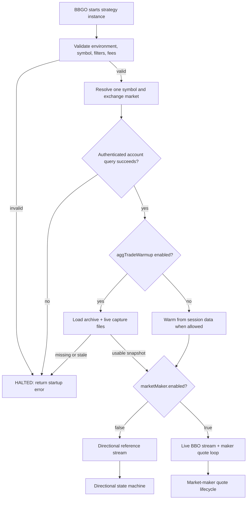
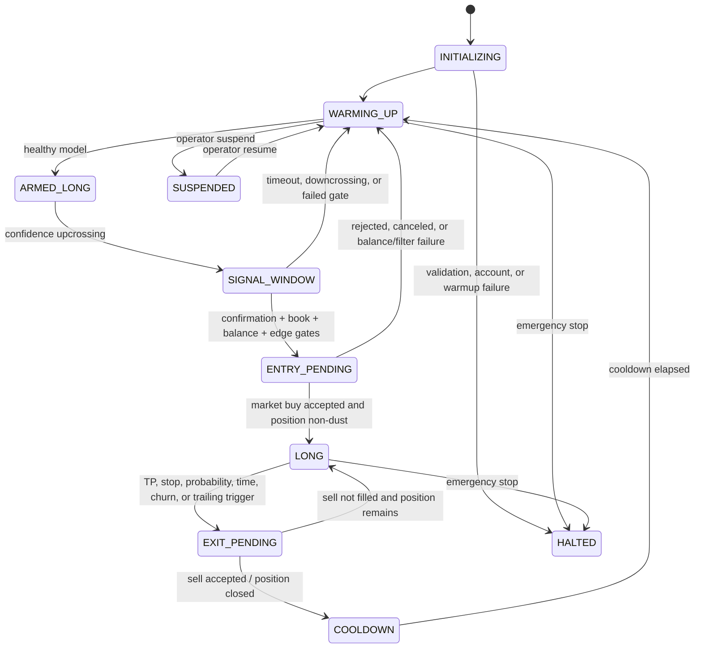
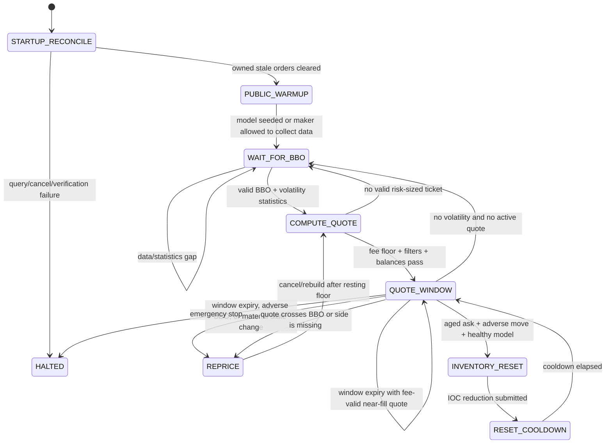
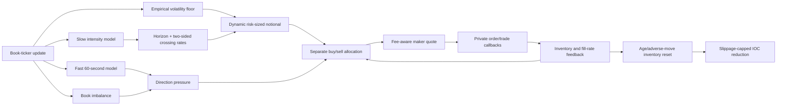

# Gamma Capture strategy (directional research and live market making)

`gammacapture` supports two deliberately separate execution paths for one JPY
market per BBGO strategy instance. The original path is a long-only,
fee-aware directional strategy driven by the crossing/intensity model. The
`marketMaker.enabled` path is a passive, two-sided Binance spot market maker
driven by live BBO updates, causal volatility, crossing rates, inventory risk,
and short-term order-book pressure. It does not consume directional entry
signals or open a position through the pivot state machine. The strategy is
registered in `pkg/cmd/strategy/builtin.go`.

`environment: live` is supported. It must be treated as an authenticated
production mode: keep the Binance API-key IP allowlist and permissions valid,
keep the aggregate-trade warmup archive current, and monitor the process for
fatal startup errors. A failed account query (for example Binance error
`-2015`) stops the process before it can quote.

## Compatibility assessment

This checkout supplies the required extension points: `SingleExchangeStrategy`
(`ID`, `InstanceID`, `Subscribe`, `Run`), `GeneralOrderExecutor`, persisted
fields, `types.Position`, `StrategyController`, and `bbgo.Sync`. Paper mode
subscribes to individual market trades and uses each trade price as a causal
reference observation. Its built-in backtester supplies closed candles, not
trades, BBO, or book deltas, so `backtest`/`replay` explicitly use one closed
candle as one *reference-price observation*. A deterministic run cannot select
`lastTrade`; this prevents a configuration that silently has no replayed input.

BBGO subscribes before a strategy's `Run` phase. As a result dynamic market
discovery must be a preflight operation that emits one allowlisted strategy
instance per eligible JPY symbol. The current strategy requires the resolved
`symbol`, rejects denylisted symbols, and accepts a selection block so generated
instances retain their discovery audit trail. A multi-symbol stream cannot share
a single `types.Position` safely.

## Architecture and state flow

The runtime is easier to audit as several related diagrams rather than one
large state machine. Configuration validation and startup are shared; after
warmup, directional mode and market-maker mode deliberately use different
decision loops.

### Mode selection and startup



For a passive maker, a non-healthy warmup snapshot can continue in
`DEGRADED`/`INSUFFICIENT_DATA` so public observations can accumulate; inventory
reset remains health-gated. Directional mode fails startup when
`requireHealthy: true` cannot be satisfied.

### Directional state machine



The directional loop consumes market trades, microprice, or closed candles
depending on environment and `referencePrice.mode`. It owns the long position,
confidence hysteresis, TP/SL passage probabilities, and gate statistics.

### Market-maker quote lifecycle



The horizon model updates every minute, but it does not cancel a healthy
resting quote merely because the calculated price changed. A quote retains its
queue position through the selected trading window. After the minimum resting
interval, a material mid-price move, order-book imbalance change, missing side,
BBO crossing, adverse BBO move, or window expiry can trigger a re-quote.
`adverseRepriceBps` is measured from the BBO captured at submission, not from
the quote's intentional distance to the current BBO.

### Event and risk feedback



The directional causal path is `market trade (paper/live) or closed candle
(deterministic replay) → reference price → CrossingEngine → IntensityModel →
finite-horizon first passage → hysteresis state → risk gate → BBGO order
executor`. Position and crossing state use BBGO persistence. Trade callbacks
reject stale timestamps and non-increasing exchange trade IDs before mutating
state.

When `marketMaker.enabled: true`, the live path is instead:
`aggregate-trade warmup → BBO update → one-minute fast model + slower model →
empirical volatility floor → fee-adjusted horizon selection → dynamic risk
notional → side allocation/distance skew → LIMIT_MAKER quotes`. Existing quote
windows are retained until their selected horizon expires, unless a quote
crosses the BBO or the BBO itself moves adversely by `adverseRepriceBps`.
The market-maker path never uses the directional entry gate to decide whether
to quote.

In paper operation, the strategy may reconstruct its crossing model from the
session's preloaded kline window. Deterministic `backtest` and `replay` modes
deliberately do not: their stores already contain the full requested range, so
preloading would leak future candles into the first simulated decision. Those
modes warm one closed candle at a time. The rolling intensity window still
deliberately discards older crossings; additional history is warm-up data, not
a way to evade its health threshold.

Each `backtest` or `replay` instance starts with a fresh position, crossing
engine, cooldown, and gate report. Persisted paper state is intentionally not
reused there: otherwise one parameter run could leak its ending state into the
next and invalidate the comparison.

## Mathematical specification and assumptions

For `Y=log(P)`, barriers are `B_k=anchor+k*h`. The engine advances only when
the observed price crosses the next adjacent barrier, counts every barrier in a
multi-observation move, and caps discontinuities. A capped move is labelled
gap-affected and resets the anchor rather than inventing unobserved crossings.
The supplied one-minute configurations set `maxCrossingsPerEvent: 1`: a candle
endpoint spanning two or more barriers does not establish the unobserved order
of those crossings, so it is treated as an uncertain gap. Paper mode receives
the ordered market-trade stream instead; an event-level configuration can use a
wider cap only after its ordering and gap handling are verified.

For a rolling window `T`, the clean-crossing estimate is
`sigma_GC = h * sqrt((N+ + N-) / T)`. Directional rates use Gamma-prior
posterior means:

`lambda+ = (alpha+ + N+) / (beta+ + T)`, and equivalently for `lambda-`.

The strategy models grid moves as a birth-death process with those rates.
`TPBeforeSL` uses uniformization to compute finite-horizon TP, SL, and
unresolved probabilities; its outputs are conserved to one. `SkellamPMF` is
provided for terminal-displacement diagnostics through a numerically stable
Poisson convolution. Neither Poisson/Skellam assumptions nor signal
upcrossings are claims of profitability; model health blocks entries until
enough clean observations exist.

Entry additionally requires a conservative resolved-path expectancy:
`P(TP) * TP_bps - P(SL) * SL_bps - all_in_cost_bps`. Unresolved paths receive
zero value rather than an optimistic drift estimate, because the later
time/probability exit is unknown at entry. This is intentionally conservative;
it does not infer an intrabar path, BBO, or fill quality from a one-minute
candle.

To prevent the candle-only backtest from chasing the very impulse that caused a
confidence upcrossing, a completed signal remains eligible for a configured
five-minute confirmation window. The submitted entry candle must have both a
range of at most 25 bps and an absolute open-to-close move of at most 15 bps.
If the signal candle itself exceeds either limit, it must also retrace 10 bps
from the signal price before confirmation. This rejects a quiet candle that is
still priced at the top of an impulse.
`stretchedSignalRetraceBps` is explicitly set in the supplied configurations;
zero disables this optional research guard.
These are deliberately conservative observation-quality filters; a production
event/BBO replay must replace them with actual spread, depth, and impact checks.

## Risk and failure modes

Directional mode submits spot market buy/sell orders. Entry size is bounded by
available quote balance, the configured symbol notional, and the hard-stop risk
budget; the hard-stop budget includes the configured round-trip execution cost.
Exit quantity comes from the BBGO long position, so a sell cannot exceed owned
base inventory. Stops and trailing decisions are measured from the actual entry
price and observed high-water price, not the crossing-grid state. The hard
price-barrier stop overrides all model decisions. Other exits are maximum
holding time, probability decline, signal downcrossing, excessive churn, and
trailing-profit reversal. Model-only soft exits do not close a small
fee-negative move: they require either a configured adverse two-barrier loss
cut or a move that has cleared the fee-aware profit floor.

Market-maker mode submits Binance `LIMIT_MAKER` orders on both sides when the
exchange filters, balances, and inventory band allow them. The common quote
notional is derived from observed volatility, the selected trading horizon,
two-sided crossing load, risk budget, and z-score; it is then reduced
independently on the riskier side using inventory, fast direction, book
imbalance, and side-specific fill rates. There is no strategy-level fixed
minimum or maximum quote-notional clamp. Account balances, symbol filters, and
`risk.maxSymbolNotionalJPY` remain hard controls. An ask is omitted when the
available base is below Binance's minimum quantity/notional, which can produce
a buy-only book while the account contains only dust.

Inventory `target` and `limit` are absolute base-asset quantities at the
current mid-price, but they are recalculated from the symbol's quote-equivalent
pair equity on every quote window. Pair equity is total quote balance plus
total base balance multiplied by the mid-price. The default target is 25% of
pair equity and the hard cap is 50%, then volatility risk and the expected
quote-ticket count can tighten both values. `inventoryRiskBudgetJPY: 10` is an
absolute floor; `inventoryRiskBudgetRatio: 0.0025` scales that adverse-move
budget to 0.25% of pair equity for larger balances. `inventoryTargetRatio` is
the target-to-cap ratio (default `0.5`), while the capital ratios make its
effective target and limit grow or shrink with deposits, withdrawals, fills,
and price changes.

The market-maker refresh policy is queue-preserving. A one-minute horizon model
update does not automatically cancel an order. A quote remains active through
its selected trading window (between 10 and 30 minutes in the supplied
configuration) and is rebuilt only after the adaptive minimum resting interval
when the window expires, the quote crosses the current BBO, a material mid-price
or imbalance change occurs, a side is missing, or the current BBO has moved
adversely by `adverseRepriceBps` from the BBO observed when the quote was
submitted. Comparing the current BBO directly with the distant quote is
incorrect and is explicitly avoided. During a temporary data/statistics gap,
an already active quote is retained through its window rather than entering a
cancel/recreate loop.

At window expiry, the strategy also applies near-fill protection: if the
existing quote is passive, remains outside the fee/adverse-selection floor, and
is at least as close to the current BBO as the replacement target, it retains
the order and its queue position. A material move, imbalance flip, missing or
unexpected side, or a quote crossing the BBO overrides this hold.

If an ask remains active while inventory is exposed, the inventory-reset policy
can submit a small slippage-capped IOC sell after the configured age/adverse
move condition. It uses the same dynamic risk-sized ticket when available,
applies a fill-intensity haircut, and has a cooldown. This is an inventory
reduction control, not a profit-taking signal.

Both paths fail closed on invalid configuration, stale/missing warmup data, or
exchange account failures. The implementation never manufactures crossings
through capped gaps. Historical aggregate trades still do not provide BBO,
depth, queue position, or this bot's private fills; market-maker research
results therefore remain sensitivity checks rather than live-fill evidence.
Startup reconciliation removes only maker orders carrying the strategy's
client-order-id prefix (or the legacy BBGO broker prefix), leaving unrelated
Binance UI orders untouched, and verifies that owned stale orders are gone
before quoting.

## Configuration and backtest

Use [config/gammacapture.yaml](../config/gammacapture.yaml). The supplied
configuration is the current SOLJPY live market-maker profile:
`environment: live`, `marketMaker.enabled: true`, `makerFeeBps: 10`,
`takerFeeBps: 10`, a six-hour intensity window, a 72-hour warmup lookback,
and a dynamically selected 10–30 minute quote window.
Durations use BBGO's `types.Duration` so YAML strings such as `30m` parse
correctly. The normal production command is:

```bash
go run ./cmd/bbgo --dotenv .env run --config config/gammacapture.yaml
```

Run it only after verifying the Binance API-key IP allowlist, trading
permissions, and the aggregate-trade archive. If account authentication fails,
BBGO stops before quoting; always verify existing exchange orders separately
after a restart.

`referencePrice.mode` defaults to `lastTrade` in paper mode and `klineClose` in
backtest/replay. Paper research may explicitly select `microprice`, calculated
from the best ask weighted by bid quantity and the best bid weighted by ask
quantity. `microprice` requires valid nonzero BBO quantities and remains
research-only until the capture has produced sufficient out-of-sample evidence.
Backtest/replay enforce `klineClose` because BBGO's standard service does not
replay market-trade or BBO callbacks. This avoids treating a candle-derived
result as a tick-level execution result.

The supplied live market-maker configuration selects `microprice`. In maker
mode each BBO update is used for quoting and also advances the causal crossing
model; the microprice is used only when both BBO quantities are valid. A maker
quote is always kept strictly outside the observed BBO, so the strategy submits
`LIMIT_MAKER` rather than crossing with a taker order.

In paper mode `lastTrade` also subscribes to the best-bid/best-ask ticker. An
entry requires a valid book ticker no older than `risk.maxBookAge` (five seconds
in the supplied configuration) and a log spread no wider than
`risk.maxSpreadBps` (10 bps). The new `book` gate appears between `retrace` and
`balance` in the gate report. Candle replay bypasses this particular gate rather
than inventing historical quotes; its configured execution-cost budget remains
conservative.

### Public BBO capture for calibration

Historical spot aggregate trades do not contain contemporaneous quotes. Capture
the same public aggregate-trade and BBO inputs used by paper/live mode without
starting a strategy, account session, or order executor:

```bash
go run ./cmd/gammacapture-capture --symbol BTCJPY --duration 2h --output data/gammacapture/live
```

The command writes separate timestamped `trades` and `bookticker` CSV files. It
is public-only and never submits an order. The BBO timestamps are local receive
times because Binance's book-ticker payload has no exchange timestamp; any
latency study must retain that distinction.

Summarize a completed (or still-growing) capture with:

```bash
go run ./cmd/gammacapture-bbo-research \
  --book data/gammacapture/live/BTCJPY-bookticker-<timestamp>.csv \
  --trades data/gammacapture/live/BTCJPY-trades-<timestamp>.csv \
  --max-spread-bps 10 --max-book-age 5s
```

The initial, still-growing live sample measured a 0.54-bps median spread,
1.22-bps 95th percentile, and 2.21-bps maximum; every observed quote was
within the 10-bps cap. Its 95th-percentile trade-to-last-BBO age was 1.95
seconds, 96.49% of trades passed the five-second book-age condition, and one
trade was 19.55 seconds after the preceding quote. The stale-book gate is
therefore an execution-safety control rather than a redundant spread check.

### AggTrade startup warmup

The live configuration now enables `aggTradeWarmup`. Before the strategy marks
itself running, it loads the configured recent archive from
`data/gammacapture/binance/<SYMBOL>/aggTrades` (and matching files under
`livePath`), replays only the crossing engine, intensity model, and maker
horizon observations, and never submits historical orders. Missing or stale
data always fails startup. With `requireHealthy: true`, an unhealthy snapshot
also fails directional mode; passive market-maker mode may start in
`DEGRADED`/`INSUFFICIENT_DATA` and continue collecting public observations, but
its directional inventory-reset decisions remain health-gated.

```yaml
aggTradeWarmup:
  enabled: true
  path: data/gammacapture
  livePath: data/gammacapture/live
  lookback: 72h
  maxAge: 72h
  requireHealthy: true
```

Keep the archive current before launching the bot, for example by downloading
the latest completed Binance Vision days:

```bash
go run ./cmd/gammacapture-data \
  --output data/gammacapture --symbol SOLJPY \
  --from 2026-07-10 --to 2026-07-15
```

The archive's aggregate trades are public market executions. They are not the
bot's private order/fill history; private fills still come from the account
stream and order reconciliation. They are nevertheless sufficient to make the
price/intensity model ready before the first live market event.

`gammacapture-data --from ... --to ...` is a bounded historical download; its
`to` value does not schedule future downloads. For an always-ready live
process, run the public capture job separately (writing under
`data/gammacapture/live`) and periodically append completed Vision archive
days. The warmup loader reads both locations on the next restart.

### Raw trade/BBO fast evidence

The maker path records a separate causal evidence window from public trades and
book-ticker updates. `fastWindow` remains the short response horizon for the
crossing model; sparse JPY profiles can set `fastEvidenceWindow` longer (the
supplied SOLJPY profile uses 10 minutes) so a 20-trade coverage threshold is
not evaluated as if the market were BTCUSDT-like. The live capture archive is
used to warm this raw window on restart, while the live stream remains the
authoritative continuation. It reports trade count, signed notional imbalance,
queue imbalance, mid-return, realized BBO volatility, and evidence age alongside
the crossing model. This layer is observational: `fastEvidenceHealth` does not
override `fastHealth` and is not a profitability claim.

The diagnostics also report the fee-aware quantities explicitly:

* `roundTripMakerFeeBps` is two maker legs (10 bps per leg is 20 bps round trip);
* `quoteEdgeAfterFeesBps` subtracts both maker fees from the two-sided quote distance;
* `quoteNetEdgeBps` additionally subtracts adverse selection and the configured
  minimum net edge.

Raw evidence must be validated out of sample with private fills, markouts, and
all fees before it is allowed to relax degraded quoting.

### Fees and minimum edge

The backtest account schema is `makerFeeRate` and `takerFeeRate` (not
`makerCommission` / `takerCommission`). The supplied configuration uses
`0.1%` (10 bps) for both maker and taker fees. Directional market-order entry
and exit therefore budget 20 bps in fees per round trip. Passive maker quotes
use the maker rate when estimating edge; inventory-reset IOC orders use the
taker rate. Replace these values with the rates returned for this account and
symbol by Binance before using a report for a trading decision; account tier,
BNB payment settings, and temporary pair promotions can change them.

`risk.estimatedCostBps: 30` is deliberately more conservative than the 20 bps
fee-only calculation, retaining 10 bps for spread/slippage. The strategy then
requires `minimumNetEdgeBps: 15` after that cost budget, delaying trailing
profit exits until at least four 10-bps barriers have been retained. Soft model
exits are disabled for the initial five minutes; hard stops and the maximum
holding limit remain immediate. These controls reject known fee-negative
setups; they do not guarantee a profit.

When assessing a BBGO report, use `finalEquityValue` (or final JPY balance) as
the net result. The built-in `totalProfit` field is calculated from the
average-cost P&L report and does not subtract the commission rows in
`trades.tsv`; it must not be treated as fee-inclusive performance.

### Hyperparameter optimization

BBGO's native `hoptimize` command is useful for generating bounded candidate
sets, but its objective must be `equity`, **not** `profit`. `profit` optimizes
`summary.totalProfit`, which excludes recorded commission; `equity` maximizes
`finalEquityValue - initialEquityValue` and is the fee-inclusive measure used
for promotion decisions. The supplied optimizer files therefore use
`objectiveBy: equity`.

The following is a directional candle/replay example only; it is not the live
SOLJPY market-maker configuration:

```bash
go run ./cmd/bbgo --dotenv .env hoptimize \
  --config config/gammacapture-research-h2-train.yaml \
  --optimizer-config config/gammacapture-hyperopt-train.yaml \
  --output /private/tmp/gammacapture-hyperopt --json --json-keep-all
```

The bounded search varies only causal candle-replay parameters: initial TP
distance (5--9 barriers), entry probability (0.58--0.70), and the residual
edge requirement (0--20 bps). It deliberately does not independently vary
hard and soft stops, because the configuration invariant requires
`softStopBarriers < hardStopBarriers`; paired stop candidates need a separate,
prevalidated sweep.

The exact historical TPE, turnover, barrier-selection, and event-calibration
figures previously recorded in this section have been removed. They were
generated before the capture-side process was included, used older fee
assumptions in some runs, and are not valid evidence for the current live
market-maker path. Do not compare those old candle-only numbers with current
SOLJPY live observations.

`objectiveBy: equityWithTurnover` and `minimumRoundTurns` remain available for
directional candle/replay experiments. They are anti-zero-trade constraints,
not profitability guarantees. A fresh directional `hoptimize` run must publish
its config, fee rates, date ranges, trial count, final-equity objective, and a
frozen holdout before any result is considered for promotion.

Entry selection now also enforces a gross-range floor. With
`minimumRangeBps: 0`, the required target excursion is derived as
`estimatedCostBps + minimumNetEdgeBps`; an explicit larger value can be used
when spread/slippage is expected to be worse. The sequential gate report now
includes `range`, `max_range_bps`, and its pass rate, so a rejected trade is
distinguished from one that merely failed the probability model.

The position state also persists causal feedback after each strategy exit:
predicted TP probability, fee-adjusted realized return, positive/negative exit
counts, and the last exit reason. It is a calibration scorecard, not an
automatic probability rewrite; the model will not be changed from a handful of
trades without an independent validation sample.

The current live path cannot be evaluated by native candle-only `hoptimize`:
the capture-side market maker needs historical BBO, visible depth, queue
position, and private fill reconciliation. The aggregate-trade/BBO research
runner below is the current replacement for a stale maker backtest, but its
queue model is still a proxy.

Do not use the live `config/gammacapture.yaml` with the candle backtester as a
market-maker performance claim: the backtester has no historical BBO, depth,
queue, or private fill stream. For a directional trade-derived replay, use
`config/gammacapture-aggtrades.yaml` and the command in the next subsection;
for the current maker path, use `gammacapture-mm-research` with captured BBO.
A new fee-inclusive report must be generated after every strategy or fee
change before publishing performance numbers.

The `gammacapture:*:gatestats.tsv` report is a sequential funnel. In addition
to `healthy`, it records raw upcrossings before health, current
`probability_ready` bars, confirmed signal windows, probability, expected-edge,
bar-quality, optional trend, retrace, BBO book, balance, quantity, and entry gates. It
also emits `eligible_after_cooldown` and an explicit percentage denominator for
every sequential gate, so rates do not need to be reconstructed manually.

The current capture-side calibration (run on 2026-07-21) used SOLJPY
aggregate trades from 2026-07-01 through 2026-07-14 for training and a
2026-07-14 through 2026-07-21 holdout. It observed 478,780 BBO events over
90.34 hours and 44,708 aggregate trades. The selected research candidate was
1-bps nominal half-spread, inventory skew 10 bps, and volatility multiplier
0.05. Training produced 950 synthetic fills (73.08/day) and −¥33,700 net;
the 200-fills/day activity target was not met. The BBO holdout produced 100
proxy fills (35 buys, 65 sells), 99.97% quote uptime, 291 seconds average quote
life, 13.66 bps average quoted half-spread, ¥2,272.82 estimated maker fees,
and +¥1,778.34 proxy net P&L (26.57 fills/day). The result is not stable-profit
evidence: the capture had 29 up-crossings and 7 down-crossings (the usability
threshold requires at least 50 of each), median spread 1.63 bps, 95th-percentile
spread 4.87 bps, and only 0.028% of BBO observations wider than the 20-bps
round-trip fee floor. Queue position is estimated from visible BBO size and
aggressive trade volume rather than exchange-confirmed fills.

The full JSON report for that run is `/tmp/gammacapture-mm-soljpy-latest.json`.
It is a calibration snapshot only and was not copied into the live YAML.

### Aggregate-trade replay

`config/gammacapture-aggtrades.yaml` uses real public Binance Vision
aggregate-trade archives rather than the SQLite candle service. Fetch and run
it as follows:

```bash
go run ./cmd/gammacapture-data --output data/gammacapture --symbol BTCJPY --from 2026-01-01 --to 2026-07-13
go run ./cmd/bbgo --dotenv .env backtest --csv --config config/gammacapture-aggtrades.yaml --sync --base-asset-baseline --output apps/backtest-report/public/output --subdir
```

The configured CSV `path` keeps raw data separate from the generated report.
BBGO's existing CSV backtester converts the chronological aggregate trades to
the configured bar interval (one minute in the supplied replay config), so every
reference candle is sourced from actual trades. It does **not** yet emit every trade event or historical spot best-bid/
best-ask updates. Consequently, this is a higher-fidelity trade-derived replay,
not a claim of tick/BBO execution fidelity.

The supplied configuration uses a two-hour intensity window with
`minEvents: 10`, so the strategy's `HEALTHY` state requires 20 clean crossings
over two hours. The CSV backtest feed filters emitted bars to
`backtest.startTime` through `backtest.endTime`; deterministic replay therefore
warms naturally after the requested start rather than consuming a future-loaded
session store.

### Aggregate-event calibration

`cmd/gammacapture-event-research` reads the same archive one aggregate trade at
a time. It is a calibration tool, not an execution simulator: it assumes fills
at observed trade prices and does not model BBO depth or queue position.

```bash
go run ./cmd/gammacapture-event-research --from 2026-01-01 --to 2026-06-01
go run ./cmd/gammacapture-event-research --from 2026-06-01 --to 2026-07-13
```

For the tested two-hour, 8-barrier target / 2-barrier stop hypothesis, the
event-level training interval had 17 qualified entries, 4 target hits, 13 stop
hits, and −¥984 after 15 bps actual taker fees. The untouched holdout had four
entries and +¥309, which is far too small to outweigh the failed training
calibration. This hypothesis is therefore research-only and is not promoted to
the supplied strategy configuration.

The historical directional 6-barrier TP / 3-barrier hard-stop, 15-minute
prediction, and 30-bps all-in-cost specification was also evaluated on the ordered aggregate
trades. From 2026-01-01 through 2026-06-01 it had 12,750,790 healthy event
observations, two healthy upcrossings, and 1,027 confirmed probability bars;
all failed the required extra 15-bps expected-edge gate. Setting that extra
edge requirement to zero admitted one trade, which hit its stop for −¥226 net.
The frozen 2026-06-01 through 2026-07-13 interval had no probability-qualified
trade even with the zero-extra-edge experiment. Thus neither the current gate
nor its looser counterpart has evidence for a TP/stop promotion.

### Independent price and lead-lag checks

Two deliberately separate, closed-price checks were used to look for missing
trade classes before changing the live algorithm. These historical rejection
checks charged a 15 bps round-trip taker fee (the current profile uses 20 bps
fee-only), and used non-overlapping positions on the 2026-01-01 to
2026-06-01 training interval. They are rejection tests, not parameter searches:

* One-hour long momentum, a 100-bps target, and a 50-bps loss cut made 246
  trades and lost 13.13 bps per trade after fees. Slower (four-hour and daily)
  lookbacks and wider targets were also negative.
* One-hour long mean reversion after a 100-bps drawdown, with the same target
  and loss cut, made 299 trades and lost 8.46 bps per trade after fees. Its
  wider-target and slower variants were likewise negative.
* A BTCUSDT closed-bar lead signal did not clear cost even before fees: its best
  tested five-minute bucket averaged about 2.9 gross bps per trade, versus 15
  bps in fees alone.

Consequently no directional, mean-reversion, or cross-market rule is enabled
in `gammacapture`, and the TP/loss-cut parameters are not loosened merely to
make orders appear. The failed aggregate-event calibration also means that a
reported first-passage TP probability is not yet a calibrated trading
probability. A promotion now requires a frozen, fee-inclusive out-of-sample
result with enough independent entries, preferably using historical spot BBO
and depth so spread, impact, and fill selection are observable.

### Market-making policy and training

The quote policy is separated from the pivot-entry logic in
`pkg/strategy/gammacapture/market_maker.go`. It charges a fee and
adverse-selection floor, widens quotes with a causal volatility feature, and
skews both sides against inventory. It also selects the quote horizon each
minute from multi-minute crossing spacing and distance statistics, applies a
symbol-specific empirical volatility floor, allocates buy and sell notionals
separately, and smooths those allocations to avoid one-minute size flips. It
suppresses a side at the inventory/filter limit and never intentionally crosses
the observed BBO.

The supplied live SOLJPY profile uses a 10 bps maker/taker fee assumption, a
10–30 minute selected quote window, a 20 bps adverse-BBO reprice threshold, and a 20-second
minimum refresh floor. `refreshInterval` is only a fallback/cap: the actual
resting interval is estimated from the selected spread and observed volatility.
The strategy records the BBO at quote submission; `adverseRepriceBps` is
measured against that reference BBO, not against the quote price itself. This
prevents a deliberately distant quote from being canceled immediately. Quote
cancellation/recreation is deferred until the minimum resting interval for
these refresh signals, which prevents per-tick cancel/re-submit churn.

On restart, `startupCancelStaleOrders` removes only orders carrying the
strategy-owned client-order-id prefix and verifies the exchange no longer
reports them. If Binance rejects account authentication, reconciliation fails
closed and the strategy does not start.

The research runner performs a small train grid and a separate holdout run:

```bash
go run ./cmd/gammacapture-mm-research \
  --data data/gammacapture/binance/SOLJPY/aggTrades \
  --symbol SOLJPY \
  --train-from 2026-07-01 --train-to 2026-07-14 \
  --holdout-from 2026-07-14 --holdout-to 2026-07-21 \
  --bbo-data data/gammacapture/live \
  --maker-fee-bps 10 --adverse-selection-bps 2 \
  --minimum-net-edge-bps 2 --min-fills-per-day 200 \
  > /tmp/gammacapture-mm-soljpy.json
```

The current archive has no historical BBO, depth, or queue position. The
runner therefore places one quote per side at the start of each 1m bar and
permits at most one fill per side when that bar's high/low crosses the quote.
The JSON marks this as `historicalBBOAvailable: false`; it is a research
sensitivity check, not live-fill evidence. The trainer now includes a
`fillsPerDay` turnover objective. If the holdout cannot sustain the requested
turnover, it must be reported as a volatility/data limitation rather than
fixed by claiming better fills. The starting YAML is
`config/gammacapture-mm-research.yaml`; this research simulator remains
separate from the live execution path in `config/gammacapture.yaml`.

For live calibration, capture public aggregate trades and BBO together:

```bash
go run ./cmd/gammacapture-capture \
  --symbol SOLJPY --duration 24h --output data/gammacapture/live
go run ./cmd/gammacapture-bbo-research \
  --book data/gammacapture/live/SOLJPY-bookticker-<timestamp>.csv \
  --trades data/gammacapture/live/SOLJPY-trades-<timestamp>.csv \
  --max-spread-bps 10 --max-book-age 5s
```

These files provide public price/quote and trade-age statistics, but not queue
position or the bot's private fills. Treat fill counts from the 1m synthetic
runner as a sensitivity range until authenticated order/trade reconciliation
has produced a sufficiently large SOLJPY sample.

`researchForceEntry` is available only for an explicitly marked replay/backtest
replay-only. It bypasses model, signal, and expected-edge *entry* gates so the
BBGO matching path can be verified; it is rejected for paper and live modes and
does not bypass balance, market-minimum, or exit controls. Do not use the P&L
from an experiment that enables it as strategy-performance evidence. The supplied configuration leaves it disabled.

## Telegram schema and command flow

BBGO's normal notifier remains bound through `GeneralOrderExecutor` order/trade
notifications. A production `RuntimeReporter` must emit immutable snapshots
with version/commit, mode, connectivity, data age, model health, barrier state,
TP/SL probabilities, current position, orders, JPY exposure, and JST timestamp.
State-changing Telegram commands must be authenticated, serialized through the
strategy control channel, and require expiring single-use confirmations for
flatten/kill. The current code does **not** expose those commands, therefore it
is not an operator-ready Telegram deployment.
