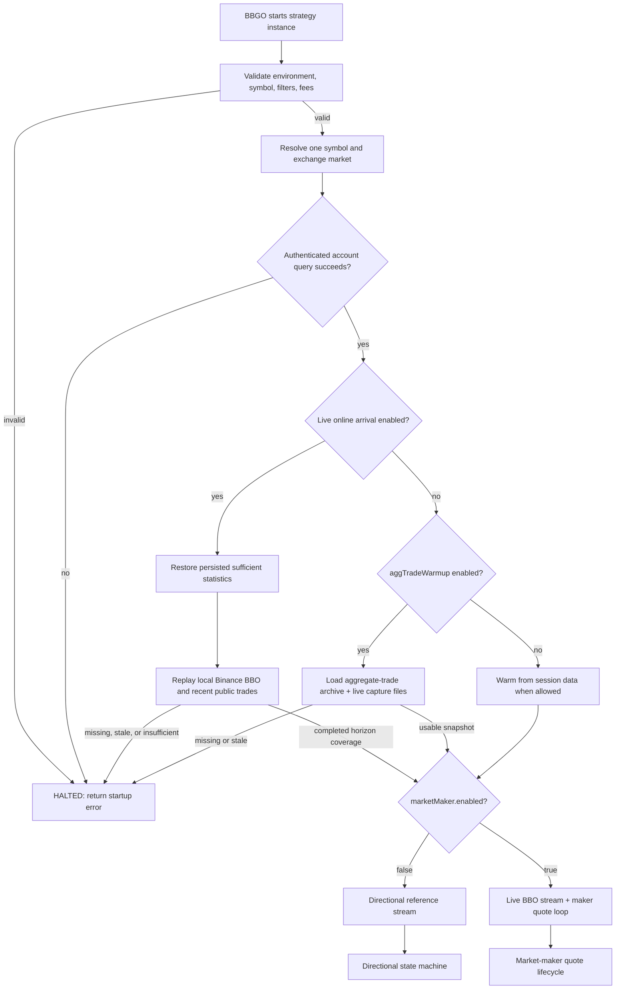
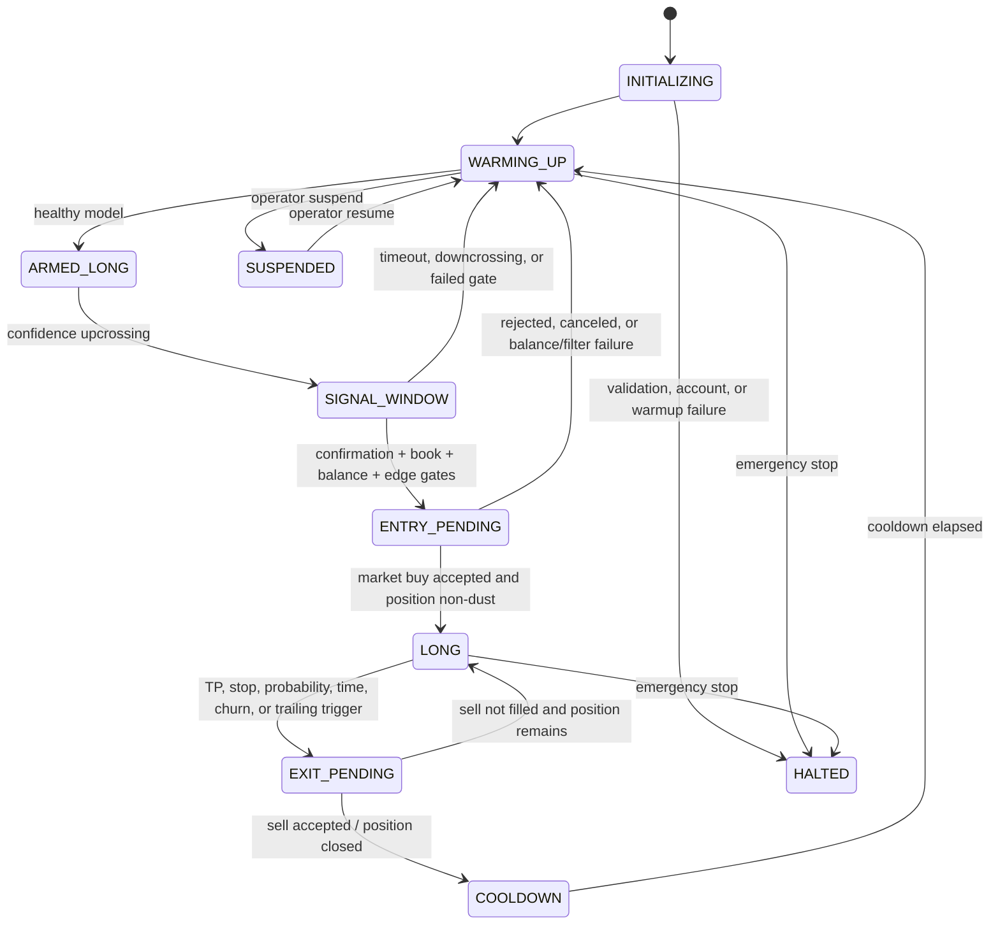

# Gamma Capture strategy (directional research and live market making)

`gammacapture` supports two deliberately separate execution paths for one JPY
market per BBGO strategy instance. The original path is a long-only,
fee-aware directional strategy driven by the crossing/intensity model. The
`marketMaker.enabled` path is a passive, two-sided Binance spot market maker
driven by live BBO updates, causal volatility, crossing rates, inventory risk,
and short-term order-book pressure. It does not consume directional entry
signals or open a position through the pivot state machine. The strategy is
registered in `pkg/cmd/strategy/builtin.go`.

`environment: live` is supported. It must be treated as an authenticated
production mode: keep the Binance API-key IP allowlist and permissions valid,
monitor persisted online-model synchronization, and monitor the process for
fatal startup errors. The supplied maker profile does not require a historical
archive or pre-trained artifact. A failed account query (for example Binance error
`-2015`) stops the process before it can quote.

## Compatibility assessment

This checkout supplies the required extension points: `SingleExchangeStrategy`
(`ID`, `InstanceID`, `Subscribe`, `Run`), `GeneralOrderExecutor`, persisted
fields, `types.Position`, `StrategyController`, and `bbgo.Sync`. Paper mode
subscribes to individual market trades and uses each trade price as a causal
reference observation. Its built-in backtester supplies closed candles, not
trades, BBO, or book deltas, so `backtest`/`replay` explicitly use one closed
candle as one *reference-price observation*. A deterministic run cannot select
`lastTrade`; this prevents a configuration that silently has no replayed input.

BBGO subscribes before a strategy's `Run` phase. As a result dynamic market
discovery must be a preflight operation that emits one allowlisted strategy
instance per eligible JPY symbol. The current strategy requires the resolved
`symbol`, rejects denylisted symbols, and accepts a selection block so generated
instances retain their discovery audit trail. A multi-symbol stream cannot share
a single `types.Position` safely.

## Architecture and state flow

The runtime is easier to audit as several related diagrams rather than one
large state machine. Configuration validation and startup are shared; after
warmup, directional mode and market-maker mode deliberately use different
decision loops.

### Mode selection and startup



The supplied live Binance maker profile requires fresh historical BBO and
enough completed 10/15/30-minute windows before order handling begins, so a
restart cannot silently fall back to a cold quote model. Profiles that set
`requireStartupHistory: false` may continue from persisted or empty state, but
inventory reset remains health-gated. Directional aggregate-trade mode still
uses its separate `requireHealthy` gate.

### Directional state machine



The directional loop consumes market trades, microprice, or closed candles
depending on environment and `referencePrice.mode`. It owns the long position,
confidence hysteresis, TP/SL passage probabilities, and gate statistics.

### Market-maker quote lifecycle

```mermaid
stateDiagram-v2
  [*] --> STARTUP_RECONCILE
  STARTUP_RECONCILE --> PUBLIC_WARMUP: owned stale orders cleared
  STARTUP_RECONCILE --> HALTED: query/cancel/verification failure
  PUBLIC_WARMUP --> WAIT_FOR_BBO: model seeded or maker allowed to collect data
  WAIT_FOR_BBO --> COMPUTE_QUOTE: valid BBO + volatility statistics
  WAIT_FOR_BBO --> WAIT_FOR_BBO: data/statistics gap
  COMPUTE_QUOTE --> QUOTE_WINDOW: fee floor + filters + balances pass
  COMPUTE_QUOTE --> WAIT_FOR_BBO: no valid risk-sized ticket
  QUOTE_WINDOW --> QUOTE_WINDOW: ordinary BBO update inside window
  QUOTE_WINDOW --> REPRICE: window expiry, adverse BBO, or material state change
  QUOTE_WINDOW --> REPRICE: quote crosses BBO or side is missing
  QUOTE_WINDOW --> INVENTORY_RESET: aged ask + adverse move + healthy model
  INVENTORY_RESET --> QUOTE_WINDOW: IOC submitted; only another reset is cooldown-gated
  REPRICE --> COMPUTE_QUOTE: cancel/rebuild after resting floor
  QUOTE_WINDOW --> WAIT_FOR_BBO: no volatility and no active quote
  QUOTE_WINDOW --> HALTED: emergency stop
```

The horizon model updates every minute, but it does not cancel a healthy
resting quote merely because the calculated price changed. Order retention uses
the same executable first-passage clock as quote risk. For each side, touch
distance includes the current spread and its own executable-price volatility:
`tau_buy = (d_ask_to_bid_quote / sigma_ask)^2` and
`tau_sell = (d_ask_quote_to_bid / sigma_bid)^2`. The paired quote uses the
later side time and the statistically selected horizon, then rounds upward to a
configured horizon with measured arrivals. The configured maximum remains a
hard exposure cap.

The paired quote window uses the farther admissible ordinary side distance. The
mark-to-market equity floor is relative to the live mark, so it cannot create the
very large, static retention distance produced by an accounting-cost floor. Pricing volatility, inventory
risk, crossing-rate lookup, and expiry all use the resulting keep horizon. An
ordinary mid-price, adverse-distance, or imbalance observation cannot cancel
the quote before that horizon; those movements are the first-passage path the
order is waiting for. A crossed quote, inventory/side-policy violation, missing
side, private maker execution, or explicit early-bump transition remains
a hard lifecycle action. A side is considered missing only if its balance and
post-allocation notional pass the exchange minimum-notional and minimum-quantity
filters; an impossible 8-JPY bid, for example, cannot churn a valid ask. L1
imbalance changes otherwise remain telemetry because they were true on 84.7%
of live evaluations and destroyed queue priority without discriminating unusual
states.
`adverseRepriceBps` is measured from the BBO captured at submission, not from
the quote's intentional distance to the current BBO.

### Executable-price model (v2)

Market-making volatility and public-touch likelihood are side-specific. A
passive buy is observable from the best-ask path and a passive sell is
observable from the best-bid path:

~~~text
buy volatility  = sqrt(sum(log(ask[t]/ask[t-1])^2) / sum(delta_t))
sell volatility = sqrt(sum(log(bid[t]/bid[t-1])^2) / sum(delta_t))

buy touch  iff min(future ask) <= submitted bid quote
sell touch iff max(future bid) >= submitted ask quote
~~~

The estimator uses BBO points at most once per second, rejects intervals across
a declared outage or longer than two minutes, and keeps quiet elapsed time in
the denominator. The former estimator discarded zero returns and took a
quantile conditional on a move; on a sparse symbol that was not a per-unit-time
volatility and could systematically widen quotes.

Quote distance and touch distance are intentionally different. The strategy
edge is the submitted ask-to-bid distance; the public path must additionally
cross the current spread:

~~~text
buyTouchDistance  = log(currentAsk / bidQuote)
sellTouchDistance = log(askQuote / currentBid)
grossQuoteEdge    = log(askQuote / bidQuote)
~~~

The spread is therefore part of passage/fill difficulty, but never counted as
strategy profit. Buy and sell short-window estimates are separately shrunk
toward their longer BBO baselines in variance space. Their conservative maximum
sizes inventory and determines the paired lifetime, while each side's own
estimate determines its quote width. Microprice barrier crossings remain
available for directional probability only; they no longer enter quote or
inventory volatility.

Online-arrival state version 2 resolves the same executable events at every
horizon/distance bucket. Version-1 midpoint cells are discarded and rebuilt
causally from local BBO capture on startup. A legacy aggregate-trade archive has
no spread, so it may warm the directional model but is only a synthetic
zero-spread compatibility input for maker statistics. Horizon-touch artifacts
now require priceBasis executable-bbo; midpoint-labeled v1 artifacts are
rejected and the legacy SQLite trainer is explicitly non-deployable until it
trains on executable BBO labels.

A read-only July BBO audit compared non-overlapping ten-minute midpoint touches
with executable touches. The largest mismatch occurred at the closest quote
distance:

| symbol | distance | midpoint buy / executable buy | midpoint sell / executable sell |
| --- | ---: | ---: | ---: |
| BTCJPY | 15 bps | 150 / 149 | 146 / 145 |
| ETHJPY | 15 bps | 257 / 257 | 233 / 233 |
| XRPJPY | 15 bps | 244 / 228 | 200 / 184 |
| SOLJPY | 15 bps | 431 / 409 | 396 / 382 |
| XRPJPY | 30 bps | 58 / 56 | 53 / 48 |
| SOLJPY | 30 bps | 119 / 112 | 104 / 100 |

These are public touch proxies, not private fills or a PnL claim. They do
demonstrate that midpoint labeling overstated close-quote arrival most on the
wider/discrete-tick XRPJPY and SOLJPY samples; the error diminished at larger
distances.

### Event and risk feedback


The directional causal path is `market trade (paper/live) or closed candle
(deterministic replay) → reference price → CrossingEngine → IntensityModel →
finite-horizon first passage → hysteresis state → risk gate → BBGO order
executor`. Position and crossing state use BBGO persistence. Trade callbacks
reject stale timestamps and non-increasing exchange trade IDs before mutating
state.

When `marketMaker.enabled: true`, the live path is instead:
`persisted online state or empty cold start → BBO update → medium-term
(10-minute) ask/bid execution models + slower ask/bid priors → side-wise
variance shrinkage → explicit 10-minute
window → joint quote policy → hard inventory/balance projection → LIMIT_MAKER
quotes`. The joint policy combines normalized inventory, direction, book
imbalance, volatility, fees, and side crossing hazards once into a signed
pressure; that pressure simultaneously determines reservation-price shift,
bid/ask distance, and bid/ask notional factors. Legacy skew/allocation
coefficients remain decode-compatible but are not read by the active path.
Existing quote
windows are retained until their selected horizon expires, unless a quote
crosses the BBO or the BBO itself moves adversely by `adverseRepriceBps`.
The market-maker path never uses the directional entry gate to decide whether
to quote.

For live market-maker instances, `marketMaker.accountSyncInterval` (default `60s`)
queries the authenticated exchange account periodically. The refresh treats total
base/quote balances as the source of truth for quoteable capital, logs available,
locked, and total JPY/base, and reconciles any non-rounding base-quantity drift into
the persisted position. It deliberately preserves the existing fee-adjusted
average cost because an account snapshot cannot infer the cost of an external
deposit. A successful refresh immediately re-evaluates the latest fresh BBO; a
failed refresh leaves the last snapshot unchanged and does not submit orders.

In paper operation, the strategy may reconstruct its crossing model from the
session's preloaded kline window. Deterministic `backtest` and `replay` modes
deliberately do not: their stores already contain the full requested range, so
preloading would leak future candles into the first simulated decision. Those
modes warm one closed candle at a time. The rolling intensity window still
deliberately discards older crossings; additional history is warm-up data, not
a way to evade its health threshold.

Each `backtest` or `replay` instance starts with a fresh position, crossing
engine, cooldown, and gate report. Persisted paper state is intentionally not
reused there: otherwise one parameter run could leak its ending state into the
next and invalidate the comparison.

## Mathematical specification and assumptions

For `Y=log(P)`, barriers are `B_k=anchor+k*h`. The engine advances only when
the observed price crosses the next adjacent barrier, counts every barrier in a
multi-observation move, and caps discontinuities. A capped move is labelled
gap-affected and resets the anchor rather than inventing unobserved crossings.
The supplied one-minute configurations set `maxCrossingsPerEvent: 1`: a candle
endpoint spanning two or more barriers does not establish the unobserved order
of those crossings, so it is treated as an uncertain gap. Paper mode receives
the ordered market-trade stream instead; an event-level configuration can use a
wider cap only after its ordering and gap handling are verified.

For a rolling window `T`, the clean-crossing estimate is
`sigma_GC = h * sqrt((N+ + N-) / T)`. Directional rates use Gamma-prior
posterior means:

`lambda+ = (alpha+ + N+) / (beta+ + T)`, and equivalently for `lambda-`.

The strategy models grid moves as a birth-death process with those rates.
`TPBeforeSL` uses uniformization to compute finite-horizon TP, SL, and
unresolved probabilities; its outputs are conserved to one. `SkellamPMF` is
provided for terminal-displacement diagnostics through a numerically stable
Poisson convolution. Neither Poisson/Skellam assumptions nor signal
upcrossings are claims of profitability; model health blocks entries until
enough clean observations exist.

Entry additionally requires a conservative resolved-path expectancy:
`P(TP) * TP_bps - P(SL) * SL_bps - all_in_cost_bps`. Unresolved paths receive
zero value rather than an optimistic drift estimate, because the later
time/probability exit is unknown at entry. This is intentionally conservative;
it does not infer an intrabar path, BBO, or fill quality from a one-minute
candle.

To prevent the candle-only backtest from chasing the very impulse that caused a
confidence upcrossing, a completed signal remains eligible for a configured
five-minute confirmation window. The submitted entry candle must have both a
range of at most 25 bps and an absolute open-to-close move of at most 15 bps.
If the signal candle itself exceeds either limit, it must also retrace 10 bps
from the signal price before confirmation. This rejects a quiet candle that is
still priced at the top of an impulse.
`stretchedSignalRetraceBps` is explicitly set in the supplied configurations;
zero disables this optional research guard.
These are deliberately conservative observation-quality filters; a production
event/BBO replay must replace them with actual spread, depth, and impact checks.

### Prior-range breakout regime overlay (research note)

The fixed log-price crossing grid does not by itself identify a break of a
previous rolling high or low. A range breakout must therefore be modeled as a
separate causal episode, not as an extra ordinary crossing and not as an
instruction to reset the grid immediately. The literature supports two
competing outcomes at salient levels: support/resistance can interrupt or
reverse an intraday trend, while clustered stop orders can propagate a genuine
break into a price cascade. See Carol Osler, *Support for Resistance:
Technical Analysis and Intraday Exchange Rates* (Federal Reserve Bank of New
York, 2000), *Stop-Loss Orders and Price Cascades in Currency Markets* (Federal
Reserve Bank of New York Staff Report 150), Huddart, Lang, and Yetman, *Volume
and Price Patterns Around a Stock's 52-Week Highs and Lows*, and Cont, Kukanov,
and Stoikov, *The Price Impact of Order Book Events*.

The executable boundaries must be side-specific. For a causal lookback L, the
upper boundary is the maximum historical best bid and the lower boundary is the
minimum historical best ask, excluding the current observation:

    U(t) = max bid(s) and D(t) = min ask(s), for s in [t-L,t).

An upward breakout candidate requires bid(t) > U(t); a downward candidate
requires ask(t) < D(t). Mid or microprice may remain latent directional
features, but must not replace executable BBO labels. A breakout episode is
resolved by competing first passages: continuation to a volatility-normalized
extension, re-entry through the old boundary plus a microstructure-noise
margin, or unresolved at the selected 10/15/30-minute horizon. Repeated BBO
updates outside the range belong to one episode and must not be counted as
independent observations.

The initial online model should combine a shrinkage-aware Beta posterior for
continuation versus re-entry with a Bayesian online changepoint probability.
It keeps the old slow posterior and a shadow post-break posterior concurrently:

    lambda(t) = (1-pRegime(t))*lambdaOld + pRegime(t)*lambdaPostBreak.

Candidate features are normalized penetration, occupation time outside the
range, boundary age, executable-side horizon volatility, spread, depth-scaled
OFI, and the abnormal-volume absorption/decay state. Raw public volume alone is
not a directional claim. Symbols and sides should share hierarchical priors so
sparse JPY pairs do not require many brittle bins. The model needs no offline
artifact: startup BBO replay warms every candidate lookback and live
observations continue the same posterior.

The overlay outputs exactly one breakout drift, mixture variance, and
side-specific toxicity estimate to the joint quote policy. Drift shifts the
reservation price, mixture variance widens risk, and toxicity changes the
affected side's distance and size. The same evidence must not be applied again
through independent price, quantity, and hard-allow multipliers. Hard gates
remain limited to balance, inventory safety, and exchange feasibility.
Unresolved candidates keep the two-sided quote loop running; they do not
trigger a cold reset or blanket cancellation.

A directional action is fee-admissible only when the posterior expected value
is positive after the complete round trip. With continuation gain G,
failed-break loss L, and all-in cost C, the required probability is

    pContinuation > (L+C)/(G+L).

The live profile's 10-bps maker fee on each side gives a 20-bps fee floor
before adverse selection and queue uncertainty, offset only by spread actually
captured. Deployment should require a positive lower credible bound for
expected value, not merely pContinuation > 0.5.

Breakout timing must be coherent with the maker horizon. A detector using a
five-minute peak-to-current drawdown can miss a slower 10--30-minute decline:
by the time a rebound confirms, the causal peak may already have left the
five-minute buffer. Breakout and early-rebound studies must therefore maintain
10-, 15-, and 30-minute extrema in parallel and select them by prequential
calibration/fee-adjusted value. Order retention may preserve queue priority,
but a statistically confirmed regime or urgency transition must be able to
request one bounded reprice inside the normal keep window without creating a
per-BBO cancel loop.

Validation uses de-clustered causal episodes and executable BBO paths for
BTCJPY, ETHJPY, XRPJPY, and SOLJPY. Walk-forward reports must include Brier
score/log loss, continuation and re-entry calibration, next-15-minute-pivot
markout, fill proxy, trades per hour, fee-adjusted PnL, and drawdown. A model
that fails to improve holdout expected value remains a risk/toxicity overlay
and must not become breakout alpha.

## Risk and failure modes

Directional mode submits spot market buy/sell orders. Entry size is bounded by
available quote balance, the configured symbol notional, and the hard-stop risk
budget; the hard-stop budget includes the configured round-trip execution cost.
Exit quantity comes from the BBGO long position, so a sell cannot exceed owned
base inventory. Stops and trailing decisions are measured from the actual entry
price and observed high-water price, not the crossing-grid state. The hard
price-barrier stop overrides all model decisions. Other exits are maximum
holding time, probability decline, signal downcrossing, excessive churn, and
trailing-profit reversal. Model-only soft exits do not close a small
fee-negative move: they require either a configured adverse two-barrier loss
cut or a move that has cleared the fee-aware profit floor.

Market-maker mode submits Binance `LIMIT_MAKER` orders on both sides when the
exchange filters, balances, and inventory band allow them. The common quote
notional is derived from observed volatility, the selected trading horizon,
two-sided crossing load, risk budget, and z-score; it is then reduced
independently on the riskier side using inventory, fast direction, book
imbalance, and side-specific fill rates. There is no strategy-level fixed
minimum or maximum quote-notional clamp. Account balances, symbol filters, and
`risk.maxSymbolNotionalJPY` remain hard controls. An ask is omitted when the
available base is below Binance's minimum quantity/notional, which can produce
a buy-only book while the account contains only dust.

Inventory `min`, `target`, and `max` are absolute base-asset quantities
at the current mid-price, recalculated from quote-equivalent pair equity on every
quote window. Pair equity is total quote balance plus total base balance times
mid-price. The live profile centers inventory at 50% of pair equity and currently keeps
0%/100% as hard emergency guardrails so all pair capital remains available over
time. Statistical risk capacity
`D = riskBudget / (z sigma sqrt(horizon) levels)` is a half-width around that
target, producing `max(25% E, 50% E-D)` and `min(75% E, 50% E+D)` rather
than an absolute cap measured from zero. `inventoryRiskBudgetJPY: 10` is an
absolute floor; `inventoryRiskBudgetRatio: 0.0025` scales it to 0.25% of pair
equity for larger balances.

Order construction separates hard band headroom from one executable ticket.
Let `W` be the smaller target-to-edge band half-width in quote notional and `L`
be `inventoryMaxOrderLevels`. The target exploration tranche is `W/max(1,L)`.
A corrective BUY/SELL may cover the current distance to target, but a single
fill cannot traverse from one hard edge through the target to the opposite edge.
At target, both sides use one equity-scaled tranche before joint pressure can
shrink the riskier side. Because Binance applies side-specific quote precision,
lot-size, and minimum-notional filters, a smaller model tranche is projected
upward to the smallest executable BUY or SELL lattice quantity only when that
quantity still fits the corresponding hard inventory headroom. If the hard
headroom cannot fit an exchange-minimum ticket, that side is deliberately
omitted instead of weakening the hard band. Final BUY and SELL quantities
remain capped by hard band headroom, balances, and exchange filters. Diagnostics
expose hard headroom, effective order headroom, and
`inventoryOrderTrancheJPY`, in addition to policy capital bounds, effective
bounds, risk half-width, and both side headrooms so deposits, withdrawals,
volatility changes, and fills can be reconciled numerically.

A quote replacement is fully constructed and checked against exchange filters
before any safe resting maker order is cancelled. If no executable replacement
exists, current orders are preserved and reconstruction is retried on a
transport cooldown rather than on every BBO callback. This prevents a
sub-minimum target tranche from producing an empty book and a runaway
missing-side retry loop.

Every BBO evaluation also sums the remaining quantities of all active maker
orders by side. If all remaining bids filling would exceed the latest upper
edge, or all remaining asks filling would breach the latest lower edge, the
strategy immediately cancels and rebuilds the quote. This risk contraction
path bypasses the normal anti-churn minimum resting interval.

The market-maker refresh policy is queue-preserving. A medium-term (10-minute) quote model
update does not automatically cancel an order. A quote remains active through
the explicit 10-minute trading window in the supplied configuration and is
rebuilt only after the adaptive minimum resting interval when the window
expires, the quote crosses the current BBO, a material mid-price change occurs,
a side is missing, or the current BBO has moved adversely by
`adverseRepriceBps` from the BBO observed when the quote was submitted. Comparing the current BBO directly with the distant quote is
incorrect and is explicitly avoided. During a temporary data/statistics gap,
an already active quote is retained through its window rather than entering a
cancel/recreate loop.

Every private maker execution is an exception to the minimum resting interval.
The trade callback observes both partial and terminal fills after TradeCollector
has applied them to Position. Executions arriving within 500 ms are coalesced. Ordinary BBO callbacks keep
ingesting fast evidence, crossing state, and executable-side volatility while
the rebalance is in flight; the surviving maker order remains live. The worker
first obtains an authoritative REST account snapshot and reconciles the base
position. It then computes the complete unified two-sided price-and-quantity
plan from a fresh BBO while the old order is still active. Only when that plan
is complete and its execution generation is still current does it cancel the
remaining strategy-owned order and immediately submit the replacement set.
This minimizes the no-order interval while still replacing a survivor whose
price and quantity were derived from pre-fill inventory. Balance-sync or
fresh-BBO failures retain the old quote and retry without submitting from stale
balances. A newer partial fill invalidates the calculated generation and forces
another sync before cancellation.

The selected window is a hard maximum quote age. The former near-fill hold was
removed because it never activated in live observations and could retain stale
evidence indefinitely after the statistical window expired.

If an ask remains active while inventory is exposed, the inventory-reset policy
can submit a small slippage-capped IOC sell only when the exit remains profitable
against BBGO's fee-adjusted average position cost and improves on the passive
alternative by the configured minimum. The ordinary stale path still requires a
healthy slow model; the fast path additionally requires both a healthy fast
crossing model and healthy raw trade/BBO evidence. Passive fill probability is estimated from completed BBO windows at the
actual resting ask distance; the fixed 10-bps directional lambda is rejected,
and insufficient distance-specific samples fail closed. The observed adverse
move is shrunk by `driftContinuationWeight`; the live SOLJPY configuration
uses the holdout-selected martingale baseline of zero rather than repeating the
last decline as a future forecast. Reset cooldown limits only another IOC reset
and never blocks normal maker refresh or fill replenishment.

Normal passive asks protect mark-to-market equity rather than a realized-profit
ledger or historical accounting-cost floor. Let Q be total JPY, B the marked
base position, M the current midpoint, q the proposed sell quantity, P its maker
price, f the effective maker fee rate, a the adverse-selection allowance in BPS,
and g the configured minimum round-trip edge in BPS. Before and immediately
after a fill, with the remaining position still marked at M,

E_before = Q + B M

E_after = Q + q P (1-f) + (B-q) M.

The passive sell floor is therefore

P_floor = M exp((a + g/2)/10000) / (1-f),

which guarantees

E_after - E_before >= q M (exp((a + g/2)/10000) - 1).

This is an execution-level equity invariant, not a promise that market risk
cannot reduce the value of unsold inventory. It is available on every BBO before
the first fill and moves proportionally with the live mark, so an ask can chase
down while reducing exposure instead of waiting forever at historical average
cost. Later profitable fills and lower-cost acquisitions already change Q, B,
and the next marked equity calculation; they are not converted into a separate
credit that can be counted twice. BBGO average cost remains accounting telemetry
and is still used by the separate IOC inventory-reset profitability gate. Price
formatting rounds the equity floor upward to the next exchange tick.

The optional acquisition-reset path is deliberately not a symmetric copy of
the sell reset. It may replace a passive bid with a target-capped IOC BUY only
while total base inventory has remained below the dynamic target for a
continuous `minDeficitAge`. Normal maker repricing does not reset that clock.
The path uses only crossings measured at the horizon optimizer's actual maker
quote distance; directional barrier events, raw BBO counts, and fast evidence
coverage cannot authorize an acquisition.

An anchor-to-current gain is not sufficient breakout confirmation. The same
causal five-minute public-data check is applied to shadow observations and to
the live IOC gate: fast evidence must be healthy and at least the configured
numbers of trades and BBO observations must exist. Return thresholds are not
fixed BPS floors. Under the same local martingale approximation, a configured
one-sided tail probability `alpha_r` generates

`q_r(t) = Phi^-1(1-alpha_r) sigma_hat sqrt(t)`.

The one-minute continuation check requires `return_1m >= -q_r(1m)`, the
five-minute breakout check requires `return_5m >= q_r(5m)`, and the
anchor-to-current adverse-move gate reuses `q_r(5m)`. The live profile uses
`alpha_r=0.10` (`z=1.28155`). Missing variance calibration fails closed; the
zero-valued legacy YAML return/adverse thresholds do not silently restore an
old volatility regime.

The false-breakout limit is not a fixed BPS constant. Midpoints are reduced to
one observation per second over the causal five-minute window and the local
log-price variance rate is estimated as

`sigma_hat^2 = sum((Delta log(mid))^2) / sum(Delta t)`.

Under the explicit local martingale approximation
`d log(mid) = sigma_hat dW`, the reflection principle gives

`P(max(X)-X(T) <= d) = 2 Phi(d / (sigma_hat sqrt(T))) - 1`.

For configured tail probability `alpha`, the live limit is therefore

`d_alpha = Phi^-1(1-alpha/2) sigma_hat sqrt(T)`.

The SOLJPY profile uses `alpha=0.10`, so `z=1.64485`; the resulting BPS
changes with current five-minute volatility. At least 20 one-second variance
increments are required and missing/zero variance fails closed. A legacy
`startMaxDrawdown5mBps` may only tighten this calculated limit and is zero
(disabled) in live configuration. Thus a price can still be above the deficit
anchor while a statistically unusual spike-and-crash invalidates acquisition.
This path check is a false-breakout veto, not standalone proof of positive
expected value; the confidence-bounded crossing and fee-aware value gates below
remain mandatory.

For `N+` upward and `N-` downward quote-distance crossings, the gate first
requires at least `minSamples` two-sided observations. With configured
one-sided z-score `z`, the Wilson lower confidence bound for the upward share
must exceed 0.5. It separately bounds the Poisson crossing intensities:

`lambda+_L = max(0, (N+ - z*sqrt(N+)) / T+)`

`lambda-_U = (N- + z*sqrt(N-) + z^2) / T-`

and requires `lambda+_L > lambda-_U`. Passive-bid and future maker-ask fill
probabilities are then `1-exp(-lambda*t*fillIntensityHaircut)`, using the
downward upper bound for the value of continuing to wait and the upward lower
bound for the IOC's exit probability. The expected IOC value charges the
configured taker fee, future maker fee, maximum IOC slippage, adverse-selection
allowance, and a z-score volatility penalty for unresolved inventory. It must
exceed both zero by `minimumExpectedValueBps` and the passive-wait value by
`minimumImprovementBps`. Quantity is capped at the current dynamic inventory
target and risk-sized buy ticket; spot inventory limit and exchange filters
remain hard constraints.

The 2026-07-28 chronological BBO holdout contained 83,696 BBO events and 3,470
aggregate trades over 14.15 active hours. The earlier fixed-20-bps acquisition
gate produced no qualifying IOC BUY; that is evidence against promoting the
fixed threshold, not evidence that a different adaptive gate is profitable.
A 2026-07-29 production-policy replay over 686,608 BBO events and 31,109
public trades produced 31,871 acquisition evaluations. Every evaluation had a
valid live drawdown limit (3.35--56.37 bps, mean 15.61 bps), demonstrating that
the variance calibration updates through changing regimes. None passed all
return, false-breakout, quote-distance crossing, and fee-adjusted value gates;
no IOC BUY was generated. The visible-queue fill calibration also failed its
predeclared tolerance, so the replay cannot be used to loosen those gates.
`acquisitionReset.enabled` therefore remains false until a nonzero,
fee-positive chronological holdout sample exists.

The follow-up start-label study therefore tests a different question. It takes
one non-overlapping observation per 10-minute horizon inside contiguous BBO
segments and labels a start positive only when a future best bid reaches the
IOC-entry price plus 10-bps taker fee, 10-bps future maker fee, 5-bps slippage,
2-bps adverse selection, and 2-bps minimum edge (29 bps total). Across 1,000
observations it found 68 positive labels. In the chronological 400-observation
holdout, 20 were positive; the old trailing-20-bps condition selected 32 starts
and caught 4, while the causal `return1m >= -5 bps`, `return5m >= 20 bps`, and
at-least-10-public-trades rule selected 12 and caught 2. Their union caught 6
of 20 rather than 4 of 20. The new rule's hit rate was 2/12 = 16.7%, but its
95% Wilson interval (about 4.7%-44.8%) still overlaps the unconditional 5%
holdout rate. It is therefore enabled only as `shadowStartEnabled`: live logs
can collect nonzero causal observations, but this signal cannot submit an IOC.
A future best bid is public executable/touch evidence, not proof of a private
maker exit fill.

The 2026-07-29 anti-overfit follow-up froze a 432-member grid before reading
the newer July 25-29 interval. Every candidate used the same five causal
thresholds (10-minute return or an early conjunction of 1-minute return,
5-minute return, 5-minute trade imbalance, and 5-minute trade count). Selection
used five chronological development folds and required at least 40 signals,
five hits, 15% positive coverage, four active folds, and three folds containing
a hit. The score penalized fold-to-fold hit-rate dispersion in addition to
maximizing the aggregate Wilson lower bound.

Development selected only one change: `startMinimumTrades5m` from 10 to 20.
Its development precision increased from 17/96 (17.7%) to 17/91 (18.7%) and
all five folds contained hits. On the previously untouched July 25-29 test,
however, reference and candidate were identical at 5/40 (12.5%, 95% Wilson
about 5.5%-26.1%). The predeclared promotion rule required at least a two-point
absolute precision gain, so it rejected the candidate. Live shadow thresholds


Both paths fail closed on invalid configuration, stale/missing warmup data, or
exchange account failures. The implementation never manufactures crossings
through capped gaps. Historical aggregate trades still do not provide BBO,
depth, queue position, or this bot's private fills; market-maker research
results therefore remain sensitivity checks rather than live-fill evidence.
Startup reconciliation removes only maker orders carrying the strategy's
client-order-id prefix (or the legacy BBGO broker prefix), leaving unrelated
Binance UI orders untouched, and verifies that owned stale orders are gone
before quoting.

## Configuration and backtest

Use [config/gammacapture.yaml](../config/gammacapture.yaml). The supplied
configuration is the current SOLJPY live market-maker profile:
`environment: live`, `marketMaker.enabled: true`, `makerFeeBps: 10`,
`takerFeeBps: 10`, a six-hour intensity window, a 72-hour warmup lookback,
and a dynamically selected 10–30 minute quote window.
Durations use BBGO's `types.Duration` so YAML strings such as `30m` parse
correctly. The normal production command is:

```bash
go run ./cmd/bbgo --dotenv .env run --config config/gammacapture.yaml
```

Run it only after verifying the Binance API-key IP allowlist, trading
permissions, and the aggregate-trade archive. If account authentication fails,
BBGO stops before quoting; always verify existing exchange orders separately
after a restart.

`referencePrice.mode` defaults to `lastTrade` in paper mode and `klineClose` in
backtest/replay. Paper research may explicitly select `microprice`, calculated
from the best ask weighted by bid quantity and the best bid weighted by ask
quantity. `microprice` requires valid nonzero BBO quantities and remains
research-only until the capture has produced sufficient out-of-sample evidence.
Backtest/replay enforce `klineClose` because BBGO's standard service does not
replay market-trade or BBO callbacks. This avoids treating a candle-derived
result as a tick-level execution result.

The supplied live market-maker configuration selects `microprice`. In maker
mode each BBO update is used for quoting and also advances the causal crossing
model; the microprice is used only when both BBO quantities are valid. A maker
quote is always kept strictly outside the observed BBO, so the strategy submits
`LIMIT_MAKER` rather than crossing with a taker order.

In paper mode `lastTrade` also subscribes to the best-bid/best-ask ticker. An
entry requires a valid book ticker no older than `risk.maxBookAge` (five seconds
in the supplied configuration) and a log spread no wider than
`risk.maxSpreadBps` (10 bps). The new `book` gate appears between `retrace` and
`balance` in the gate report. Candle replay bypasses this particular gate rather
than inventing historical quotes; its configured execution-cost budget remains
conservative.

### Public BBO capture for calibration

Historical spot aggregate trades do not contain contemporaneous quotes. Capture
the same public aggregate-trade and BBO inputs used by paper/live mode without
starting a strategy, account session, or order executor:

```bash
go run ./cmd/gammacapture-capture --symbol BTCJPY --duration 2h --output data/gammacapture/live
```

The command writes separate timestamped `trades` and `bookticker` CSV files. It
is public-only and never submits an order. The BBO timestamps are local receive
times because Binance's book-ticker payload has no exchange timestamp; any
latency study must retain that distinction.

Summarize a completed (or still-growing) capture with:

```bash
go run ./cmd/gammacapture-bbo-research \
  --book data/gammacapture/live/BTCJPY-bookticker-<timestamp>.csv \
  --trades data/gammacapture/live/BTCJPY-trades-<timestamp>.csv \
  --max-spread-bps 10 --max-book-age 5s
```

The initial, still-growing live sample measured a 0.54-bps median spread,
1.22-bps 95th percentile, and 2.21-bps maximum; every observed quote was
within the 10-bps cap. Its 95th-percentile trade-to-last-BBO age was 1.95
seconds, 96.49% of trades passed the five-second book-age condition, and one
trade was 19.55 seconds after the preceding quote. The stale-book gate is
therefore an execution-safety control rather than a redundant spread check.

### Online arrival training with Binance startup replay

The supplied maker configuration sets `aggTradeWarmup.enabled: false`: it does
not load a frozen model or train from private fills. Instead, startup causally
replays the local raw Binance book-ticker capture through the same online
learner used by the live stream. It also reconstructs the volatile crossing,
fast-direction, volatility-prior, and recent public trade/BBO evidence state
before any order lifecycle begins. The strategy then resolves non-overlapping BBO paths for every admitted horizon and every five-bps executable-distance bucket. BUY labels use future best ask reaching the bid quote; SELL labels use future best bid reaching the ask quote.
Training every bucket prevents the active quote policy from censoring
alternatives that were not submitted. Binance book-ticker is change-driven, so
a silence shorter than two minutes is forward-filled at the last BBO; a
two-minute gap marks the path discontinuous and discards the affected label.
The aggregate-trade warmup's explicit five-second outage rule remains separate.

For each side and cell, the estimator keeps event count `N` and exposure hours
`T`. Its Poisson maximum-likelihood intensity is `lambda = N/T`. Both values
are exponentially decayed on two clocks:

* the six-hour fast component follows the current intraday regime;
* the 72-hour slow component prevents rare ETHJPY crossings from disappearing
  at a hard six-hour cutoff.

The live blend is
`lambda = w*lambda_fast + (1-w)*lambda_slow`, where
`w = W_fast/(W_fast + horizonMinSamples)` and `W_fast` is the effective number
of completed fast windows. Using exposure rather than touch count lets a
well-observed quiet regime reduce the estimated arrival rate. A cell is usable only after at least
`horizonMinSamples` effective completed windows and at least one observed touch
on each side. Before then, the strategy reports `insufficient online arrival
exposure` and retains conservative one-ticket sizing rather than inventing a
fill probability.

```yaml
aggTradeWarmup:
  enabled: false
marketMaker:
  horizonMinSamples: 20
  onlineArrival:
    enabled: true
    distanceStepBps: 5
    fastHalfLife: 6h
    slowHalfLife: 72h
    persistenceInterval: 10m
    startupLookback: 72h
    startupMaxAge: 15m
    requireStartupHistory: true
```

Only compact version-2 executable-BBO sufficient statistics are persisted in the BBGO strategy state; midpoint-labeled version-1 cells are cleared and rebuilt from raw capture on upgrade;
the collector remains the source of raw Binance history. On restart, the
strategy replays up to `startupLookback`, while each persisted per-horizon
resolution cursor prevents overlapping windows from being counted twice. The
raw replay always reconstructs the non-persisted rolling models. Startup fails
before order handling when the newest BBO is older than `startupMaxAge`, the
capture is missing, or any configured horizon has fewer than
`horizonMinSamples` effective completed windows. With a 10-minute horizon and
`horizonMinSamples: 20`, an actually empty archive needs about 3 hours 20
minutes of history for the sample-count gate; two-sided touch evidence can take
longer in a sparse market. Existing quotes keep the parameters selected at the
beginning of their window.

A read-only cadence validation of the captured ETHJPY BBO from July 23--31
(187.48 hours) produced 1,122 valid non-overlapping 10-minute windows and 747
valid 15-minute windows with the two-minute outage rule. At 20--50 bps, the
10-minute cells cleared the 20-window/two-sided gate after about 3.33 hours. The
15-minute 20/30-bps cells cleared after 5 hours; the sparser 50-bps cell needed
17.77 hours. An 80-bps tail cell needed 17.69 hours at 10 minutes and 96.98 hours
at 15 minutes. These figures validate data sufficiency and restart-replay
timing. Production replays the raw observations, not these research summaries,
and the figures are not fill or profitability claims.

The legacy aggregate-trade warmup remains available for directional research
profiles. It replays public executions, not private fills, and must not be
mistaken for the live maker's BBO arrival estimator.

### Raw trade/BBO fast evidence

The maker path also derives a causal `VolumeBalanceSnapshot` from the same
trade/BBO window. It buckets notional into 30-second intervals, estimates a
robust log-volume z-score from the preceding buckets, and compares the latest
price impact with the local impact distribution. A large volume z-score with
small price impact enters `SHOCK_ABSORPTION`; when volume and signed pressure
return toward baseline it enters `BALANCING`. The snapshot exposes shock,
absorption, balance progress, signed pressure, confidence, and a bounded
auxiliary signal to the unified quote model. Fewer than six buckets or fewer
than four baseline volume buckets produce a neutral signal. This detector is
not a profitability claim; its continuation/reversal probabilities remain a
0.5 prior transformed by the confidence-weighted signal. Calibration must use
chronological public-data labels: BBO mid markouts, public trade-through/touch
proxies, spread, and the configured fee floor. It cannot infer this bot's
private queue position or exact fills.

The maker maintains parallel crossing and public-evidence models for every
configured `fastWindows` entry. The supplied ETHJPY profile uses
`[10m, 15m, 30m]`; every live event is fed to all three models. On each quote
evaluation it selects the shortest crossing window whose raw `fastHealth` is
`HEALTHY`. If a shorter window degrades, a longer healthy window takes over
without a restart; the shorter window resumes automatically when it recovers.
When none is healthy, selection still prefers the highest-health candidate with
the most clean crossings, then the longer window for a tighter zero-event rate
estimate.

Crossing activity and raw-data coverage are deliberately separate. A selected
window with healthy public trade/BBO coverage and zero clean crossings is
`fastActivity=QUIET`, not missing data. It exposes `fastRateUsable=true` and
continues ordinary two-sided quoting from executable ask/bid volatility, online
arrival statistics, inventory, and fee constraints. Missing or incomplete
public coverage is `UNOBSERVED` and fails the fast posterior closed. Raw `fastHealth` may therefore remain `INSUFFICIENT_DATA` while the rate is
usable; that label continues to describe activity count only. One clean
crossing is `SPARSE`; two or more (the current fast `MinEvents=1` health rule)
is `ACTIVE`. Only `ACTIVE` may set `fastDirectionalActions=true` for the fast
inventory-reset gate.

The selected fast rate is an online Gamma-Poisson empirical-Bayes update and
needs no pretrained artifact. Let the live slow crossing rate be
`lambda_s`, let `N` be clean crossings in fast observed exposure `T`, and set
`kappa = min(1/lambda_s, T_s)`, where `T_s` is slow observed exposure. The
posterior total rate is

`lambda_fast = (1 + N) / (kappa + T)`.

Thus the slow model contributes exactly one pseudo-crossing rather than a
manually tuned weight. Slow rate usability is based on explicit observed
market-data exposure, not its crossing-count health label: every causal BBO (or
aggregate-trade fallback observation) advances exposure, the configured window
caps it, and a detected data gap resets it. This lets a fully observed
zero-crossing slow window provide a valid low-rate posterior. If no slow
exposure exists, a non-empty fast window temporarily uses causal `N/T`; an
empty window remains rate-unusable.

Direction is estimated only from the currently selected window with a symmetric
`Beta(1,1)` prior. For `N_up` and `N_down`, signed direction is

`d_fast = (N_up - N_down) / (N_up + N_down + 2)`,

and confidence is `N/(N+2)`. Consequently zero crossings are exactly neutral,
one isolated crossing contributes only `+/-1/3`, and crossings outside the
selected window cannot leak into today's quote. The signal is multiplied by
the smaller public-trade/BBO completion ratio. Diagnostics expose
`fastActivity`, `fastDataHealth`, `fastRateUsable`,
`fastDirectionalActions`, `fastDirectionConfidence`, posterior up/down rates,
observed exposure, prior exposure, and `fastRateSource`, in addition to
`fastWindowSelected` and `fastWindowHealths`.

The diagnostics also report the fee-aware quantities explicitly:

* `roundTripMakerFeeBps` is two maker legs (10 bps per leg is 20 bps round trip);
* `quoteEdgeAfterFeesBps` subtracts both maker fees from the two-sided quote distance;
* `quoteNetEdgeBps` additionally subtracts adverse selection and the configured
  minimum net edge.

Raw evidence must be validated out of sample with private fills, markouts, and
all fees before it is allowed to relax degraded quoting.

### 15-minute pivot mapping table

For longer-horizon evaluation, the public-data replay writes
`data/gammacapture/research/SOLJPY-volume-balance-pivot15m-execution.csv`. It builds
causal 15-minute bars from BBO mid prices and confirms a fractal pivot only
after the following bar is complete:

* `HIGH` when the bar high is above the previous bar high and at least as high
  as the next bar high;
* `LOW` when the bar low is below the previous bar low and at most as low as
  the next bar low.

Each non-neutral volume-balance observation is mapped to the next confirmed
pivot, but performance is measured from the first direction-matched public
aggregate trade at or after the signal (and no later than that pivot). The
table records the execution proxy time/price/side, expected/actual pivot,
pivot confirmation time, elapsed minutes from the execution proxy, directional
hit, and gross markout in basis points.
`fee_positive_15bps` means the public markout in the signal direction reached
the configured 15 bps round-trip maker-fee floor; it is a markout proxy, not a
claim that the bot's order filled. Rows without a later pivot are censored,
not treated as failures. This removes the previous arbitrary 30-minute
cutoff while preserving causal labeling, and the table is for calibration and
backtesting rather than a live decision input. The current SOLJPY public-data
run contains 1,205 bars and 20 mapped signals. Nineteen have a usable public
execution proxy: 10/19 directional hits (52.6%) and 10/19 markouts at or above
15 bps (52.6%); one row is censored because no trade occurred before its pivot.
This is a small calibration sample, so it should not yet be used to relax quote
gates. The same replay also writes per-symbol tables for `BTCJPY`, `ETHJPY`,
and `XRPJPY`. The current public-data results are: BTCJPY 4/4 execution
proxies, 3/4 directional hits (75.0%), 0/4 at or above 15 bps; ETHJPY 11/11,
6/11 hits (54.5%), 4/11 at or above 15 bps (36.4%); XRPJPY 41/41, 16/41 hits
(39.0%), 12/41 at or above 15 bps (29.3%). These are ticker-specific samples
and must not be pooled into one probability without a symbol/liquidity
hierarchy.

### Depth-normalized OFI and impact-decay study

The reproducible read-only study command is:

```bash
go run ./cmd/gammacapture-ofi-study \
  --data data/gammacapture --symbol ETHJPY \
  --from 2026-07-23 --to 2026-07-30 --test-from 2026-07-27
```

It aggregates public BBO events and trades into 30-second buckets, computes
Cont-style BBO order-flow imbalance normalized by visible L1 depth, queue
imbalance, signed-volume pressure, spread, impact per notional, and shock age,
then labels the next causal 15-minute pivot. Every baseline uses the same first
public trade after the observation as its execution proxy; no private fill or
queue-position claim is made. It reports 30-second/1-minute/5-minute/10-minute
markout curves and train/test metrics. The fixed `agreement` baseline only emits
a directional prediction when depth-normalized OFI and signed-volume pressure
have the same sign; it has no fitted parameter search.

The current chronological holdouts (15 bps round-trip fee floor) are:

| ticker | baseline | test signals | direction hit | mean net bps | coverage |
| --- | --- | ---: | ---: | ---: | ---: |
| BTCJPY | OFI-depth | 145 | 54.5% | -15.55 | 100% |
| BTCJPY | agreement | 72 | 54.2% | -20.85 | 49.7% |
| ETHJPY | OFI-depth | 135 | 54.1% | -1.88 | 100% |
| ETHJPY | agreement | 63 | 68.3% | +5.76 | 46.7% |
| XRPJPY | OFI-depth | 86 | 58.1% | -2.89 | 100% |
| XRPJPY | agreement | 49 | 67.3% | +4.72 | 57.0% |
| SOLJPY | OFI-depth | 140 | 54.3% | -12.42 | 100% |
| SOLJPY | agreement | 71 | 47.9% | -21.94 | 50.7% |

ETHJPY and XRPJPY are promising public markout results, but they are not yet
accepted for live use: the confidence intervals remain wide, the sample covers
only one short period, and the public execution proxy is optimistic. SOLJPY and
BTCJPY do not support deployment of this agreement gate. The output artifacts
are stored as `data/gammacapture/research/<SYMBOL>-ofi-pivot15m-study.json` and
`.csv`; they are research outputs, not live strategy inputs.

### Early-bump escape-before-fill model

The early-bump path addresses a specific competing-risk event: after a
statistically unusual drawdown, will price escape upward before the existing
passive bid is traded through? It does not replace the slow/fast crossing
models and does not reinterpret an instantaneous BBO as a ten-minute crossing.
The ordinary quote remains the baseline. An eligible signal may improve only
the BUY price by a discrete, configured delta, capped at best bid and always
strictly below best ask.

The causal inputs now include:

* midpoint drawdown from the trailing adaptive selected 10/15/30-minute high;
* the legacy five-minute drawdown retained as a diagnostic and for the
  independent acquisition-reset calibration;
* midpoint rebound from the trailing 30-second low;
* Cont-style top-of-book order-flow imbalance over 30 seconds;
* microprice displacement from midpoint, normalized by half-spread; and
* the existing public-trade, BBO-coverage, volatility, inventory-target, and
  headroom observations.

Queue imbalance, OFI, and microprice are diagnostic features in the first
artifact. They do not independently authorize a delta: the local SOLJPY study
did not show useful separation from queue imbalance alone. The initial
activation is the simpler predeclared drawdown/rebound rule so it remains
auditable and can be rejected cleanly by future holdouts.

The July 23–29 causal study sampled one observation per minute after a
five-minute drawdown of at least 15 bps. The response was whether the +10-bps
best-bid barrier occurred before the -10-bps best-ask barrier within two
minutes. A rebound of at least 7 bps produced 21 successes in 45 observations
(46.7%, two-sided 95% Wilson interval 32.9%–60.9%). The less-than-1-bps
baseline produced 45/255 (17.6%, 13.5%–22.8%). Production recomputes those
Wilson bounds from the artifact counts and fails closed unless the activation
lower bound exceeds the baseline upper bound plus
`minimumProbabilityLift`. These counts were selected on the original
five-minute population. The live selected-window implementation therefore
remains `shadowOnly` while it accumulates separate 10/15/30-minute outcomes;
the old Wilson result must not be presented as calibrated live-trading support
for the expanded trigger population.

The first quote-distance sensitivity study evaluated the discrete grid
`{0,3,5,7,10}` bps using public trade-through as a private-fill proxy. The
missed July 29 order was 6.7 bps below the lowest public trade, so the first
artifact selected +7 bps. This was a grid choice, not evidence that every
additional basis point had positive value.

A subsequent reproducible replay expanded the grid to
`{0,3,5,7,10,15,20,25,30}` bps and used one-second BBO, public trade-through
during the 30-second lock, a two-minute escape label, and a ten-minute
fee-adjusted markout. Across July 23–29, the +7-bps policy filled 1/143
signals and caught 0/49 upward escapes. Moving approximately to best bid at
+30 bps caught 7/49 escapes, but produced -12.33 bps per signal after two
10-bps maker fees and the configured risk allowances. In the chronological
July 27+ evaluation slice it caught 6/37 escapes and produced -14.20 bps per
signal. Its paired daily-bootstrap interval was entirely negative. Acting
earlier did not produce a fee-positive policy that caught an upward escape.

The research command also fits a causal ridge forecast of the 30-second
best-bid return from 5/15/30-second returns, return acceleration, rebound,
five-minute drawdown, 30-second OFI, microprice displacement, and spread. The
adaptive delta is the largest configured grid point no greater than:

`min(distance to best bid, max(0, predicted return - z * development residual sigma))`

Spread therefore affects the forecast and also caps the order at best bid; it
is not treated as forecast profit. The pre-July-27 fit chose ridge lambda 100.
On July 27+ its out-of-sample R² was -0.052. With no confidence penalty it
acted on only 4/91 signals, filled one that the baseline also filled, and
caught no upward escape; at one residual standard deviation it made no
amendments. The adaptive model contributes zero paired value and stays out of
live trading. The limiting mechanism is execution as well as prediction:
after an upward escape begins, aggressive sell flow commonly disappears, so
a passive bid cannot fill. Any future taker or earlier-queue-position model
must be evaluated separately against the full round-trip fee budget.

The 30-second forecast above is a one-shot urgency comparison, not a rolling
chase controller. The cadence-corrected replay keeps 30 seconds only as the
episode limit, recomputes features from each causal BBO snapshot, and tests
5-, 10-, and 20-second amend cadences. Each amend is upward-only, adds the
confidence-adjusted forecast to the resting bid, and remains capped at the
current best bid. The 20-second candidate matches the live maker minimum
refresh interval; faster candidates quantify the value and churn of changing
that control limit.

Development selected 20 seconds, a 1-bps minimum amend, and no confidence
penalty. On July 27+ it amended 6 times in 5/91 episodes, filled 2 orders versus
1 baseline fill, caught no upward escape, and lost 0.17 bps per signal relative
to baseline. Its cadence-aligned forecast R² was -0.066, so it is not promoted.

As an execution upper bound, the replay also forces every eligible amend to
the contemporaneous best bid. On July 27+, 5/10/20-second cadences caught
5/5/4 upward escapes respectively, but their paired fee-adjusted values were
-12.76/-11.75/-11.12 bps per signal. All three daily-bootstrap intervals were
entirely negative. These bounds already ignore queue-ahead and do not charge
an invented queue-reset penalty, so real execution cannot justify promotion
from this sample. Faster control does improve capture, but the additional
fills are not profitable after the declared round-trip cost budget.

The lifecycle is stateful:

1. `IDLE`: retain the normal fee- and volatility-aware bid.
2. `LOCKED`: after one supported signal, amend once and hold that absolute
   price. Rising BBO updates cannot cause another lift or reset queue age.
3. `COOLDOWN`: expiry, a new 30-second low, loss of rebound confirmation, an
   ask crossing the locked bid, or an inventory/headroom safety change ends
   urgency. Normal quoting resumes before the next episode can arm.

`shadowOnly: true` executes the complete classifier and logs the hypothetical
bid without changing orders. The supplied profile remains shadow-only because
the observations above selected the rule and are not an untouched production
test. Promotion requires a chronological holdout plus private-fill calibration:
at least 50 independent bump episodes, a positive lower confidence bound for
incremental fee-adjusted PnL, no material worsening of one/five-minute
markouts, and at least 30 private BUY fills. IOC/taker acquisition remains a
separate path and is never enabled by this maker urgency state.

### Fees and minimum edge

The backtest account schema is `makerFeeRate` and `takerFeeRate` (not
`makerCommission` / `takerCommission`). The supplied configuration uses
`0.1%` (10 bps) for both maker and taker fees. Directional market-order entry
and exit therefore budget 20 bps in fees per round trip. Passive maker quotes
use the maker rate when estimating edge and enforce a fee-adjusted position-cost
floor on sells. Inventory-reset IOC orders use the taker rate and must still clear
`minimumRoundTripValueBps` at the configured worst-case IOC limit; they are no
longer permitted merely because a negative IOC estimate is less negative than
waiting. Replace these values with the rates returned for this account and
symbol by Binance before using a report for a trading decision; account tier,
BNB payment settings, and temporary pair promotions can change them.

`risk.estimatedCostBps: 30` is deliberately more conservative than the 20 bps
fee-only calculation, retaining 10 bps for spread/slippage. The strategy then
requires `minimumNetEdgeBps: 15` after that cost budget, delaying trailing
profit exits until at least four 10-bps barriers have been retained. Soft model
exits are disabled for the initial five minutes; hard stops and the maximum
holding limit remain immediate. These controls reject known fee-negative
setups; they do not guarantee a profit.

When assessing a BBGO report, use `finalEquityValue` (or final JPY balance) as
the net result. The built-in `totalProfit` field is calculated from the
average-cost P&L report and does not subtract the commission rows in
`trades.tsv`; it must not be treated as fee-inclusive performance.

### Hyperparameter optimization

BBGO's native `hoptimize` command is useful for generating bounded candidate
sets, but its objective must be `equity`, **not** `profit`. `profit` optimizes
`summary.totalProfit`, which excludes recorded commission; `equity` maximizes
`finalEquityValue - initialEquityValue` and is the fee-inclusive measure used
for promotion decisions. The supplied optimizer files therefore use
`objectiveBy: equity`.

The following is a directional candle/replay example only; it is not the live
SOLJPY market-maker configuration:

```bash
go run ./cmd/bbgo --dotenv .env hoptimize \
  --config config/gammacapture-research-h2-train.yaml \
  --optimizer-config config/gammacapture-hyperopt-train.yaml \
  --output /private/tmp/gammacapture-hyperopt --json --json-keep-all
```

The bounded search varies only causal candle-replay parameters: initial TP
distance (5--9 barriers), entry probability (0.58--0.70), and the residual
edge requirement (0--20 bps). It deliberately does not independently vary
hard and soft stops, because the configuration invariant requires
`softStopBarriers < hardStopBarriers`; paired stop candidates need a separate,
prevalidated sweep.

The exact historical TPE, turnover, barrier-selection, and event-calibration
figures previously recorded in this section have been removed. They were
generated before the capture-side process was included, used older fee
assumptions in some runs, and are not valid evidence for the current live
market-maker path. Do not compare those old candle-only numbers with current
SOLJPY live observations.

`objectiveBy: equityWithTurnover` and `minimumRoundTurns` remain available for
directional candle/replay experiments. They are anti-zero-trade constraints,
not profitability guarantees. A fresh directional `hoptimize` run must publish
its config, fee rates, date ranges, trial count, final-equity objective, and a
frozen holdout before any result is considered for promotion.

Entry selection now also enforces a gross-range floor. With
`minimumRangeBps: 0`, the required target excursion is derived as
`estimatedCostBps + minimumNetEdgeBps`; an explicit larger value can be used
when spread/slippage is expected to be worse. The sequential gate report now
includes `range`, `max_range_bps`, and its pass rate, so a rejected trade is
distinguished from one that merely failed the probability model.

The position state also persists causal feedback after each strategy exit:
predicted TP probability, fee-adjusted realized return, positive/negative exit
counts, and the last exit reason. It is a calibration scorecard, not an
automatic probability rewrite; the model will not be changed from a handful of
trades without an independent validation sample.

The current live path cannot be evaluated by native candle-only `hoptimize`:
the capture-side market maker needs historical BBO, visible depth, queue
position, and private fill reconciliation. The aggregate-trade/BBO research
runner below is the current replacement for a stale maker backtest, but its
queue model is still a proxy.

Do not use the live `config/gammacapture.yaml` with the candle backtester as a
market-maker performance claim: the backtester has no historical BBO, depth,
queue, or private fill stream. For a directional trade-derived replay, use
`config/gammacapture-aggtrades.yaml` and the command in the next subsection;
for the current maker path, use `gammacapture-mm-research` with captured BBO.
A new fee-inclusive report must be generated after every strategy or fee
change before publishing performance numbers.

The `gammacapture:*:gatestats.tsv` report is a sequential funnel. In addition
to `healthy`, it records raw upcrossings before health, current
`probability_ready` bars, confirmed signal windows, probability, expected-edge,
bar-quality, optional trend, retrace, BBO book, balance, quantity, and entry gates. It
also emits `eligible_after_cooldown` and an explicit percentage denominator for
every sequential gate, so rates do not need to be reconstructed manually.

The current capture-side calibration (run on 2026-07-21) used SOLJPY
aggregate trades from 2026-07-01 through 2026-07-14 for training and a
2026-07-14 through 2026-07-21 holdout. It observed 478,780 BBO events over
90.34 hours and 44,708 aggregate trades. The selected research candidate was
1-bps nominal half-spread, inventory skew 10 bps, and volatility multiplier
0.05. Training produced 950 synthetic fills (73.08/day) and −¥33,700 net;
the 200-fills/day activity target was not met. The BBO holdout produced 100
proxy fills (35 buys, 65 sells), 99.97% quote uptime, 291 seconds average quote
life, 13.66 bps average quoted half-spread, ¥2,272.82 estimated maker fees,
and +¥1,778.34 proxy net P&L (26.57 fills/day). The result is not stable-profit
evidence: the capture had 29 up-crossings and 7 down-crossings (the usability
threshold requires at least 50 of each), median spread 1.63 bps, 95th-percentile
spread 4.87 bps, and only 0.028% of BBO observations wider than the 20-bps
round-trip fee floor. Queue position is estimated from visible BBO size and
aggressive trade volume rather than exchange-confirmed fills.

The full JSON report for that run is `/tmp/gammacapture-mm-soljpy-latest.json`.
It is a calibration snapshot only and was not copied into the live YAML.

### Aggregate-trade replay

`config/gammacapture-aggtrades.yaml` uses real public Binance Vision
aggregate-trade archives rather than the SQLite candle service. Fetch and run
it as follows:

```bash
go run ./cmd/gammacapture-data --output data/gammacapture --symbol BTCJPY --from 2026-01-01 --to 2026-07-13
go run ./cmd/bbgo --dotenv .env backtest --csv --config config/gammacapture-aggtrades.yaml --sync --base-asset-baseline --output apps/backtest-report/public/output --subdir
```

The configured CSV `path` keeps raw data separate from the generated report.
BBGO's existing CSV backtester converts the chronological aggregate trades to
the configured bar interval (one minute in the supplied replay config), so every
reference candle is sourced from actual trades. It does **not** yet emit every trade event or historical spot best-bid/
best-ask updates. Consequently, this is a higher-fidelity trade-derived replay,
not a claim of tick/BBO execution fidelity.

The supplied configuration uses a two-hour intensity window with
`minEvents: 10`, so the strategy's `HEALTHY` state requires 20 clean crossings
over two hours. The CSV backtest feed filters emitted bars to
`backtest.startTime` through `backtest.endTime`; deterministic replay therefore
warms naturally after the requested start rather than consuming a future-loaded
session store.

### Aggregate-event calibration

`cmd/gammacapture-event-research` reads the same archive one aggregate trade at
a time. It is a calibration tool, not an execution simulator: it assumes fills
at observed trade prices and does not model BBO depth or queue position.

```bash
go run ./cmd/gammacapture-event-research --from 2026-01-01 --to 2026-06-01
go run ./cmd/gammacapture-event-research --from 2026-06-01 --to 2026-07-13
```

For the tested two-hour, 8-barrier target / 2-barrier stop hypothesis, the
event-level training interval had 17 qualified entries, 4 target hits, 13 stop
hits, and −¥984 after 15 bps actual taker fees. The untouched holdout had four
entries and +¥309, which is far too small to outweigh the failed training
calibration. This hypothesis is therefore research-only and is not promoted to
the supplied strategy configuration.

The historical directional 6-barrier TP / 3-barrier hard-stop, 15-minute
prediction, and 30-bps all-in-cost specification was also evaluated on the ordered aggregate
trades. From 2026-01-01 through 2026-06-01 it had 12,750,790 healthy event
observations, two healthy upcrossings, and 1,027 confirmed probability bars;
all failed the required extra 15-bps expected-edge gate. Setting that extra
edge requirement to zero admitted one trade, which hit its stop for −¥226 net.
The frozen 2026-06-01 through 2026-07-13 interval had no probability-qualified
trade even with the zero-extra-edge experiment. Thus neither the current gate
nor its looser counterpart has evidence for a TP/stop promotion.

### Independent price and lead-lag checks

Two deliberately separate, closed-price checks were used to look for missing
trade classes before changing the live algorithm. These historical rejection
checks charged a 15 bps round-trip taker fee (the current profile uses 20 bps
fee-only), and used non-overlapping positions on the 2026-01-01 to
2026-06-01 training interval. They are rejection tests, not parameter searches:

* One-hour long momentum, a 100-bps target, and a 50-bps loss cut made 246
  trades and lost 13.13 bps per trade after fees. Slower (four-hour and daily)
  lookbacks and wider targets were also negative.
* One-hour long mean reversion after a 100-bps drawdown, with the same target
  and loss cut, made 299 trades and lost 8.46 bps per trade after fees. Its
  wider-target and slower variants were likewise negative.
* A BTCUSDT closed-bar lead signal did not clear cost even before fees: its best
  tested five-minute bucket averaged about 2.9 gross bps per trade, versus 15
  bps in fees alone.

Consequently no directional, mean-reversion, or cross-market rule is enabled
in `gammacapture`, and the TP/loss-cut parameters are not loosened merely to
make orders appear. The failed aggregate-event calibration also means that a
reported first-passage TP probability is not yet a calibrated trading
probability. A promotion now requires a frozen, fee-inclusive out-of-sample
result with enough independent entries, preferably using historical spot BBO
and depth so spread, impact, and fill selection are observable.

### Market-making policy and training

The quote policy is separated from the pivot-entry logic in
`pkg/strategy/gammacapture/market_maker.go`. It charges a fee and
adverse-selection floor, widens each side from its causal executable-price
volatility, and projects the unified inventory/direction/hazard pressure onto
both sides. It measures ask-path BUY and bid-path SELL crossing statistics,
shrinks each short estimator toward its longer BBO baseline in variance space,
allocates buy and sell notionals from inventory/fill-rate evidence, and smooths
those allocations to avoid one-minute size flips. The supplied profile
continuously updates every configured fast window for direction and public
evidence; the executable-BBO volatility model uses the selected short window
without requiring directional crossing health. Independently, the fee-adjusted
arrival score chooses among the same horizons for quote distance and lifetime.
It suppresses a side at the inventory/filter limit and never intentionally
crosses the observed BBO.

The supplied live ETHJPY profile keeps 10 bps maker/taker values as a
conservative execution floor. Live pricing uses the larger of that floor and
the authenticated exchange/account rate before spread, cost-floor, reset, and
expected-value calculations. This prevents an advertised 7.5-bps discount from
being used when actual Binance fills are charged 10 bps in base or quote. Diagnostics expose `feeSource`,
`makerFeeBpsEffective`, and `takerFeeBpsEffective`. The ETH profile uses a 10-minute statistical floor and a 30-minute exposure
cap, with 10/15/30-minute candidates, a 20 bps adverse-BBO diagnostic threshold,
and a 20-second transport anti-churn floor. `refreshInterval` is only a
compatibility fallback: the actual resting interval is the first-passage
duration rounded upward to one of those measured horizons. Ordinary BBO movement does not consume that queue lifetime.
The following frozen July table is retained as a legacy midpoint-model result and must not be used to promote the executable-price v2 policy. It used July 24--28 for training and July 28--31 as an
untouched 72-hour holdout. The 15-minute training grid selected 30 bps, zero
inventory skew, and a 0.25 volatility multiplier. Holding those parameters
fixed, the holdout comparison was:

| retention cap | full fills (buy/sell) | fills/day | average quote life | fees | net PnL | excess over hold |
| --- | ---: | ---: | ---: | ---: | ---: | ---: |
| 10m | 64 (32/32) | 21.33 | 520s | 35.63 JPY | -23.03 JPY | +4.44 JPY |
| 15m | 65 (32/33) | 21.67 | 673s | 36.75 JPY | -17.87 JPY | +9.60 JPY |
| 30m | 56 (27/29) | 18.67 | 767s | 32.59 JPY | -29.03 JPY | -1.56 JPY |

The hold benchmark starts with the replay target inventory of 0.01 ETH and was
-27.47 JPY over the same falling market. Fifteen minutes is the continuous
holdout point estimate and is therefore enabled; it is not a significance
claim. In three reset-at-midnight daily blocks, 15m, 10m, and 30m each won one
day, so more independent days are required before promoting a longer cap. The
30-minute volatility/arrival statistic remains diagnostic.
The strategy records the BBO at quote submission; `adverseRepriceBps` is
measured against that reference BBO, not against the quote price itself. This
prevents a deliberately distant quote from being canceled immediately. Quote
cancellation/recreation is deferred until the minimum resting interval for
these refresh signals, which prevents per-tick cancel/re-submit churn.

Not every YAML number is an estimand. Tail probabilities, confidence levels,
capital ratios, minimum net edge, slippage caps, cooldowns, minimum sample
counts, and hard spread/capital limits are operator risk policy and remain
fixed guardrails. Market-state quantities such as quote notional, inventory
band, horizon, spread, refresh interval, joint quote pressure, acquisition return
floors, acquisition drawdown, and authenticated fees are derived at runtime.
The remaining active fixed market-scale controls (`barrier.width`,
`refreshMoveBps`, `adverseRepriceBps`, and
inventory-reset adverse-move thresholds) are intentionally not self-modified
in this change: they affect crossing-state identity, queue churn, or live IOC
exits and require a frozen shadow/holdout comparison before promotion.

Maker fill-rate statistics are accepted only when the persisted online BBO
estimator has enough effective completed windows and observed both upward and
downward touches at the relevant horizon/distance bucket. The directional Gamma
barrier model uses a separate fixed barrier width and is not a valid fallback
for maker fills. During a sparse-market cold start or an unvalidated horizon,
the maker path reports no side-specific fill rate and uses its conservative
one-ticket sizing prior instead of claiming unsupported turnover. The legacy
rolling calculation remains decode/test compatible, but the supplied live
profile selects `EstimatorSource=online-bbo` once the online gate matures.

The optional `horizonTouchModel` is currently fail-closed. Version-1 cells
were trained with midpoint path labels and midpoint-relative distance; they are
not statistically compatible with the executable distance passed by version 2.
The artifact loader now requires both
`version: gammacapture-horizon-touch-v2` and
`priceBasis: executable-bbo`. The existing SQLite trainer can still reproduce
legacy midpoint-proxy research metrics, but marks its output non-deployable
because one-minute OHLC has neither best ask nor best bid.

A future deployable artifact must train BUY labels from future ask minima and
SELL labels from future bid maxima, use the BBO-to-order executable distance,
retain a chronological executable-BBO holdout, and clear the configured Brier
and log-loss gates. Midpoint return and realized-volatility features may remain
directional covariates; only the label and distance basis are prohibited from
using midpoint as a fill proxy. Public touch still is not proof of a private
fill, so `touchToFillHaircut` and eventual private queue evidence remain
required. The supplied live profile keeps `horizonTouchModel.enabled: false`;
online version-2 arrival rates provide the no-pretraining path.

On restart, `startupCancelStaleOrders` removes only orders carrying the
strategy-owned client-order-id prefix and verifies the exchange no longer
reports them. If Binance rejects account authentication, reconciliation fails
closed and the strategy does not start.

The research runner performs a small train grid and a separate holdout run:

```bash
go run ./cmd/gammacapture-mm-research \
  --data data/gammacapture/binance/SOLJPY/aggTrades \
  --symbol SOLJPY \
  --train-from 2026-07-01 --train-to 2026-07-14 \
  --holdout-from 2026-07-14 --holdout-to 2026-07-21 \
  --bbo-data data/gammacapture/live \
  --maker-fee-bps 10 --adverse-selection-bps 2 \
  --minimum-net-edge-bps 2 --min-fills-per-day 200 \
  --inventory-target-ratio 0.5 \
  > /tmp/gammacapture-mm-soljpy.json
```

When captured BBO is available, training and holdout both use the same event
replay. The runner fails closed if only one period has BBO, instead of selecting
parameters with synthetic 1m fills and evaluating them with a different queue
model. Archive and collector trades are merged by Binance trade ID so an
overlapping capture is consumed once. If neither period has BBO, both periods
use the same 1m high/low fallback and the JSON marks
`historicalBBOAvailable: false`.

The standard event replay treats `inventory-limit` as the spot maximum, uses
`inventory-target-ratio` to center the `[0, maximum]` band, and passes that
band to the same joint quote policy used by the strategy. Order quantities use
`BidQuoteNotional` and `AskQuoteNotional`, capped by quote balance and inventory
headroom; a partial execution reduces the remaining quantity and stays active
until completion or refresh. JSON `fills` counts completed orders, while
`executionEvents` and `partialFillEvents` expose queue consumption separately.
Crossing health comes from future BBO paths over the selected quote horizon,
not an aggressive trade compared with its contemporaneous mid. The slow model
selects only among the 10-, 15-, and 30-minute first-passage arrival rates; the
shorter 1-, 3-, and 5-minute values remain diagnostics only. A crossing event is counted only once
per side per horizon-length refractory period, so overlapping BBO observations
do not masquerade as independent arrivals.

Volatility used to describe this slow policy is horizon matched. The JSON
`horizonVolatility` values are computed from non-overlapping, UTC-aligned BBO-mid
closes and report 15- and 30-minute RMS/log-return standard deviation, sample
count, mean, and absolute-return p95. `realizedOneMinuteVolatilityBps` remains a
short-scale diagnostic for compatibility; it must not be substituted into the
10--30-minute inventory-risk or arrival-rate calculation. Terminal-return
volatility and within-window maximum excursion answer different questions: the
former measures horizon risk, while `horizonExcursions` measures whether a
resting quote could be touched before expiry.

The visible top-of-book queue remains only a proxy for queue ahead at a deeper
quote, and cancel/replace transport latency is still absent. The trainer's
`fillsPerDay` constraint and PnL therefore remain sensitivity evidence rather
than a live-fill claim. If holdout cannot sustain the requested turnover, it
must be reported as a volatility/data limitation. The starting YAML is
`config/gammacapture-mm-research.yaml`; this research simulator remains
separate from live exchange execution in `config/gammacapture.yaml`.

For live calibration, capture public aggregate trades and BBO together:

```bash
go run ./cmd/gammacapture-capture \
  --symbol SOLJPY --duration 24h --output data/gammacapture/live
go run ./cmd/gammacapture-bbo-research \
  --book data/gammacapture/live/SOLJPY-bookticker-<timestamp>.csv \
  --trades data/gammacapture/live/SOLJPY-trades-<timestamp>.csv \
  --max-spread-bps 10 --max-book-age 5s
```

These files provide public price/quote and trade-age statistics, but not queue
position or the bot's private fills. Treat fill counts from the 1m synthetic
runner as a sensitivity range until authenticated order/trade reconciliation
has produced a sufficiently large SOLJPY sample.

The production-policy comparison replays the current dynamic sizing,
inventory band, fast/slow intensity, and horizon-touch decisions over the
captured BBO and aggregate-trade stream:

```bash
go run ./cmd/gammacapture-mm-research \
  --production-compare --symbol SOLJPY \
  --config config/gammacapture.yaml \
  --horizon-touch-model config/gammacapture-horizon-touch-soljpy.json \
  --bbo-data data/gammacapture/live \
  --holdout-from 2026-07-17 --holdout-to 2026-07-26 \
  --pair-equity-jpy 7255 --starting-base 0.287 \
  --calibration-from 2026-07-23T07:54:00Z \
  --calibration-to 2026-07-25T15:51:30Z \
  --journal-data /tmp/gammacapture-strategy-lifecycle.jsonl
```

Before comparing policies, the runner calibrates its visible-BBO queue
multiplier against confirmed maker BUY and SELL fills from the legacy live
policy. Export the selected userspace journal interval locally as JSONL and
pass it with `--journal-data`; do not publish the export because unrelated
error messages may contain signed request URLs. The parser accepts only
strategy-owned `gcmm-* LIMIT_MAKER GTC` orders. Inventory-reset
`LIMIT IOC` trades are treated as maker cancellation boundaries and are
excluded from maker-fill calibration.

For a fast order-lifecycle-only check:

```bash
go run ./cmd/gammacapture-mm-research \
  --lifecycle-only --symbol SOLJPY \
  --bbo-data data/gammacapture/live \
  --calibration-from 2026-07-23T07:54:00Z \
  --calibration-to 2026-07-25T15:51:30Z \
  --journal-data /tmp/gammacapture-strategy-lifecycle.jsonl
```

The lifecycle gate requires at least 30 confirmed maker fills, including at
least 10 BUY and 10 SELL fills, in addition to acceptable precision and recall.
This prevents a perfect match on a handful of orders from being presented as
statistically calibrated.

`calibrationPassed` is false when the best candidate misses the directional
fill counts by more than one order in total. In that case `decision` explicitly
forbids using the synthetic comparison to promote a policy or tune live quote
distances. This is a fail-closed research gate: public BBO and aggregate trades
cannot reconstruct private queue position, account locks, or the exact deployed
order lifecycle.

`researchForceEntry` is available only for an explicitly marked replay/backtest
replay-only. It bypasses model, signal, and expected-edge *entry* gates so the
BBGO matching path can be verified; it is rejected for paper and live modes and
does not bypass balance, market-minimum, or exit controls. Do not use the P&L
from an experiment that enables it as strategy-performance evidence. The supplied configuration leaves it disabled.

## Telegram schema and command flow

BBGO's normal notifier remains bound through `GeneralOrderExecutor` order/trade
notifications. A production `RuntimeReporter` must emit immutable snapshots
with version/commit, mode, connectivity, data age, model health, barrier state,
TP/SL probabilities, current position, orders, JPY exposure, and JST timestamp.
State-changing Telegram commands must be authenticated, serialized through the
strategy control channel, and require expiring single-use confirmations for
flatten/kill. The current code does **not** expose those commands, therefore it
is not an operator-ready Telegram deployment.

## ETHJPY conversion and OFI/volume agreement

The userspace ETHJPY profile is `config/gammacapture-ethjpy.yaml`. Before
switching symbols, the SOLJPY service must be stopped and its strategy-owned
`gcmm-*` orders cancelled. The conversion performed on 2026-07-31 sold
`0.506 SOL` at market; the remaining `0.00008116 SOL` is below the exchange
quantity step and is intentionally left as dust. The resulting JPY remains
liquid for passive ETHJPY acquisition; the strategy does not market-buy ETH.

`marketMaker.ofiVolumeAgreement` compares the normalized 30-second public OFI
with the five-minute signed public-trade imbalance. It is an auxiliary input,
not a hard side gate: when both magnitudes exceed their configured thresholds
and signs disagree, only `VolumeBalance.Signal` is suppressed before the joint
quote model; inventory, direction, spread, and exchange-filter controls remain
active. `ofiVolumeAgreementReady`, `ofiVolumeAgreementApplied`, and
`ofiVolumeAgreementReason` are emitted in the quote diagnostic log.

The live ETHJPY profile enables:

```yaml
ofiVolumeAgreement:
  enabled: true
  minOFI: 0.10
  minVolume: 0.10
  suppressOnDisagreement: true
```

The warmup loader accepts both the Vision archive hierarchy and the active
userspace collector layout (`data/gammacapture/<SYMBOL>/*.csv`).


When an exchange-side cancellation removes a strategy-owned maker order, the
userspace service now coalesces the cancellation callbacks and re-evaluates
within 500ms using a fresh BBO. Cancellations initiated by the strategy's own
repricing path are tagged and ignored by this replenisher, preventing a
cancel/requote loop.
